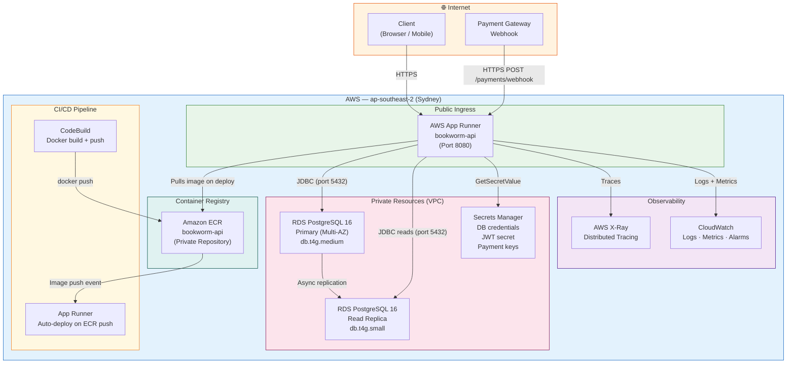
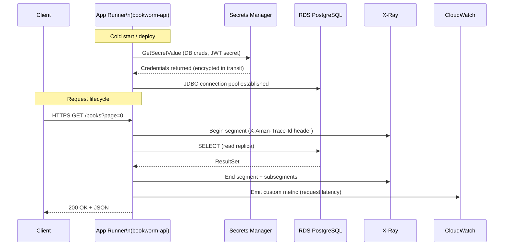
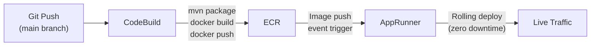

# Book Worm E-Store — AWS Deployment Architecture

> **Application:** `bookworm-api` · Spring Boot 3.3.4 · Java 21 · Single deployable JAR  
> **Scope:** Production-grade AWS deployment using App Runner, ECR, RDS PostgreSQL, Secrets Manager, CloudWatch, and X-Ray  
> **Note:** CloudFormation / IaC templates are out of scope for this document.

---

## Table of Contents

1. [Architecture Diagram](#1-architecture-diagram)
2. [Resource List](#2-resource-list)
3. [Cost Estimate](#3-cost-estimate)
4. [Security Controls](#4-security-controls)

---

## 1. Architecture Diagram

### 1.1 High-Level Topology



### 1.2 Network Flow Detail



### 1.3 CI/CD Pipeline Flow



---

## 2. Resource List

### 2.1 Compute — AWS App Runner

| Property | Value |
|----------|-------|
| Service name | `bookworm-api-prod` |
| Source | Amazon ECR (private) — image `bookworm-api:latest` |
| Port | `8080` |
| CPU | `1 vCPU` |
| Memory | `2 GB` |
| Auto-scaling — min instances | `1` |
| Auto-scaling — max instances | `5` |
| Auto-scaling — concurrency | `100` requests/instance |
| Health check path | `GET /v1/actuator/health` |
| Health check interval | `10 s` |
| Health check timeout | `5 s` |
| Health check healthy threshold | `1` |
| Health check unhealthy threshold | `5` |
| VPC connector | Yes — private subnets for RDS and Secrets Manager access |
| Environment — `SPRING_PROFILES_ACTIVE` | `prod` |
| Environment — `SERVER_PORT` | `8080` |
| Environment — secrets resolution | Via Secrets Manager ARN references (not plaintext env vars) |

> **Why App Runner over ECS/EKS?** The application is a single-module monolith with predictable traffic patterns. App Runner removes cluster management overhead, provides built-in load balancing, TLS termination, and auto-scaling out of the box — ideal before a potential future microservices split.

---

### 2.2 Container Registry — Amazon ECR

| Property | Value |
|----------|-------|
| Repository name | `bookworm/api` |
| Visibility | Private |
| Image tag mutability | **IMMUTABLE** — tags cannot be overwritten |
| Scan on push | Enabled (Enhanced scanning via Inspector) |
| Encryption | AWS-managed KMS (`AES-256`) |
| Lifecycle policy — untagged images | Expire after `1 day` |
| Lifecycle policy — tagged `release-*` | Keep last `10` images |
| Lifecycle policy — all other tags | Keep last `5` images |
| Cross-region replication | Not required at this stage |

---

### 2.3 Database — Amazon RDS PostgreSQL

#### Primary Instance

| Property | Value |
|----------|-------|
| Engine | PostgreSQL 16 |
| Instance class | `db.t4g.medium` (2 vCPU, 4 GB RAM) |
| Storage type | `gp3` SSD |
| Allocated storage | `100 GB` |
| Max storage autoscaling | `500 GB` |
| Multi-AZ | **Yes** — synchronous standby in second AZ |
| Publicly accessible | **No** |
| Subnet group | Private subnets only |
| Database name | `bookworm` |
| Port | `5432` |
| Parameter group | `pg16-bookworm-prod` (custom) |
| Backup retention | `7 days` |
| Backup window | `02:00–03:00 UTC` |
| Maintenance window | `Sun 03:00–04:00 UTC` |
| Performance Insights | Enabled (7-day retention) |
| Enhanced monitoring | Enabled (`60 s` granularity) |
| Deletion protection | **Enabled** |

#### Read Replica

| Property | Value |
|----------|-------|
| Purpose | Offload read-heavy endpoints (catalogue, search, recommendations) |
| Instance class | `db.t4g.small` (2 vCPU, 2 GB RAM) |
| Region | Same region, different AZ |
| Promotion tier | `1` (promoted if primary fails) |
| Application datasource | Separate Spring `DataSource` bean bound to replica endpoint |

#### RDS Parameter Group Customisations (`pg16-bookworm-prod`)

| Parameter | Value | Reason |
|-----------|-------|--------|
| `shared_buffers` | `128MB` | t4g.medium baseline |
| `work_mem` | `8MB` | Sort/hash operations per query |
| `wal_level` | `logical` | Enables logical replication if needed later |
| `log_min_duration_statement` | `1000` | Log slow queries >1 s to CloudWatch |
| `log_connections` | `on` | Audit trail |
| `log_disconnections` | `on` | Audit trail |
| `ssl` | `1` | Force TLS-only connections |

---

### 2.4 Secrets Management — AWS Secrets Manager

| Secret Name | Contents | Rotation |
|-------------|----------|----------|
| `bookworm/prod/db/primary` | `username`, `password`, `host`, `port`, `dbname` | Every `30 days` (RDS Lambda rotator) |
| `bookworm/prod/db/replica` | `username`, `password`, `host`, `port`, `dbname` | Every `30 days` |
| `bookworm/prod/jwt` | `secret`, `access-token-ttl-seconds`, `refresh-token-ttl-seconds` | Manual rotation |
| `bookworm/prod/payment` | `api-key`, `webhook-secret`, `hmac-key` | Manual rotation |
| `bookworm/prod/mail` | `smtp-host`, `smtp-port`, `smtp-username`, `smtp-password` | Manual rotation |

> **Consumption pattern:** App Runner resolves secrets at instance startup via IAM task role. The Spring application reads them via `spring-cloud-aws-secrets-manager` or environment variable injection — never stored in plaintext in the container image or task definition.

---

### 2.5 Observability — Amazon CloudWatch

#### Log Groups

| Log Group | Retention | Source |
|-----------|-----------|--------|
| `/aws/apprunner/bookworm-api-prod/application` | `30 days` | App Runner application logs |
| `/aws/apprunner/bookworm-api-prod/system` | `7 days` | App Runner platform events |
| `/aws/rds/instance/bookworm-prod/postgresql` | `14 days` | PostgreSQL slow query + error logs |

#### Metrics & Alarms

| Alarm Name | Metric | Threshold | Action |
|------------|--------|-----------|--------|
| `bookworm-api-5xx-rate` | `5XXStatusResponses` (App Runner) | >1% over 5 min | SNS → PagerDuty |
| `bookworm-api-p99-latency` | `RequestLatency` p99 | >2000 ms over 5 min | SNS → Slack |
| `bookworm-api-instance-count-max` | `ActiveInstances` | ≥5 (at max) | SNS → Slack |
| `bookworm-rds-cpu` | `CPUUtilization` (RDS) | >80% over 10 min | SNS → PagerDuty |
| `bookworm-rds-connections` | `DatabaseConnections` | >80 over 5 min | SNS → Slack |
| `bookworm-rds-storage-low` | `FreeStorageSpace` | <20 GB | SNS → PagerDuty |
| `bookworm-rds-replica-lag` | `ReplicaLag` | >30 s | SNS → Slack |

#### Dashboard: `bookworm-prod-ops`

Widgets:
- App Runner: requests/min, 2xx/4xx/5xx counts, p50/p95/p99 latency, active instances
- RDS Primary: CPU, IOPS, connections, free storage, write latency
- RDS Replica: replica lag, read IOPS, CPU
- JVM (via Actuator + CloudWatch EMF): heap used %, GC pause time, thread count

---

### 2.6 Distributed Tracing — AWS X-Ray

| Property | Value |
|----------|-------|
| Integration | `aws-xray-sdk-java` + Spring Boot auto-instrumentation |
| Sampling rule | 5% of requests in steady state; 100% of error responses |
| Segments emitted | Incoming HTTP requests, JDBC calls (subsegments), Secrets Manager calls |
| Service map | `Client → App Runner → RDS`, `App Runner → Secrets Manager` |
| Trace retention | `30 days` |
| Group: `5xx-errors` | Filter: `responsecode >= 500` — dedicated insights group |

> **Why X-Ray alongside CloudWatch?** CloudWatch covers aggregate metrics and logs. X-Ray provides per-request distributed traces — critical for diagnosing slow JDBC queries across the 15 domains, Secrets Manager cold-start latency, and payment webhook failures where a root-cause cannot be isolated from metrics alone.

---

### 2.7 Networking — VPC Connector (App Runner)

| Property | Value |
|----------|-------|
| VPC connector name | `bookworm-apprunner-connector` |
| Subnets | 2× private subnets (different AZs) |
| Security group | `sg-apprunner-outbound` |
| Outbound: RDS | TCP 5432 → `sg-rds-inbound` |
| Outbound: Secrets Manager | TCP 443 → VPC Endpoint (Interface) |
| Outbound: X-Ray | UDP 2000 → VPC Endpoint (Interface) |
| Outbound: CloudWatch Logs | TCP 443 → VPC Endpoint (Interface) |
| Outbound: ECR API + DKR | TCP 443 → VPC Endpoints (Interface) |

---

## 3. Cost Estimate

> **Region:** `ap-southeast-2` (Sydney)  
> **Pricing basis:** AWS public pricing as of Q3 2025 — on-demand rates, no Reserved Instances applied. Actual costs will vary with traffic.  
> **Currency:** USD/month

### 3.1 Per-Service Breakdown

#### AWS App Runner

| Component | Qty / Unit | Rate | Monthly Est. |
|-----------|-----------|------|--------------|
| Compute — active (1 vCPU × 2 GB) | ~`400 h/month` at steady state | $0.064/vCPU-h + $0.007/GB-h | ~$32 |
| Compute — provisioned idle (min 1 instance) | ~`344 h/month` idle | $0.005/vCPU-h + $0.0005/GB-h | ~$2 |
| Requests | ~`5M req/month` estimated | $0.000001/req (no separate charge in AR) | Included |
| **Subtotal** | | | **~$34/month** |

#### Amazon ECR

| Component | Qty / Unit | Rate | Monthly Est. |
|-----------|-----------|------|--------------|
| Storage | ~`5 GB` (10 images × ~500 MB) | $0.10/GB-month | ~$0.50 |
| Data transfer out (to App Runner) | Negligible (same region) | $0.00 | $0.00 |
| **Subtotal** | | | **~$1/month** |

#### Amazon RDS PostgreSQL

| Component | Qty / Unit | Rate | Monthly Est. |
|-----------|-----------|------|--------------|
| Primary: `db.t4g.medium` Multi-AZ | 730 h/month | $0.228/h (Multi-AZ) | ~$166 |
| Replica: `db.t4g.small` | 730 h/month | $0.057/h | ~$42 |
| Storage: `gp3` 100 GB × 2 (Multi-AZ) | 200 GB | $0.138/GB-month | ~$28 |
| Backup storage (7-day PITR) | ~`100 GB` | $0.095/GB-month | ~$10 |
| Performance Insights | Enabled (free tier 7 days) | $0.00 | $0.00 |
| **Subtotal** | | | **~$246/month** |

#### AWS Secrets Manager

| Component | Qty / Unit | Rate | Monthly Est. |
|-----------|-----------|------|--------------|
| Secrets stored | `5` secrets | $0.40/secret/month | $2.00 |
| API calls | ~`50,000/month` (instance startups + rotation) | $0.05/10,000 calls | ~$0.25 |
| **Subtotal** | | | **~$2.25/month** |

#### Amazon CloudWatch

| Component | Qty / Unit | Rate | Monthly Est. |
|-----------|-----------|------|--------------|
| Log ingestion | ~`10 GB/month` | $0.57/GB | ~$5.70 |
| Log storage (30-day retention) | ~`10 GB` | $0.025/GB-month | ~$0.25 |
| Custom metrics | `~15` | $0.30/metric/month (first 10,000) | ~$4.50 |
| Alarms | `7` | $0.10/alarm/month | ~$0.70 |
| Dashboard | `1` | $3.00/dashboard/month | $3.00 |
| **Subtotal** | | | **~$14/month** |

#### AWS X-Ray

| Component | Qty / Unit | Rate | Monthly Est. |
|-----------|-----------|------|--------------|
| Traces recorded (~5% sample of 5M req) | ~`250,000 traces/month` | First 100,000 free; $0.50/100,000 after | ~$0.75 |
| **Subtotal** | | | **~$1/month** |

#### VPC Endpoints (Interface)

| Endpoint | Monthly Est. |
|----------|-------------|
| `com.amazonaws.*.secretsmanager` | ~$7.30 |
| `com.amazonaws.*.xray` | ~$7.30 |
| `com.amazonaws.*.logs` | ~$7.30 |
| `com.amazonaws.*.ecr.api` | ~$7.30 |
| `com.amazonaws.*.ecr.dkr` | ~$7.30 |
| **Subtotal (~5 endpoints × $7.30)** | **~$36/month** |

---

### 3.2 Total Monthly Estimate

| Service | Monthly (USD) |
|---------|--------------|
| AWS App Runner | $34 |
| Amazon ECR | $1 |
| Amazon RDS PostgreSQL (Primary + Replica) | $246 |
| AWS Secrets Manager | $2.25 |
| Amazon CloudWatch | $14 |
| AWS X-Ray | $1 |
| VPC Endpoints | $36 |
| **Total** | **~$334/month** |

> **Cost reduction levers:**
> - Switch RDS to 1-year Reserved Instances → saves ~40% (~$98/month on RDS alone)
> - Remove read replica until read traffic justifies it → saves ~$42/month
> - Replace 5 Interface VPC Endpoints with a NAT Gateway if bandwidth is low → may be cheaper at low request volume
> - Scale App Runner min instances to `0` (pause mode) in non-prod environments → $0 idle compute

---

## 4. Security Controls

### 4.1 Identity & Access Management (IAM)

#### App Runner Instance Role — `bookworm-apprunner-task-role`

Minimum permissions required for runtime operation:

```
secretsmanager:GetSecretValue
  → Resource: arn:aws:secretsmanager:*:*:secret:bookworm/prod/*

xray:PutTraceSegments
xray:PutTelemetryRecords
  → Resource: *

logs:CreateLogStream
logs:PutLogEvents
  → Resource: arn:aws:logs:*:*:log-group:/aws/apprunner/bookworm-api-prod/*

ecr:GetAuthorizationToken
ecr:BatchGetImage
ecr:GetDownloadUrlForLayer
  → Resource: arn:aws:ecr:*:*:repository:bookworm/api
```

> **Principle of least privilege:** The instance role has no permissions beyond what the application strictly needs at runtime. No `AdministratorAccess`, no `PowerUserAccess`, no wildcards on resource ARNs.

#### CI/CD Role — `bookworm-cicd-role`

```
ecr:GetAuthorizationToken
ecr:BatchCheckLayerAvailability
ecr:PutImage
ecr:InitiateLayerUpload
ecr:UploadLayerPart
ecr:CompleteLayerUpload
  → Resource: arn:aws:ecr:*:*:repository:bookworm/api

apprunner:UpdateService
  → Resource: arn:aws:apprunner:*:*:service/bookworm-api-prod/*
```

---

### 4.2 Network Security

#### Security Groups

| Group | Inbound | Outbound |
|-------|---------|----------|
| `sg-apprunner-outbound` | None (App Runner manages inbound) | TCP 5432 → `sg-rds-inbound`; TCP 443 → VPC Endpoints |
| `sg-rds-inbound` | TCP 5432 from `sg-apprunner-outbound` **only** | None required |

> RDS has **no public accessibility**. The only network path to PostgreSQL is from the App Runner VPC connector security group. No bastion host or direct internet exposure.

#### VPC Endpoints

All AWS service calls (Secrets Manager, X-Ray, CloudWatch Logs, ECR) route through **Interface VPC Endpoints** — traffic never traverses the public internet. VPC endpoint policies restrict access to the owning AWS account only.

#### TLS

| Layer | Enforcement |
|-------|------------|
| Client → App Runner | TLS 1.2+ (App Runner managed, HTTPS only) |
| App Runner → RDS | `ssl=true` in JDBC URL; RDS parameter `ssl=1` forces TLS |
| App Runner → Secrets Manager | TLS (HTTPS) via VPC endpoint |
| App Runner → X-Ray | UDP 2000 via VPC endpoint (daemon protocol) |

---

### 4.3 Secrets Handling

| Control | Detail |
|---------|--------|
| No secrets in environment variables | App Runner references secrets by ARN; the plaintext value is never stored in the task definition or image |
| No secrets in source code | `.env.example` contains placeholder values only; validated by pre-commit hooks |
| No secrets in CloudWatch logs | Spring Boot `application.yml` masks all `password`, `secret`, `key` properties in actuator `/env` |
| Rotation | DB credentials rotated every 30 days via AWS-managed Lambda rotator; zero-downtime rotation via dual-user strategy |
| KMS encryption | All secrets encrypted with a customer-managed KMS key (`bookworm-prod-secrets-cmk`) |
| Audit | All `GetSecretValue` calls logged to CloudTrail |

---

### 4.4 Container Security

| Control | Detail |
|---------|--------|
| Non-root user | Container runs as `UID 1001` (`bookworm`) — enforced in `Dockerfile` |
| Read-only filesystem | App Runner does not mount writable host volumes by default |
| No privileged mode | App Runner does not support privileged containers |
| Image scanning | ECR Enhanced Scanning (powered by Inspector) on every push; critical/high CVEs block deploy via pipeline gate |
| Immutable tags | ECR image tag mutability set to `IMMUTABLE` — no tag can be overwritten silently |
| Base image | `eclipse-temurin:21-jre-alpine` — minimal JRE-only layer, no build tools in runtime image |
| JAVA_OPTS hardened | `ExitOnOutOfMemoryError` prevents degraded state; container support flags honour cgroup limits |

---

### 4.5 Application-Layer Security

| Control | Detail |
|---------|--------|
| JWT authentication | Short-lived access tokens (15 min); long-lived refresh tokens stored server-side with revocation support |
| JWT secret strength | Min 256-bit secret stored in Secrets Manager, never in source code |
| Guest token isolation | `X-Guest-Token` (UUID) cannot escalate to authenticated roles |
| HMAC payment webhook | `/payments/webhook` validated via HMAC-SHA256 signature before any processing |
| CORS | Configured to allow only known front-end origins; `*` wildcard explicitly rejected |
| HTTPS-only | App Runner redirects HTTP → HTTPS at the platform level |
| SQL injection | All queries use Spring Data JPA / JPQL with bound parameters; no dynamic SQL string concatenation |
| Input validation | All API inputs validated via `spring-boot-starter-validation` (JSR-380); rejections return `400 Bad Request` |
| Actuator exposure | `/v1/actuator/health` and `/v1/actuator/info` public; all other actuator endpoints restricted to `PLATFORM_ADMIN` |

---

### 4.6 Data Protection

| Control | Detail |
|---------|--------|
| Encryption at rest (RDS) | AES-256 via AWS-managed key |
| Encryption at rest (ECR) | AES-256 via AWS-managed key |
| Encryption at rest (Secrets Manager) | AES-256 via customer-managed KMS key |
| Encryption in transit | TLS enforced end-to-end (see §4.2) |
| PII minimisation | Payment card data never stored (redirect to payment gateway); only last 4 digits and expiry retained as reference |
| Soft delete | Member records use `deleted_at` timestamp (no hard delete); required for order history integrity and GDPR right-to-erasure workflow |
| Backup | Automated daily snapshots with 7-day PITR; manual snapshot before any major migration |

---

### 4.7 Audit & Compliance

| Control | Detail |
|---------|--------|
| AWS CloudTrail | All API calls (IAM, Secrets Manager, ECR, App Runner, RDS) logged to S3 with integrity validation |
| RDS audit logging | `log_connections`, `log_disconnections`, `log_min_duration_statement=1000ms` shipped to CloudWatch |
| Correlation ID | Every HTTP request tagged with `X-Correlation-ID` header; propagated to all log entries and X-Ray traces |
| Application audit columns | All 40+ tables carry `created_at`, `created_by`, `updated_at`, `updated_by` — see Database Design |
| CloudWatch Log encryption | Log groups encrypted with a KMS key |
| Alarm on 5xx errors | Any spike in 500-range responses triggers PagerDuty within 5 minutes |

---

*Document generated from Spring Boot Design, Database Design, and Dockerfile analysis of the `bookworm-api` repository.*
