# Book Worm — Domain-Driven Design Architecture

> **Based on:** `Requirements/Requirements.md` and wireframe analysis.
> **Purpose:** Complete domain model covering Bounded Contexts, Aggregates, Entities, Value Objects, Domain Events, Commands, Read Models, Relationships, and State Transitions.
> **Convention:** Aggregates are the consistency boundary. Cross-context communication is via Domain Events only — no direct aggregate references across contexts.

---

## 1. Bounded Contexts

Each Bounded Context owns a linguistic boundary — the same word (e.g. "User") means something different in each context.

| # | Bounded Context | Ubiquitous Language Anchor | Core Responsibility |
|---|-----------------|---------------------------|---------------------|
| BC-1 | **Identity** | Member, Credential, Session | Authentication, registration, role assignment, entitlement |
| BC-2 | **Catalogue** | Book, Author, Publisher, Category | Book listings, metadata, formats, pricing source |
| BC-3 | **Discovery** | SearchResult, Recommendation, FeaturedList | Search indexing, personalised recommendations, cross-sell, curated lists |
| BC-4 | **Store** | Store, StorePolicy | Store configuration, tax rules, delivery thresholds |
| BC-5 | **Cart** | Cart, CartItem, Wishlist | Transient and persistent product selections |
| BC-6 | **Order** | Order, OrderLine, ReturnRequest | Order lifecycle from placement to completion or return |
| BC-7 | **Promotions** | Coupon, DiscountRule, GiftPointRule | Coupon validation, discount computation, gift-point rules |
| BC-8 | **Checkout** | CheckoutSession, OrderSummary, DeliveryAddress | Checkout orchestration, address collection, total computation |
| BC-9 | **Payment** | PaymentTransaction, PaymentMethod, Refund | Payment processing, gateway delegation, refund issuance |
| BC-10 | **Wallet** | WalletAccount, WalletTransaction | Wallet balance, gift credits, debit/credit lifecycle |
| BC-11 | **Shipping** | Shipment, DeliveryEstimate, ReturnShipment | Rate calculation, delivery estimation, return logistics |
| BC-12 | **Review** | Review, Rating, ReviewSummary | User-generated reviews, aggregate ratings, moderation |
| BC-13 | **Notification** | NotificationEvent, NotificationTemplate | Transactional outbound communications |

### Context Map

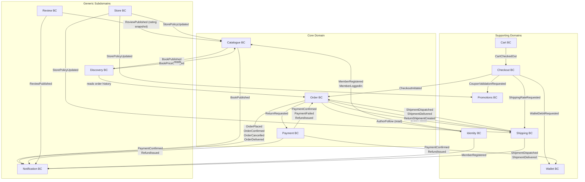

---

## 2. Aggregates

An Aggregate is a cluster of domain objects treated as a single unit for data changes. The **Aggregate Root** is the only entry point.

| Bounded Context | Aggregate Root | Internal Entities / VOs | Invariants Enforced |
|-----------------|---------------|--------------------------|---------------------|
| Identity | **Member** | Credential, Address (list), AuthorFollow (list), Role (list) | One credential per identity channel (email/phone); password is hashed before storage |
| Identity | **Session** | — | A session belongs to exactly one Member; expiry must not be in the past when created |
| Catalogue | **Book** | BookFormat (list), BookPrice (per format), CategoryTag (list) | At least one format must be active; price must be > 0 |
| Catalogue | **Author** | — | Author name is non-empty |
| Catalogue | **Publisher** | — | Publisher name is non-empty |
| Catalogue | **Category** | — | Category name is unique within the catalogue |
| Store | **Store** | StorePolicy, TaxRule (list), DeliveryThreshold (list) | A store must have exactly one active StorePolicy |
| Discovery | **RecommendationProfile** | RecommendedBook (list), CrossSellEntry (list) | Profile is scoped to one Member (or anonymous session) |
| Discovery | **FeaturedList** | FeaturedEntry (list) | List type must be one of: RECOMMENDED, BESTSELLER, NEW_LAUNCH |
| Cart | **Cart** | CartItem (list) | Cart belongs to one owner (Member ID or guest session token); quantity per line ≥ 1 |
| Cart | **Wishlist** | WishlistItem (list) | Wishlist belongs to an authenticated Member only |
| Order | **Order** | OrderLine (list), DeliveryAddress (VO), PriceSummary (VO), ReturnRequest (list) | Total must equal sum of lines + tax + shipping − discount; status transitions are guarded |
| Promotions | **Coupon** | DiscountRule | Coupon code is unique; expiry date must be in the future at time of issuance; usage count ≤ max uses |
| Promotions | **GiftPointPolicy** | GiftPointRule (list) | Redemption rate must be > 0 |
| Checkout | **CheckoutSession** | SelectedCartItems (VO), DeliveryAddress (VO), PricingBreakdown (VO) | Session is tied to exactly one cart snapshot; expires after a configurable TTL |
| Payment | **PaymentTransaction** | PaymentAttempt (list) | A confirmed transaction is immutable; refund amount ≤ original captured amount |
| Payment | **Refund** | — | Refund is linked to exactly one PaymentTransaction |
| Wallet | **WalletAccount** | WalletTransaction (list) | Balance must never go negative; debits require sufficient balance check |
| Shipping | **Shipment** | ShipmentEvent (list) | Shipment belongs to exactly one Order; events must be appended in chronological order |
| Shipping | **ReturnShipment** | ReturnShipmentEvent (list) | Linked to exactly one ReturnRequest on an Order |
| Review | **Review** | — | One review per Member per Book; rating must be 1–5; review cannot be edited after publication (only moderated) |

---

## 3. Entities

Entities have identity that persists across state changes. Listed per Bounded Context.

### 3.1 Identity

| Entity | Identity Key | Key Attributes |
|--------|-------------|----------------|
| **Member** | `memberId` (UUID) | displayName, email, phoneNumber, status, createdAt |
| **Credential** | `credentialId` | channel (EMAIL/PHONE), hashedSecret, resetToken, resetExpiresAt |
| **Address** | `addressId` | label, firstName, lastName, line1, line2, city, pinCode, state, country, isDefault |
| **AuthorFollow** | `followId` | memberId, authorId, followedAt |
| **Session** | `sessionId` | memberId, accessToken, refreshToken, expiresAt, deviceInfo |

### 3.2 Catalogue

| Entity | Identity Key | Key Attributes |
|--------|-------------|----------------|
| **Book** | `bookId` (ISBN or UUID) | title, synopsis, language, coverImageUrl, publishedDate, salesCount, averageRating, isActive |
| **Author** | `authorId` | name, bio, photoUrl, isActive |
| **Publisher** | `publisherId` | name, website, isActive |
| **Category** | `categoryId` | name, slug, parentCategoryId (nullable) |
| **BookFormat** | `bookFormatId` | bookId, formatType (PAPERBACK/HARDCOVER/EBOOK), isbn, pageCount, isActive |
| **BookPrice** | `bookPriceId` | bookFormatId, storeId, amount, currency, effectiveFrom, effectiveTo |

### 3.3 Store

| Entity | Identity Key | Key Attributes |
|--------|-------------|----------------|
| **Store** | `storeId` | name, slug, region, status, ownerId |
| **StorePolicy** | `policyId` | storeId, returnWindowDays, freeDeliveryThresholdAmount, currency, isActive |
| **TaxRule** | `taxRuleId` | storeId, taxCategory, ratePercent, effectiveFrom |
| **DeliveryThreshold** | `thresholdId` | storeId, minOrderAmount, shippingCost |

### 3.4 Discovery

| Entity | Identity Key | Key Attributes |
|--------|-------------|----------------|
| **RecommendationProfile** | `profileId` | ownerId (memberId or guestToken), updatedAt |
| **RecommendedBook** | `entryId` | profileId, bookId, score, reason (ORDER_HISTORY/CATEGORY_AFFINITY) |
| **FeaturedList** | `listId` | listType, storeId, effectiveFrom, effectiveTo |
| **FeaturedEntry** | `entryId` | listId, bookId, rank |

### 3.5 Cart

| Entity | Identity Key | Key Attributes |
|--------|-------------|----------------|
| **Cart** | `cartId` | ownerId (memberId or guestToken), status (ACTIVE/MERGED/CONVERTED), updatedAt |
| **CartItem** | `cartItemId` | cartId, bookId, bookFormatId, quantity, unitPrice (snapshot), addedAt |
| **Wishlist** | `wishlistId` | memberId, createdAt |
| **WishlistItem** | `wishlistItemId` | wishlistId, bookId, bookFormatId, addedAt |

### 3.6 Order

| Entity | Identity Key | Key Attributes |
|--------|-------------|----------------|
| **Order** | `orderId` | memberId (or guestEmail), storeId, status, placedAt, confirmedAt, cancelledAt |
| **OrderLine** | `orderLineId` | orderId, bookId, bookFormatId, title (snapshot), quantity, unitPrice (snapshot), subtotal |
| **ReturnRequest** | `returnRequestId` | orderId, status, reason, requestedAt, resolvedAt |

### 3.7 Promotions

| Entity | Identity Key | Key Attributes |
|--------|-------------|----------------|
| **Coupon** | `couponId` | code, description, discountType (FLAT/PERCENT), discountValue, minOrderAmount, maxUses, usedCount, expiresAt, isActive |
| **CouponRedemption** | `redemptionId` | couponId, memberId (or guestToken), orderId, redeemedAt |
| **GiftPointPolicy** | `policyId` | storeId, pointsPerRupee, rupeesPerPoint, maxRedemptionPercent |

### 3.8 Checkout

| Entity | Identity Key | Key Attributes |
|--------|-------------|----------------|
| **CheckoutSession** | `sessionId` | cartId, memberId (or guestToken), status, expiresAt, createdAt |

### 3.9 Payment

| Entity | Identity Key | Key Attributes |
|--------|-------------|----------------|
| **PaymentTransaction** | `transactionId` | orderId, gatewayReference, method (CREDIT_CARD/DEBIT_CARD/UPI/WALLET), amount, currency, status, createdAt, confirmedAt |
| **PaymentAttempt** | `attemptId` | transactionId, attemptedAt, gatewayStatus, failureReason |
| **Refund** | `refundId` | transactionId, orderId, amount, reason, status, initiatedAt, completedAt |

### 3.10 Wallet

| Entity | Identity Key | Key Attributes |
|--------|-------------|----------------|
| **WalletAccount** | `walletId` | memberId, balance, currency, createdAt |
| **WalletTransaction** | `walletTxnId` | walletId, type (CREDIT/DEBIT), amount, source (REFUND/GIFT/REDEMPTION), referenceId, createdAt |

### 3.11 Shipping

| Entity | Identity Key | Key Attributes |
|--------|-------------|----------------|
| **Shipment** | `shipmentId` | orderId, carrier, trackingNumber, estimatedDeliveryDate, status |
| **ShipmentEvent** | `eventId` | shipmentId, eventType, location, occurredAt |
| **ReturnShipment** | `returnShipmentId` | returnRequestId, carrier, trackingNumber, pickedUpAt, receivedAt, status |

### 3.12 Review

| Entity | Identity Key | Key Attributes |
|--------|-------------|----------------|
| **Review** | `reviewId` | bookId, memberId, rating (1–5), body, status (PENDING/PUBLISHED/REJECTED), submittedAt, publishedAt |

### 3.13 Notification

| Entity | Identity Key | Key Attributes |
|--------|-------------|----------------|
| **NotificationEvent** | `notificationId` | recipientMemberId, channel (EMAIL/SMS), templateCode, payload (JSON), status, sentAt |
| **NotificationTemplate** | `templateCode` | subject, bodyTemplate, channel, isActive |

---

## 4. Value Objects

Value Objects have no identity — they are defined entirely by their attributes and are immutable.

| Value Object | Owning Context | Attributes | Notes |
|--------------|---------------|------------|-------|
| **Money** | Cross-cutting | amount: Decimal, currency: ISO-4217 | Arithmetic operations return new Money instances |
| **EmailAddress** | Identity | value: string | Validates RFC-5322 format on construction |
| **PhoneNumber** | Identity | countryCode: string, number: string | E.164-normalised |
| **PasswordHash** | Identity | hash: string, algorithm: enum | Opaque — never exposes raw value |
| **PersonName** | Identity / Checkout | firstName: string, lastName: string | Immutable; used in Address and Member |
| **Address** *(VO copy)* | Checkout / Order | firstName, lastName, line1, line2, city, pinCode, state, country, email, phone | Snapshot at time of order — independent of Member's saved Address entity |
| **DateRange** | Catalogue / Promotions | from: Date, to: Date | `to` must be ≥ `from` |
| **FormatType** | Catalogue | value: enum (PAPERBACK, HARDCOVER, EBOOK) | Closed set |
| **Rating** | Review | value: int (1–5) | Guards 1 ≤ value ≤ 5 |
| **DiscountAmount** | Promotions / Order | flatAmount: Money (nullable), percentRate: Decimal (nullable) | Exactly one must be set |
| **PriceSummary** | Order / Checkout | subTotal: Money, taxAmount: Money, shippingAmount: Money, discountAmount: Money, grandTotal: Money | Derived; grandTotal = subTotal + taxAmount + shippingAmount − discountAmount |
| **GatewayReference** | Payment | gatewayId: string, gatewayName: string | Opaque external reference |
| **CardDetails** | Payment | maskedCardNumber: string, cardholderName: string, expiryMonth: int, expiryYear: int | Raw card data is never stored — only masked number post-tokenisation |
| **TrackingInfo** | Shipping | carrier: string, trackingNumber: string, trackingUrl: string (nullable) | Immutable once set |
| **DeliveryWindow** | Shipping / Catalogue | estimatedDate: Date, isGuaranteed: bool | Used on PDP and order confirmation |
| **ReviewSummary** | Review → Catalogue (projection) | bookId, averageRating: Decimal, reviewCount: int | Computed projection published as event payload |
| **Slug** | Catalogue / Store | value: string | URL-safe; lowercase, hyphenated |
| **CouponCode** | Promotions | value: string | Case-insensitive; normalised to uppercase |

---

## 5. Domain Events

Domain Events record facts that have already happened. They are the primary integration mechanism between Bounded Contexts.

| # | Event | Originating Context | Payload (key fields) | Consumed By |
|---|-------|--------------------|-----------------------|-------------|
| DE-01 | `MemberRegistered` | Identity | memberId, email, phoneNumber, registeredAt | Notification (welcome email), Wallet (create account) |
| DE-02 | `MemberLoggedIn` | Identity | memberId, sessionId, loginAt | Discovery (profile warm-up) |
| DE-03 | `MemberPasswordReset` | Identity | memberId, resetAt | Notification (confirmation email) |
| DE-04 | `AuthorFollowed` | Identity | memberId, authorId, followedAt | Discovery (update profile) |
| DE-05 | `AuthorUnfollowed` | Identity | memberId, authorId, unfollowedAt | Discovery (update profile) |
| DE-06 | `BookPublished` | Catalogue | bookId, title, authorIds, categoryIds, formats, publishedAt | Discovery (index), Notification (author follow alert) |
| DE-07 | `BookUpdated` | Catalogue | bookId, changedFields, updatedAt | Discovery (re-index) |
| DE-08 | `BookDeactivated` | Catalogue | bookId, deactivatedAt | Discovery (remove from index), Cart (flag stale items) |
| DE-09 | `BookPriceChanged` | Catalogue | bookId, bookFormatId, oldPrice, newPrice, effectiveFrom | Cart (flag price-changed items), Discovery |
| DE-10 | `StorePolicyUpdated` | Store | storeId, policyId, changes, updatedAt | Catalogue, Shipping, Promotions |
| DE-11 | `ItemAddedToCart` | Cart | cartId, cartItemId, bookId, bookFormatId, quantity, unitPrice | (internal) |
| DE-12 | `ItemRemovedFromCart` | Cart | cartId, cartItemId, bookId | (internal) |
| DE-13 | `CartCheckedOut` | Cart | cartId, memberId/guestToken, items[], totalItems | Checkout (create session) |
| DE-14 | `CartMerged` | Cart | guestCartId, memberCartId, mergedAt | (internal) |
| DE-15 | `ItemAddedToWishlist` | Cart | wishlistId, bookId, bookFormatId, addedAt | (internal) |
| DE-16 | `CheckoutSessionCreated` | Checkout | sessionId, cartId, ownerId, expiresAt | (internal) |
| DE-17 | `CheckoutSessionExpired` | Checkout | sessionId, expiredAt | Cart (reactivate cart) |
| DE-18 | `OrderPlaced` | Order | orderId, memberId/guestEmail, storeId, lines[], priceSummary, deliveryAddress, placedAt | Payment (initiate), Shipping (create shipment), Notification, Discovery (update history) |
| DE-19 | `OrderConfirmed` | Order | orderId, confirmedAt | Notification, Shipping |
| DE-20 | `OrderCancelled` | Order | orderId, reason, cancelledAt | Payment (trigger refund), Shipping (cancel shipment), Notification, Promotions (release coupon use) |
| DE-21 | `OrderDelivered` | Order | orderId, deliveredAt | Notification, Review (unlock review eligibility) |
| DE-22 | `ReturnRequested` | Order | returnRequestId, orderId, reason, requestedAt | Shipping (create return shipment), Payment (pre-authorise refund) |
| DE-23 | `ReturnApproved` | Order | returnRequestId, orderId, approvedAt | Notification |
| DE-24 | `CouponApplied` | Promotions | couponId, code, orderId, discountAmount, appliedAt | Order (embed discount), Notification |
| DE-25 | `CouponExpired` | Promotions | couponId, expiredAt | (housekeeping) |
| DE-26 | `PaymentInitiated` | Payment | transactionId, orderId, method, amount, initiatedAt | (internal) |
| DE-27 | `PaymentConfirmed` | Payment | transactionId, orderId, gatewayReference, confirmedAt | Order (confirm), Wallet (credit if overpaid), Notification |
| DE-28 | `PaymentFailed` | Payment | transactionId, orderId, reason, failedAt | Order (revert to PENDING_PAYMENT), Notification |
| DE-29 | `RefundInitiated` | Payment | refundId, transactionId, orderId, amount, initiatedAt | Notification |
| DE-30 | `RefundCompleted` | Payment | refundId, amount, completedAt | Wallet (credit), Order (update return status), Notification |
| DE-31 | `WalletCredited` | Wallet | walletId, amount, source, referenceId, creditedAt | Notification |
| DE-32 | `WalletDebited` | Wallet | walletId, amount, orderId, debitedAt | Checkout (confirm wallet portion paid) |
| DE-33 | `ShipmentCreated` | Shipping | shipmentId, orderId, carrier, estimatedDeliveryDate | Order (attach tracking), Notification |
| DE-34 | `ShipmentDispatched` | Shipping | shipmentId, orderId, dispatchedAt, trackingInfo | Order (status → DISPATCHED), Notification |
| DE-35 | `ShipmentDelivered` | Shipping | shipmentId, orderId, deliveredAt | Order (status → DELIVERED) |
| DE-36 | `ReturnShipmentCreated` | Shipping | returnShipmentId, returnRequestId, orderId | Order (update return status), Notification |
| DE-37 | `ReturnShipmentReceived` | Shipping | returnShipmentId, receivedAt | Order (update return status → RETURN_RECEIVED), Payment (release refund) |
| DE-38 | `ReviewSubmitted` | Review | reviewId, bookId, memberId, rating, submittedAt | (moderation queue) |
| DE-39 | `ReviewPublished` | Review | reviewId, bookId, memberId, rating, body, publishedAt | Catalogue (update ReviewSummary VO), Notification |
| DE-40 | `ReviewRejected` | Review | reviewId, reason, rejectedAt | Notification |

---

## 6. Commands

Commands express intent to change state. They are validated before execution and may be rejected.

| # | Command | Target Aggregate | Issued By | Preconditions / Guards |
|---|---------|-----------------|-----------|------------------------|
| CMD-01 | `RegisterMember` | Member | Visitor | Email or phone not already registered |
| CMD-02 | `AuthenticateMember` | Session | Member / Guest | Credential matches; account not locked |
| CMD-03 | `RequestPasswordReset` | Credential | Member | Identity channel exists |
| CMD-04 | `ResetPassword` | Credential | Member | Reset token valid and not expired |
| CMD-05 | `LogOut` | Session | Member | Active session exists |
| CMD-06 | `FollowAuthor` | Member | Registered Member | Author exists; not already following |
| CMD-07 | `UnfollowAuthor` | Member | Registered Member | Currently following |
| CMD-08 | `AddSavedAddress` | Member | Registered Member | ≤ 10 saved addresses (configurable limit) |
| CMD-09 | `RemoveSavedAddress` | Member | Registered Member | Address exists on member |
| CMD-10 | `PublishBook` | Book | Catalogue Manager | At least one format with valid price |
| CMD-11 | `UpdateBookPrice` | Book | Catalogue Manager | New price > 0; effective date valid |
| CMD-12 | `DeactivateBook` | Book | Catalogue Manager | Book exists and is active |
| CMD-13 | `CreateStore` | Store | Platform Admin | Store slug unique |
| CMD-14 | `UpdateStorePolicy` | Store | Store Admin | Store is active |
| CMD-15 | `AddToCart` | Cart | Guest / Member | Book and format exist and are active; quantity ≥ 1 |
| CMD-16 | `UpdateCartItemQuantity` | Cart | Guest / Member | CartItem exists; new quantity ≥ 1 |
| CMD-17 | `RemoveCartItem` | Cart | Guest / Member | CartItem exists in cart |
| CMD-18 | `MergeGuestCart` | Cart | System (on login) | Guest cart exists; member cart exists or is created |
| CMD-19 | `AddToWishlist` | Wishlist | Registered Member | Item not already on wishlist |
| CMD-20 | `RemoveFromWishlist` | Wishlist | Registered Member | Item on wishlist |
| CMD-21 | `InitiateCheckout` | CheckoutSession | Guest / Member | Cart is non-empty; all items still active |
| CMD-22 | `SetDeliveryAddress` | CheckoutSession | Guest / Member | Session is ACTIVE; address is valid |
| CMD-23 | `ApplyCoupon` | CheckoutSession | Guest / Member | Coupon code exists; not expired; usage limit not reached; order meets minimum amount |
| CMD-24 | `RedeemWalletBalance` | CheckoutSession | Registered Member | Wallet balance > 0; session is ACTIVE |
| CMD-25 | `PlaceOrder` | Order | Guest / Member | Checkout session is CONFIRMED; payment method selected |
| CMD-26 | `CancelOrder` | Order | Registered Member | Order status is PENDING_PAYMENT or CONFIRMED; before dispatch |
| CMD-27 | `RequestReturn` | Order | Registered Member | Order status is DELIVERED; within return window |
| CMD-28 | `InitiatePayment` | PaymentTransaction | System (Checkout) | Order is in AWAITING_PAYMENT status |
| CMD-29 | `ConfirmPayment` | PaymentTransaction | Payment Gateway (webhook) | Transaction in PENDING state; gateway response is SUCCESS |
| CMD-30 | `FailPayment` | PaymentTransaction | Payment Gateway (webhook) | Transaction in PENDING state |
| CMD-31 | `InitiateRefund` | Refund | System (Order cancellation / return) | Original transaction is CONFIRMED; no prior full refund |
| CMD-32 | `CreditWallet` | WalletAccount | System (Refund / Gift) | Wallet account exists; amount > 0 |
| CMD-33 | `DebitWallet` | WalletAccount | System (Checkout) | Balance ≥ debit amount |
| CMD-34 | `CreateShipment` | Shipment | System (OrderPlaced) | Order is CONFIRMED; physical format items present |
| CMD-35 | `RecordShipmentEvent` | Shipment | Shipping Service / Carrier | Shipment exists; event is in chronological order |
| CMD-36 | `CreateReturnShipment` | ReturnShipment | System (ReturnApproved) | Return request is APPROVED |
| CMD-37 | `SubmitReview` | Review | Registered Member | Member has a DELIVERED order containing the book; no prior review for this book |
| CMD-38 | `PublishReview` | Review | Moderator / System | Review status is PENDING |
| CMD-39 | `RejectReview` | Review | Moderator | Review status is PENDING |
| CMD-40 | `IssueCoupon` | Coupon | Store Admin / Platform Admin | Code is unique; expiry is in the future |
| CMD-41 | `DeactivateCoupon` | Coupon | Store Admin | Coupon is active |

---

## 7. Read Models

Read Models (Query Models / Projections) are denormalised, optimised for reads. They are updated by Domain Event handlers.

| Read Model | Updated By Events | Key Fields | Used On |
|------------|------------------|-----------|---------|
| **BookListingView** | BookPublished, BookUpdated, BookDeactivated, BookPriceChanged, ReviewPublished | bookId, title, authorName, coverImageUrl, categoryTags, formats[{type, price}], averageRating, reviewCount, deliveryEstimate, isNew, isBestseller | Catalogue listing pages, search results |
| **BookDetailView** | BookPublished, BookUpdated, BookPriceChanged, ReviewPublished | All BookListingView fields + synopsis, language, publisherName, authorBio, salesCount, allReviews (paginated) | Product Detail Page (PDP) |
| **CategoryTreeView** | (on category CRUD) | categoryId, name, slug, parentId, bookCount | Left-nav category filter |
| **AuthorProfileView** | BookPublished, AuthorFollowed | authorId, name, bio, photoUrl, followerCount, books[] | Author page, My Writers |
| **RecommendationView** | MemberLoggedIn, OrderDelivered, AuthorFollowed, BookPublished | memberId, recommendedBooks[], crossSellByBookId{bookId: books[]}, featuredLists{BESTSELLER: [], NEW_LAUNCH: []} | Home page sections, PDP sidebar |
| **SearchIndexView** | BookPublished, BookUpdated, BookDeactivated | bookId, title, authorNames, categoryNames, tags, language, formats[], priceRange | Full-text search |
| **CartView** | ItemAddedToCart, ItemRemovedFromCart, UpdateCartItemQuantity, CartCheckedOut, CartMerged | cartId, ownerId, items[{bookId, title, coverUrl, format, quantity, unitPrice, subtotal}], totalItems, totalPrice | Cart drawer, cart badge count |
| **WishlistView** | ItemAddedToWishlist, ItemRemovedFromWishlist | memberId, items[{bookId, title, coverUrl, format, price}] | Wishlist page |
| **CheckoutSummaryView** | CheckoutSessionCreated, CouponApplied, WalletDebited | sessionId, items[], deliveryAddress, subTotal, taxAmount, shippingAmount, discountAmount, grandTotal, couponCode | Checkout page order summary panel |
| **OrderHistoryView** | OrderPlaced, OrderConfirmed, OrderCancelled, OrderDelivered, ShipmentDispatched | memberId, orders[{orderId, placedAt, status, items[], total, trackingInfo, estimatedDelivery}] | My Orders page |
| **OrderDetailView** | OrderPlaced, OrderConfirmed, OrderCancelled, ShipmentCreated, ShipmentDispatched, ShipmentDelivered, PaymentConfirmed, ReturnRequested, ReturnApproved | Full order data + payment status + shipment tracking events | Order detail page |
| **OrderConfirmationView** | OrderConfirmed, PaymentConfirmed | orderId, items[], priceSummary, deliveryAddress, estimatedDelivery | Post-purchase confirmation screen |
| **WalletBalanceView** | WalletCredited, WalletDebited | memberId, balance, currency, recentTransactions[] | Checkout payment options, wallet page |
| **ShipmentTrackingView** | ShipmentCreated, ShipmentDispatched, ShipmentDelivered, ReturnShipmentCreated, ReturnShipmentReceived | orderId, shipmentId, status, trackingNumber, carrier, events[{type, location, occurredAt}] | Order detail, shipment tracking page |
| **ReviewListView** | ReviewPublished | bookId, reviews[{reviewId, memberName, rating, body, publishedAt}], averageRating, reviewCount | PDP reviews section |
| **MemberProfileView** | MemberRegistered, AddSavedAddress, RemoveSavedAddress, AuthorFollowed, AuthorUnfollowed | memberId, name, email, phone, savedAddresses[], followedAuthors[] | Account settings page |
| **CouponValidationView** | IssueCoupon, CouponApplied, DeactivateCoupon, CouponExpired | couponCode, discountType, discountValue, minOrderAmount, isValid, expiresAt | Checkout coupon input |

---

## 8. Relationships

### 8.1 Entity Relationship Overview

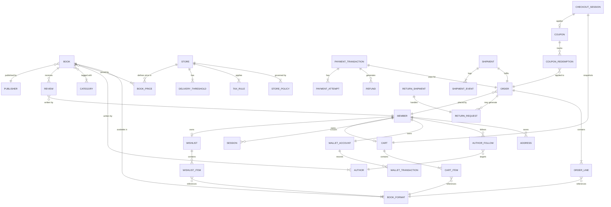

### 8.2 Cross-Context Relationships (by Integration Events)

| From Context | Relationship | To Context | Mechanism |
|-------------|-------------|------------|-----------|
| Identity → Catalogue | Member entitlement gates book visibility | Domain Event / Policy check | `EntitlementGranted` / `EntitlementRevoked` |
| Identity → Discovery | AuthorFollow updates recommendation profile | `AuthorFollowed` event | Async event |
| Catalogue → Discovery | New/updated books update search index | `BookPublished`, `BookUpdated` | Async event |
| Cart → Checkout | Cart snapshot initiates checkout session | `CartCheckedOut` event | Async event |
| Checkout → Order | Confirmed checkout creates order | `CheckoutConfirmed` command result | Sync via Checkout service |
| Checkout → Promotions | Coupon validation at checkout | `ApplyCoupon` command | Sync request |
| Checkout → Wallet | Wallet balance debit at payment | `DebitWallet` command | Sync request |
| Order → Payment | Order placement triggers payment initiation | `OrderPlaced` event | Async event |
| Order → Shipping | Confirmed order triggers shipment creation | `OrderConfirmed` event | Async event |
| Payment → Order | Payment result updates order state | `PaymentConfirmed` / `PaymentFailed` events | Async event |
| Payment → Wallet | Refund credits wallet | `RefundCompleted` event | Async event |
| Shipping → Order | Shipment status advances order lifecycle | `ShipmentDispatched`, `ShipmentDelivered` events | Async event |
| Review → Catalogue | Published review updates aggregate rating | `ReviewPublished` event | Async event (projection) |

---

## 9. State Transitions

### 9.1 Order State Machine

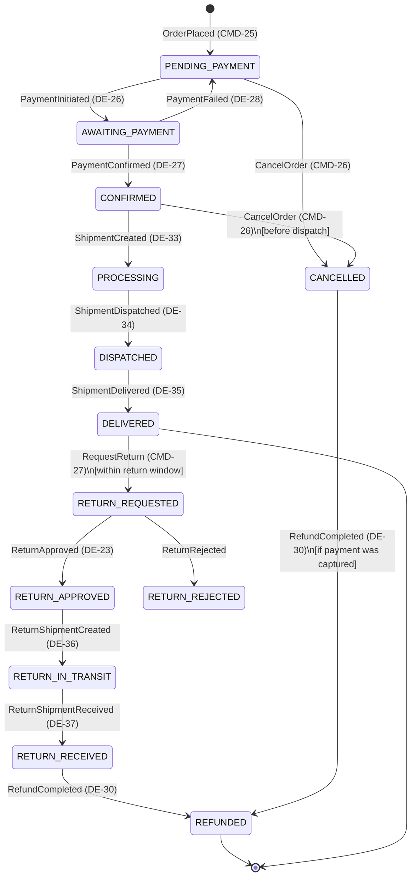

### 9.2 Payment Transaction State Machine

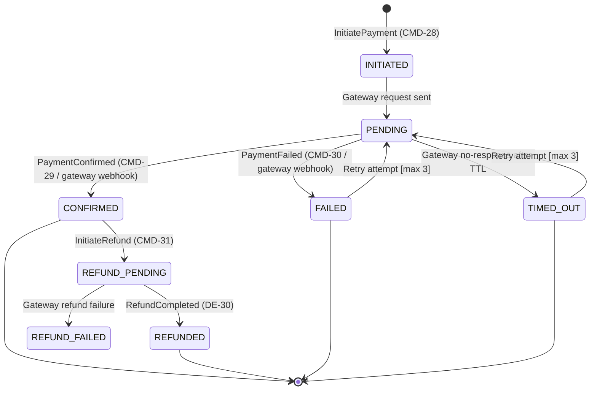

### 9.3 Shipment State Machine

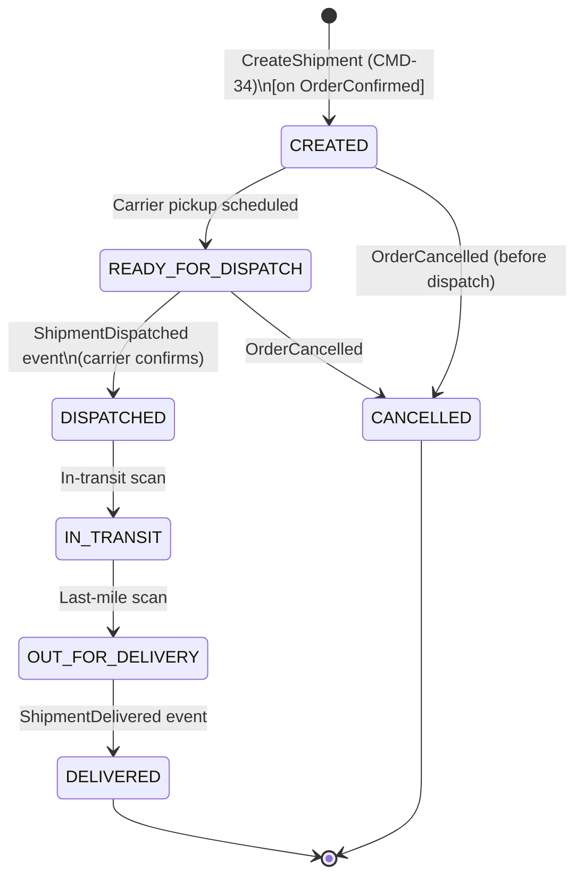

### 9.4 Return Shipment State Machine

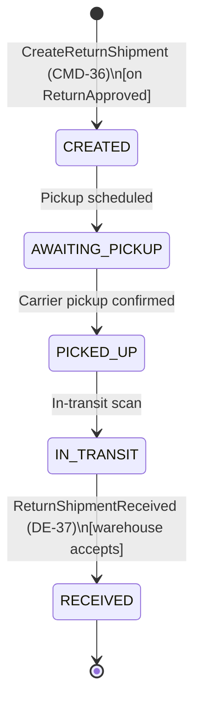

### 9.5 Review State Machine

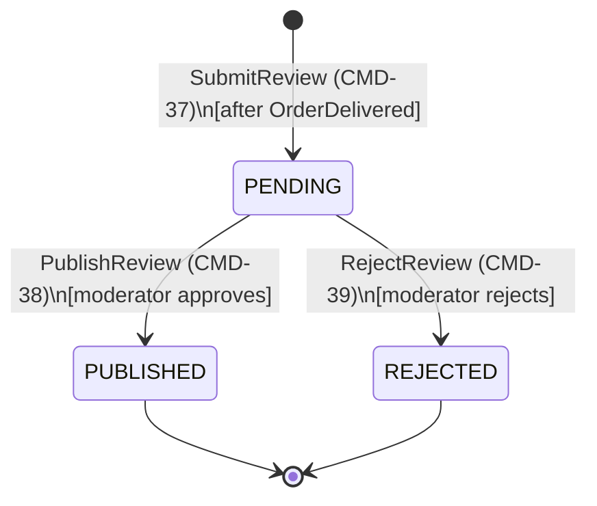

### 9.6 Coupon State Machine

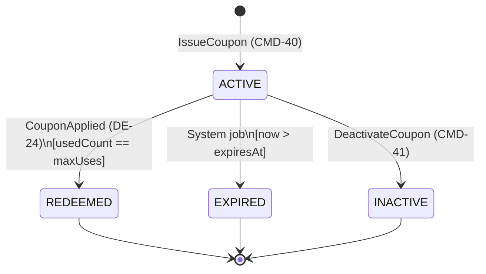

### 9.7 Cart State Machine

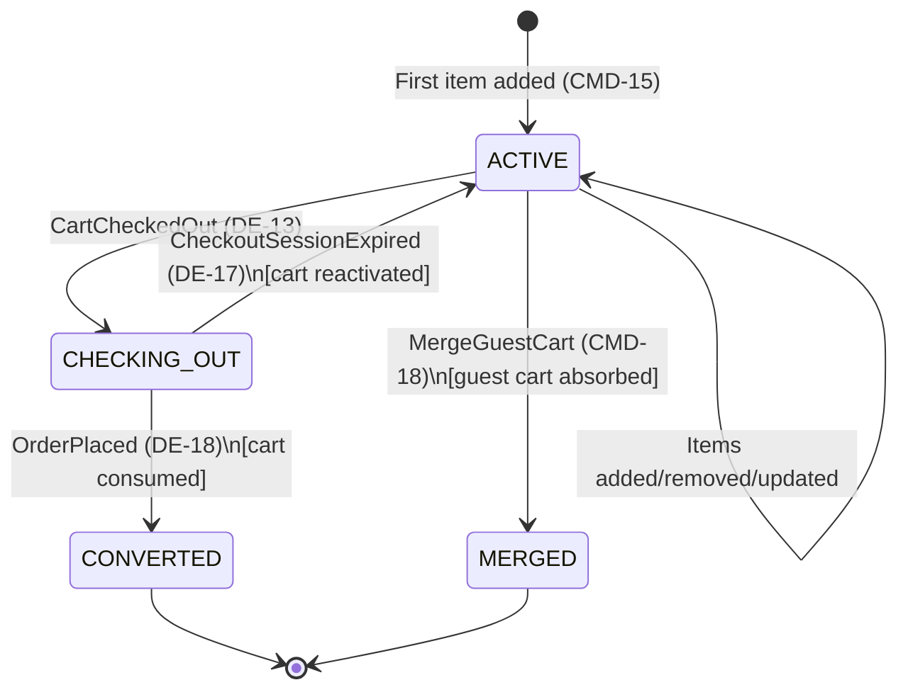

### 9.8 CheckoutSession State Machine

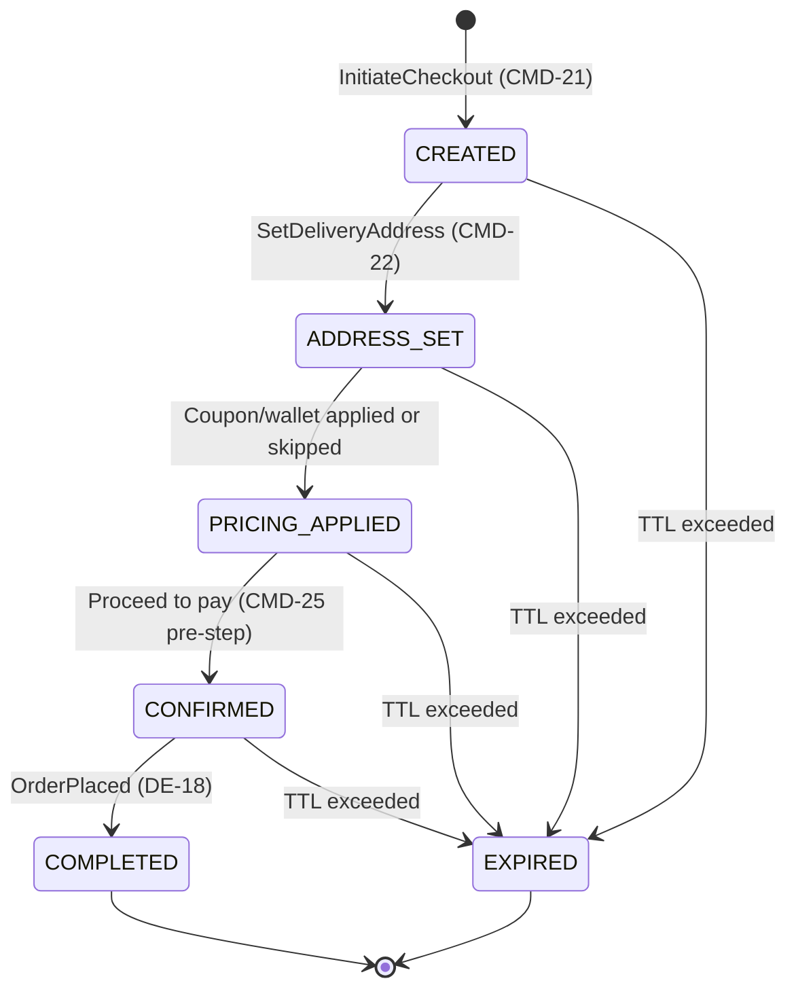

### 9.9 Wallet Account State Machine

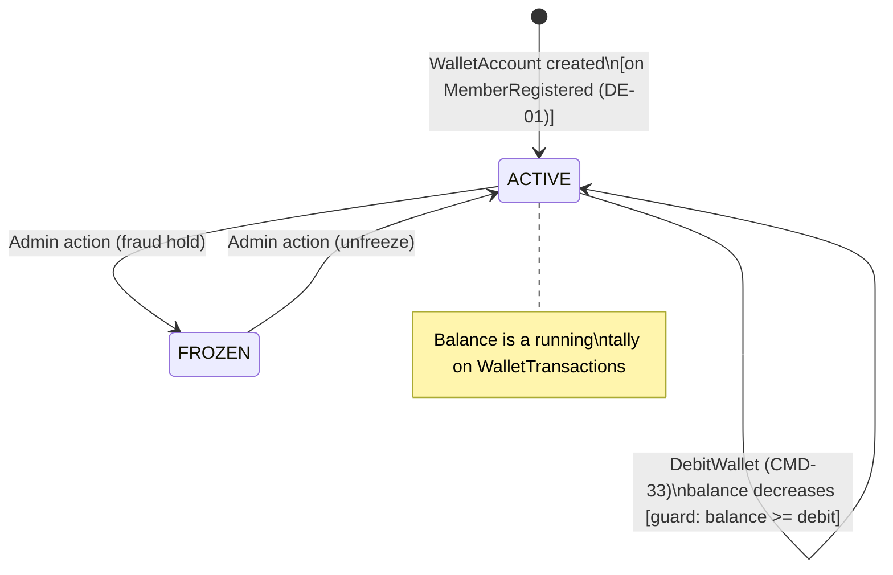

---

## Summary: Bounded Context × Aggregate Matrix

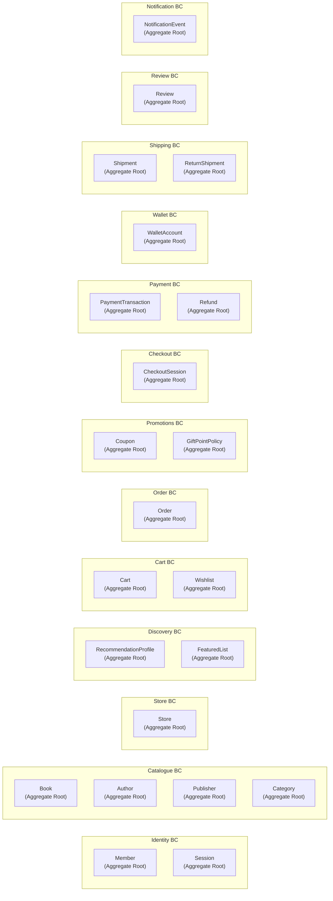

---

*Document version: 1.0 — DDD model reverse-engineered from Book Worm wireframes and requirements.*
