# Book Worm — Relational Database Design

> **Source:** `Architecture/DDD Architecture.md`
> **Target RDBMS:** PostgreSQL 15+
> **Normal Form:** Third Normal Form (3NF)
> **Conventions:**
> - All primary keys: `UUID` (generated via `gen_random_uuid()`)
> - Audit columns on every table: `created_at TIMESTAMPTZ NOT NULL DEFAULT now()`, `updated_at TIMESTAMPTZ NOT NULL DEFAULT now()`, `created_by UUID`, `updated_by UUID`
> - Soft delete: `deleted_at TIMESTAMPTZ NULL` — a `NULL` value means the row is active
> - Optimistic locking: `version INTEGER NOT NULL DEFAULT 1` — incremented on every `UPDATE`; application compares before writing
> - Money stored as `NUMERIC(14,2)` with an explicit `currency CHAR(3)` column (ISO-4217)
> - Enumerations are modelled as `VARCHAR` with a `CHECK` constraint; values are listed in-column for portability and readability
> - Schema prefix: `bw_` (BookWorm) — each bounded context uses a PostgreSQL **schema** to enforce boundary separation

---

## Standard Audit Columns (applied to every table)

| Column | Type | Nullable | Default | Purpose |
|--------|------|----------|---------|---------|
| `created_at` | `TIMESTAMPTZ` | NOT NULL | `now()` | Row creation timestamp |
| `updated_at` | `TIMESTAMPTZ` | NOT NULL | `now()` | Last modification timestamp (trigger-maintained) |
| `created_by` | `UUID` | NULL | — | Member/system actor who created the row |
| `updated_by` | `UUID` | NULL | — | Member/system actor who last updated the row |
| `deleted_at` | `TIMESTAMPTZ` | NULL | `NULL` | Soft-delete marker; NULL = active |
| `version` | `INTEGER` | NOT NULL | `1` | Optimistic lock counter |

> All indexes, foreign keys, and unique constraints operate only on active rows unless otherwise stated. Applications should include `WHERE deleted_at IS NULL` in query predicates.

---

## 1. Entity Relationship Diagram

```mermaid
erDiagram

    %% ── IDENTITY ──────────────────────────────────────────────
    members {
        uuid member_id PK
        varchar display_name
        varchar email
        varchar phone_number
        varchar status
    }
    credentials {
        uuid credential_id PK
        uuid member_id FK
        varchar channel
        varchar hashed_secret
        varchar reset_token
        timestamptz reset_expires_at
    }
    member_addresses {
        uuid address_id PK
        uuid member_id FK
        varchar label
        varchar first_name
        varchar last_name
        varchar line1
        varchar city
        varchar pin_code
        varchar state
        varchar country
        boolean is_default
    }
    author_follows {
        uuid follow_id PK
        uuid member_id FK
        uuid author_id FK
    }
    sessions {
        uuid session_id PK
        uuid member_id FK
        text access_token
        text refresh_token
        timestamptz expires_at
    }
    member_roles {
        uuid member_role_id PK
        uuid member_id FK
        varchar role_name
    }

    members ||--o{ credentials : "has"
    members ||--o{ member_addresses : "saves"
    members ||--o{ author_follows : "follows"
    members ||--o{ sessions : "opens"
    members ||--o{ member_roles : "assigned"

    %% ── CATALOGUE ─────────────────────────────────────────────
    authors {
        uuid author_id PK
        varchar name
        text bio
        varchar photo_url
        boolean is_active
    }
    publishers {
        uuid publisher_id PK
        varchar name
        varchar website
        boolean is_active
    }
    categories {
        uuid category_id PK
        varchar name
        varchar slug
        uuid parent_category_id FK
    }
    books {
        uuid book_id PK
        varchar title
        text synopsis
        varchar language
        varchar cover_image_url
        date published_date
        integer sales_count
        numeric average_rating
        integer review_count
        uuid publisher_id FK
        boolean is_active
    }
    book_authors {
        uuid book_author_id PK
        uuid book_id FK
        uuid author_id FK
        varchar role
    }
    book_categories {
        uuid book_category_id PK
        uuid book_id FK
        uuid category_id FK
    }
    book_formats {
        uuid book_format_id PK
        uuid book_id FK
        varchar format_type
        varchar isbn
        integer page_count
        boolean is_active
    }
    book_prices {
        uuid book_price_id PK
        uuid book_format_id FK
        uuid store_id FK
        numeric amount
        char currency
        timestamptz effective_from
        timestamptz effective_to
    }

    books }o--|| publishers : "published by"
    books ||--|{ book_formats : "available in"
    books ||--|{ book_authors : "written by"
    books ||--|{ book_categories : "tagged"
    book_formats ||--|{ book_prices : "priced"
    categories ||--o{ categories : "parent of"
    author_follows }o--|| authors : "targets"

    %% ── STORE ────────────────────────────────────────────────
    stores {
        uuid store_id PK
        varchar name
        varchar slug
        varchar region
        varchar status
        uuid owner_member_id FK
    }
    store_policies {
        uuid policy_id PK
        uuid store_id FK
        integer return_window_days
        numeric free_delivery_threshold
        char currency
        boolean is_active
    }
    tax_rules {
        uuid tax_rule_id PK
        uuid store_id FK
        varchar tax_category
        numeric rate_percent
        date effective_from
        date effective_to
    }
    delivery_thresholds {
        uuid threshold_id PK
        uuid store_id FK
        numeric min_order_amount
        numeric shipping_cost
        char currency
    }

    stores ||--|{ store_policies : "governed by"
    stores ||--o{ tax_rules : "applies"
    stores ||--o{ delivery_thresholds : "has"
    stores }o--|| members : "owned by"

    %% ── DISCOVERY ────────────────────────────────────────────
    recommendation_profiles {
        uuid profile_id PK
        uuid member_id FK
        varchar guest_token
        timestamptz updated_at
    }
    recommended_books {
        uuid entry_id PK
        uuid profile_id FK
        uuid book_id FK
        numeric score
        varchar reason
    }
    featured_lists {
        uuid list_id PK
        uuid store_id FK
        varchar list_type
        timestamptz effective_from
        timestamptz effective_to
    }
    featured_entries {
        uuid entry_id PK
        uuid list_id FK
        uuid book_id FK
        integer rank
    }

    recommendation_profiles ||--o{ recommended_books : "contains"
    featured_lists ||--|{ featured_entries : "ranks"

    %% ── CART ─────────────────────────────────────────────────
    carts {
        uuid cart_id PK
        uuid member_id FK
        varchar guest_token
        varchar status
    }
    cart_items {
        uuid cart_item_id PK
        uuid cart_id FK
        uuid book_id FK
        uuid book_format_id FK
        integer quantity
        numeric unit_price
        char currency
    }
    wishlists {
        uuid wishlist_id PK
        uuid member_id FK
    }
    wishlist_items {
        uuid wishlist_item_id PK
        uuid wishlist_id FK
        uuid book_id FK
        uuid book_format_id FK
    }

    members ||--o| carts : "owns"
    carts ||--o{ cart_items : "contains"
    members ||--o| wishlists : "owns"
    wishlists ||--o{ wishlist_items : "saves"

    %% ── ORDER ───────────────────────────────────────────────
    orders {
        uuid order_id PK
        uuid member_id FK
        varchar guest_email
        uuid store_id FK
        varchar status
        numeric subtotal
        numeric tax_amount
        numeric shipping_amount
        numeric discount_amount
        numeric grand_total
        char currency
        timestamptz placed_at
        timestamptz confirmed_at
        timestamptz cancelled_at
        timestamptz delivered_at
    }
    order_delivery_addresses {
        uuid delivery_address_id PK
        uuid order_id FK
        varchar first_name
        varchar last_name
        varchar line1
        varchar line2
        varchar city
        varchar pin_code
        varchar state
        varchar country
        varchar email
        varchar phone
    }
    order_lines {
        uuid order_line_id PK
        uuid order_id FK
        uuid book_id FK
        uuid book_format_id FK
        varchar title_snapshot
        varchar format_snapshot
        integer quantity
        numeric unit_price
        numeric subtotal
        char currency
    }
    return_requests {
        uuid return_request_id PK
        uuid order_id FK
        varchar status
        varchar reason
        text notes
        timestamptz requested_at
        timestamptz resolved_at
    }

    orders ||--|| order_delivery_addresses : "ships to"
    orders ||--|{ order_lines : "contains"
    orders ||--o{ return_requests : "may generate"

    %% ── PROMOTIONS ───────────────────────────────────────────
    coupons {
        uuid coupon_id PK
        uuid store_id FK
        varchar code
        text description
        varchar discount_type
        numeric discount_value
        numeric min_order_amount
        integer max_uses
        integer used_count
        timestamptz expires_at
        boolean is_active
    }
    coupon_redemptions {
        uuid redemption_id PK
        uuid coupon_id FK
        uuid member_id FK
        varchar guest_token
        uuid order_id FK
        timestamptz redeemed_at
    }
    gift_point_policies {
        uuid policy_id PK
        uuid store_id FK
        numeric points_per_rupee
        numeric rupees_per_point
        numeric max_redemption_percent
        boolean is_active
    }

    coupons ||--o{ coupon_redemptions : "tracks"
    stores ||--o{ coupons : "issues"

    %% ── CHECKOUT ─────────────────────────────────────────────
    checkout_sessions {
        uuid session_id PK
        uuid cart_id FK
        uuid member_id FK
        varchar guest_token
        varchar status
        timestamptz expires_at
        uuid coupon_id FK
        numeric wallet_debit_amount
        numeric subtotal
        numeric tax_amount
        numeric shipping_amount
        numeric discount_amount
        numeric grand_total
        char currency
    }

    checkout_sessions }o--o| coupons : "applies"
    checkout_sessions }o--|| carts : "snapshots"

    %% ── PAYMENT ─────────────────────────────────────────────
    payment_transactions {
        uuid transaction_id PK
        uuid order_id FK
        varchar gateway_id
        varchar gateway_name
        varchar payment_method
        numeric amount
        char currency
        varchar status
        varchar masked_card_number
        varchar cardholder_name
        integer card_expiry_month
        integer card_expiry_year
        timestamptz confirmed_at
    }
    payment_attempts {
        uuid attempt_id PK
        uuid transaction_id FK
        timestamptz attempted_at
        varchar gateway_status
        text failure_reason
    }
    refunds {
        uuid refund_id PK
        uuid transaction_id FK
        uuid order_id FK
        numeric amount
        char currency
        varchar reason
        varchar status
        timestamptz initiated_at
        timestamptz completed_at
    }

    orders ||--o{ payment_transactions : "paid via"
    payment_transactions ||--o{ payment_attempts : "has"
    payment_transactions ||--o{ refunds : "generates"

    %% ── WALLET ───────────────────────────────────────────────
    wallet_accounts {
        uuid wallet_id PK
        uuid member_id FK
        numeric balance
        char currency
        varchar status
    }
    wallet_transactions {
        uuid wallet_txn_id PK
        uuid wallet_id FK
        varchar txn_type
        numeric amount
        varchar source
        uuid reference_id
    }

    members ||--|| wallet_accounts : "owns"
    wallet_accounts ||--o{ wallet_transactions : "records"

    %% ── SHIPPING ─────────────────────────────────────────────
    shipments {
        uuid shipment_id PK
        uuid order_id FK
        varchar carrier
        varchar tracking_number
        varchar tracking_url
        date estimated_delivery_date
        varchar status
        timestamptz dispatched_at
        timestamptz delivered_at
    }
    shipment_events {
        uuid event_id PK
        uuid shipment_id FK
        varchar event_type
        varchar location
        timestamptz occurred_at
    }
    return_shipments {
        uuid return_shipment_id PK
        uuid return_request_id FK
        varchar carrier
        varchar tracking_number
        varchar tracking_url
        varchar status
        timestamptz picked_up_at
        timestamptz received_at
    }

    orders ||--o| shipments : "fulfilled by"
    shipments ||--o{ shipment_events : "logs"
    return_requests ||--o| return_shipments : "handled by"

    %% ── REVIEW ───────────────────────────────────────────────
    reviews {
        uuid review_id PK
        uuid book_id FK
        uuid member_id FK
        integer rating
        text body
        varchar status
        timestamptz submitted_at
        timestamptz published_at
    }

    books ||--o{ reviews : "receives"
    members ||--o{ reviews : "writes"

    %% ── NOTIFICATION ─────────────────────────────────────────
    notification_templates {
        varchar template_code PK
        varchar subject
        text body_template
        varchar channel
        boolean is_active
    }
    notification_events {
        uuid notification_id PK
        uuid recipient_member_id FK
        varchar channel
        varchar template_code FK
        jsonb payload
        varchar status
        timestamptz sent_at
    }

    notification_templates ||--o{ notification_events : "used by"
    members ||--o{ notification_events : "receives"

    %% ── DOMAIN EVENTS (outbox) ───────────────────────────────
    domain_event_outbox {
        uuid event_id PK
        varchar event_type
        varchar aggregate_type
        uuid aggregate_id
        jsonb payload
        varchar status
        timestamptz occurred_at
        timestamptz published_at
    }
```



---

## 2. Tables, Columns, Primary Keys & Foreign Keys

> **Schema layout:** Each bounded context maps to a PostgreSQL schema.
> `identity` · `catalogue` · `store` · `discovery` · `cart` · `ordering` · `promotions` · `checkout` · `payment` · `wallet` · `shipping` · `review` · `notification` · `outbox`

---

### Schema: `identity`

#### `identity.members`

| Column | Type | Nullable | Default | Notes |
|--------|------|----------|---------|-------|
| `member_id` | `UUID` | NOT NULL | `gen_random_uuid()` | **PK** |
| `display_name` | `VARCHAR(150)` | NOT NULL | — | |
| `email` | `VARCHAR(320)` | NULL | — | Unique when not null; normalised to lowercase |
| `phone_number` | `VARCHAR(20)` | NULL | — | Unique when not null; E.164 format |
| `status` | `VARCHAR(20)` | NOT NULL | `'ACTIVE'` | CHECK: `ACTIVE`, `SUSPENDED`, `CLOSED` |
| `created_at` | `TIMESTAMPTZ` | NOT NULL | `now()` | Audit |
| `updated_at` | `TIMESTAMPTZ` | NOT NULL | `now()` | Audit |
| `created_by` | `UUID` | NULL | — | Audit |
| `updated_by` | `UUID` | NULL | — | Audit |
| `deleted_at` | `TIMESTAMPTZ` | NULL | `NULL` | Soft delete |
| `version` | `INTEGER` | NOT NULL | `1` | Optimistic lock |

**PK:** `member_id`
**Unique:** `(email) WHERE email IS NOT NULL AND deleted_at IS NULL`
**Unique:** `(phone_number) WHERE phone_number IS NOT NULL AND deleted_at IS NULL`
**Check:** `status IN ('ACTIVE','SUSPENDED','CLOSED')`
**Check:** `email IS NOT NULL OR phone_number IS NOT NULL` — at least one contact channel required

---

#### `identity.credentials`

| Column | Type | Nullable | Default | Notes |
|--------|------|----------|---------|-------|
| `credential_id` | `UUID` | NOT NULL | `gen_random_uuid()` | **PK** |
| `member_id` | `UUID` | NOT NULL | — | **FK** → `identity.members.member_id` |
| `channel` | `VARCHAR(10)` | NOT NULL | — | CHECK: `EMAIL`, `PHONE` |
| `hashed_secret` | `VARCHAR(255)` | NOT NULL | — | bcrypt/Argon2 hash |
| `reset_token` | `VARCHAR(255)` | NULL | — | Single-use reset token |
| `reset_expires_at` | `TIMESTAMPTZ` | NULL | — | Token expiry |
| `created_at` | `TIMESTAMPTZ` | NOT NULL | `now()` | Audit |
| `updated_at` | `TIMESTAMPTZ` | NOT NULL | `now()` | Audit |
| `created_by` | `UUID` | NULL | — | Audit |
| `updated_by` | `UUID` | NULL | — | Audit |
| `deleted_at` | `TIMESTAMPTZ` | NULL | `NULL` | Soft delete |
| `version` | `INTEGER` | NOT NULL | `1` | Optimistic lock |

**PK:** `credential_id`
**FK:** `member_id` → `identity.members(member_id)`
**Unique:** `(member_id, channel) WHERE deleted_at IS NULL`
**Check:** `channel IN ('EMAIL','PHONE')`

---

#### `identity.member_addresses`

| Column | Type | Nullable | Default | Notes |
|--------|------|----------|---------|-------|
| `address_id` | `UUID` | NOT NULL | `gen_random_uuid()` | **PK** |
| `member_id` | `UUID` | NOT NULL | — | **FK** → `identity.members` |
| `label` | `VARCHAR(100)` | NULL | — | e.g. "Home", "Office" |
| `first_name` | `VARCHAR(100)` | NOT NULL | — | |
| `last_name` | `VARCHAR(100)` | NOT NULL | — | |
| `line1` | `VARCHAR(250)` | NOT NULL | — | |
| `line2` | `VARCHAR(250)` | NULL | — | |
| `city` | `VARCHAR(100)` | NOT NULL | — | |
| `pin_code` | `VARCHAR(20)` | NOT NULL | — | |
| `state` | `VARCHAR(100)` | NOT NULL | — | |
| `country` | `CHAR(2)` | NOT NULL | `'IN'` | ISO-3166 alpha-2 |
| `is_default` | `BOOLEAN` | NOT NULL | `FALSE` | |
| `created_at` | `TIMESTAMPTZ` | NOT NULL | `now()` | Audit |
| `updated_at` | `TIMESTAMPTZ` | NOT NULL | `now()` | Audit |
| `created_by` | `UUID` | NULL | — | Audit |
| `updated_by` | `UUID` | NULL | — | Audit |
| `deleted_at` | `TIMESTAMPTZ` | NULL | `NULL` | Soft delete |
| `version` | `INTEGER` | NOT NULL | `1` | Optimistic lock |

**PK:** `address_id`
**FK:** `member_id` → `identity.members(member_id)`

---

#### `identity.author_follows`

| Column | Type | Nullable | Default | Notes |
|--------|------|----------|---------|-------|
| `follow_id` | `UUID` | NOT NULL | `gen_random_uuid()` | **PK** |
| `member_id` | `UUID` | NOT NULL | — | **FK** → `identity.members` |
| `author_id` | `UUID` | NOT NULL | — | **FK** → `catalogue.authors` |
| `followed_at` | `TIMESTAMPTZ` | NOT NULL | `now()` | |
| `created_at` | `TIMESTAMPTZ` | NOT NULL | `now()` | Audit |
| `updated_at` | `TIMESTAMPTZ` | NOT NULL | `now()` | Audit |
| `created_by` | `UUID` | NULL | — | Audit |
| `updated_by` | `UUID` | NULL | — | Audit |
| `deleted_at` | `TIMESTAMPTZ` | NULL | `NULL` | Soft delete (unfollow) |
| `version` | `INTEGER` | NOT NULL | `1` | Optimistic lock |

**PK:** `follow_id`
**FK:** `member_id` → `identity.members(member_id)`
**FK:** `author_id` → `catalogue.authors(author_id)`
**Unique:** `(member_id, author_id) WHERE deleted_at IS NULL`

---

#### `identity.sessions`

| Column | Type | Nullable | Default | Notes |
|--------|------|----------|---------|-------|
| `session_id` | `UUID` | NOT NULL | `gen_random_uuid()` | **PK** |
| `member_id` | `UUID` | NOT NULL | — | **FK** → `identity.members` |
| `access_token_hash` | `VARCHAR(255)` | NOT NULL | — | SHA-256 hash of the JWT; never store raw token |
| `refresh_token_hash` | `VARCHAR(255)` | NOT NULL | — | SHA-256 hash of refresh token |
| `expires_at` | `TIMESTAMPTZ` | NOT NULL | — | |
| `device_info` | `VARCHAR(500)` | NULL | — | User-agent / device fingerprint |
| `created_at` | `TIMESTAMPTZ` | NOT NULL | `now()` | Audit |
| `updated_at` | `TIMESTAMPTZ` | NOT NULL | `now()` | Audit |
| `created_by` | `UUID` | NULL | — | Audit |
| `updated_by` | `UUID` | NULL | — | Audit |
| `deleted_at` | `TIMESTAMPTZ` | NULL | `NULL` | Soft delete = logout |
| `version` | `INTEGER` | NOT NULL | `1` | Optimistic lock |

**PK:** `session_id`
**FK:** `member_id` → `identity.members(member_id)`

---

#### `identity.member_roles`

| Column | Type | Nullable | Default | Notes |
|--------|------|----------|---------|-------|
| `member_role_id` | `UUID` | NOT NULL | `gen_random_uuid()` | **PK** |
| `member_id` | `UUID` | NOT NULL | — | **FK** → `identity.members` |
| `role_name` | `VARCHAR(50)` | NOT NULL | — | CHECK: `GUEST`, `REGISTERED_USER`, `STORE_ADMIN`, `CATALOGUE_MANAGER`, `PLATFORM_ADMIN` |
| `granted_at` | `TIMESTAMPTZ` | NOT NULL | `now()` | |
| `created_at` | `TIMESTAMPTZ` | NOT NULL | `now()` | Audit |
| `updated_at` | `TIMESTAMPTZ` | NOT NULL | `now()` | Audit |
| `created_by` | `UUID` | NULL | — | Audit |
| `updated_by` | `UUID` | NULL | — | Audit |
| `deleted_at` | `TIMESTAMPTZ` | NULL | `NULL` | Soft delete = role revoked |
| `version` | `INTEGER` | NOT NULL | `1` | Optimistic lock |

**PK:** `member_role_id`
**FK:** `member_id` → `identity.members(member_id)`
**Unique:** `(member_id, role_name) WHERE deleted_at IS NULL`

---

### Schema: `catalogue`

#### `catalogue.authors`

| Column | Type | Nullable | Default | Notes |
|--------|------|----------|---------|-------|
| `author_id` | `UUID` | NOT NULL | `gen_random_uuid()` | **PK** |
| `name` | `VARCHAR(300)` | NOT NULL | — | |
| `bio` | `TEXT` | NULL | — | |
| `photo_url` | `VARCHAR(2000)` | NULL | — | |
| `is_active` | `BOOLEAN` | NOT NULL | `TRUE` | |
| `created_at` | `TIMESTAMPTZ` | NOT NULL | `now()` | Audit |
| `updated_at` | `TIMESTAMPTZ` | NOT NULL | `now()` | Audit |
| `created_by` | `UUID` | NULL | — | Audit |
| `updated_by` | `UUID` | NULL | — | Audit |
| `deleted_at` | `TIMESTAMPTZ` | NULL | `NULL` | Soft delete |
| `version` | `INTEGER` | NOT NULL | `1` | Optimistic lock |

**PK:** `author_id`

---

#### `catalogue.publishers`

| Column | Type | Nullable | Default | Notes |
|--------|------|----------|---------|-------|
| `publisher_id` | `UUID` | NOT NULL | `gen_random_uuid()` | **PK** |
| `name` | `VARCHAR(300)` | NOT NULL | — | |
| `website` | `VARCHAR(2000)` | NULL | — | |
| `is_active` | `BOOLEAN` | NOT NULL | `TRUE` | |
| `created_at` | `TIMESTAMPTZ` | NOT NULL | `now()` | Audit |
| `updated_at` | `TIMESTAMPTZ` | NOT NULL | `now()` | Audit |
| `created_by` | `UUID` | NULL | — | Audit |
| `updated_by` | `UUID` | NULL | — | Audit |
| `deleted_at` | `TIMESTAMPTZ` | NULL | `NULL` | Soft delete |
| `version` | `INTEGER` | NOT NULL | `1` | Optimistic lock |

**PK:** `publisher_id`
**Unique:** `(name) WHERE deleted_at IS NULL`

---

#### `catalogue.categories`

| Column | Type | Nullable | Default | Notes |
|--------|------|----------|---------|-------|
| `category_id` | `UUID` | NOT NULL | `gen_random_uuid()` | **PK** |
| `name` | `VARCHAR(150)` | NOT NULL | — | |
| `slug` | `VARCHAR(150)` | NOT NULL | — | URL-safe, lowercase-hyphenated |
| `parent_category_id` | `UUID` | NULL | — | **FK** → `catalogue.categories(category_id)` (self-ref) |
| `created_at` | `TIMESTAMPTZ` | NOT NULL | `now()` | Audit |
| `updated_at` | `TIMESTAMPTZ` | NOT NULL | `now()` | Audit |
| `created_by` | `UUID` | NULL | — | Audit |
| `updated_by` | `UUID` | NULL | — | Audit |
| `deleted_at` | `TIMESTAMPTZ` | NULL | `NULL` | Soft delete |
| `version` | `INTEGER` | NOT NULL | `1` | Optimistic lock |

**PK:** `category_id`
**FK:** `parent_category_id` → `catalogue.categories(category_id)`
**Unique:** `(slug) WHERE deleted_at IS NULL`
**Unique:** `(name) WHERE deleted_at IS NULL`

---

#### `catalogue.books`

| Column | Type | Nullable | Default | Notes |
|--------|------|----------|---------|-------|
| `book_id` | `UUID` | NOT NULL | `gen_random_uuid()` | **PK** |
| `title` | `VARCHAR(500)` | NOT NULL | — | |
| `synopsis` | `TEXT` | NULL | — | |
| `language` | `VARCHAR(50)` | NOT NULL | — | e.g. `English` |
| `cover_image_url` | `VARCHAR(2000)` | NULL | — | |
| `published_date` | `DATE` | NULL | — | |
| `sales_count` | `INTEGER` | NOT NULL | `0` | Denormalised counter; updated by event |
| `average_rating` | `NUMERIC(3,2)` | NULL | — | Denormalised; updated by ReviewPublished event |
| `review_count` | `INTEGER` | NOT NULL | `0` | Denormalised counter |
| `publisher_id` | `UUID` | NULL | — | **FK** → `catalogue.publishers` |
| `is_active` | `BOOLEAN` | NOT NULL | `TRUE` | |
| `created_at` | `TIMESTAMPTZ` | NOT NULL | `now()` | Audit |
| `updated_at` | `TIMESTAMPTZ` | NOT NULL | `now()` | Audit |
| `created_by` | `UUID` | NULL | — | Audit |
| `updated_by` | `UUID` | NULL | — | Audit |
| `deleted_at` | `TIMESTAMPTZ` | NULL | `NULL` | Soft delete |
| `version` | `INTEGER` | NOT NULL | `1` | Optimistic lock |

**PK:** `book_id`
**FK:** `publisher_id` → `catalogue.publishers(publisher_id)`
**Check:** `average_rating >= 1 AND average_rating <= 5 OR average_rating IS NULL`

---

#### `catalogue.book_authors`

| Column | Type | Nullable | Default | Notes |
|--------|------|----------|---------|-------|
| `book_author_id` | `UUID` | NOT NULL | `gen_random_uuid()` | **PK** |
| `book_id` | `UUID` | NOT NULL | — | **FK** → `catalogue.books` |
| `author_id` | `UUID` | NOT NULL | — | **FK** → `catalogue.authors` |
| `role` | `VARCHAR(50)` | NOT NULL | `'AUTHOR'` | e.g. `AUTHOR`, `CO_AUTHOR`, `EDITOR` |
| `created_at` | `TIMESTAMPTZ` | NOT NULL | `now()` | Audit |
| `updated_at` | `TIMESTAMPTZ` | NOT NULL | `now()` | Audit |
| `created_by` | `UUID` | NULL | — | Audit |
| `updated_by` | `UUID` | NULL | — | Audit |
| `deleted_at` | `TIMESTAMPTZ` | NULL | `NULL` | Soft delete |
| `version` | `INTEGER` | NOT NULL | `1` | Optimistic lock |

**PK:** `book_author_id`
**FK:** `book_id` → `catalogue.books(book_id)`
**FK:** `author_id` → `catalogue.authors(author_id)`
**Unique:** `(book_id, author_id, role) WHERE deleted_at IS NULL`

---

#### `catalogue.book_categories`

| Column | Type | Nullable | Default | Notes |
|--------|------|----------|---------|-------|
| `book_category_id` | `UUID` | NOT NULL | `gen_random_uuid()` | **PK** |
| `book_id` | `UUID` | NOT NULL | — | **FK** → `catalogue.books` |
| `category_id` | `UUID` | NOT NULL | — | **FK** → `catalogue.categories` |
| `created_at` | `TIMESTAMPTZ` | NOT NULL | `now()` | Audit |
| `updated_at` | `TIMESTAMPTZ` | NOT NULL | `now()` | Audit |
| `created_by` | `UUID` | NULL | — | Audit |
| `updated_by` | `UUID` | NULL | — | Audit |
| `deleted_at` | `TIMESTAMPTZ` | NULL | `NULL` | Soft delete |
| `version` | `INTEGER` | NOT NULL | `1` | Optimistic lock |

**PK:** `book_category_id`
**FK:** `book_id` → `catalogue.books(book_id)`
**FK:** `category_id` → `catalogue.categories(category_id)`
**Unique:** `(book_id, category_id) WHERE deleted_at IS NULL`

---

#### `catalogue.book_formats`

| Column | Type | Nullable | Default | Notes |
|--------|------|----------|---------|-------|
| `book_format_id` | `UUID` | NOT NULL | `gen_random_uuid()` | **PK** |
| `book_id` | `UUID` | NOT NULL | — | **FK** → `catalogue.books` |
| `format_type` | `VARCHAR(20)` | NOT NULL | — | CHECK: `PAPERBACK`, `HARDCOVER`, `EBOOK` |
| `isbn` | `VARCHAR(20)` | NULL | — | ISBN-13 preferred |
| `page_count` | `INTEGER` | NULL | — | |
| `is_active` | `BOOLEAN` | NOT NULL | `TRUE` | |
| `created_at` | `TIMESTAMPTZ` | NOT NULL | `now()` | Audit |
| `updated_at` | `TIMESTAMPTZ` | NOT NULL | `now()` | Audit |
| `created_by` | `UUID` | NULL | — | Audit |
| `updated_by` | `UUID` | NULL | — | Audit |
| `deleted_at` | `TIMESTAMPTZ` | NULL | `NULL` | Soft delete |
| `version` | `INTEGER` | NOT NULL | `1` | Optimistic lock |

**PK:** `book_format_id`
**FK:** `book_id` → `catalogue.books(book_id)`
**Unique:** `(book_id, format_type) WHERE deleted_at IS NULL`
**Unique:** `(isbn) WHERE isbn IS NOT NULL AND deleted_at IS NULL`
**Check:** `format_type IN ('PAPERBACK','HARDCOVER','EBOOK')`

---

#### `catalogue.book_prices`

| Column | Type | Nullable | Default | Notes |
|--------|------|----------|---------|-------|
| `book_price_id` | `UUID` | NOT NULL | `gen_random_uuid()` | **PK** |
| `book_format_id` | `UUID` | NOT NULL | — | **FK** → `catalogue.book_formats` |
| `store_id` | `UUID` | NOT NULL | — | **FK** → `store.stores` |
| `amount` | `NUMERIC(14,2)` | NOT NULL | — | Must be > 0 |
| `currency` | `CHAR(3)` | NOT NULL | `'INR'` | ISO-4217 |
| `effective_from` | `TIMESTAMPTZ` | NOT NULL | `now()` | |
| `effective_to` | `TIMESTAMPTZ` | NULL | — | NULL = currently active |
| `created_at` | `TIMESTAMPTZ` | NOT NULL | `now()` | Audit |
| `updated_at` | `TIMESTAMPTZ` | NOT NULL | `now()` | Audit |
| `created_by` | `UUID` | NULL | — | Audit |
| `updated_by` | `UUID` | NULL | — | Audit |
| `deleted_at` | `TIMESTAMPTZ` | NULL | `NULL` | Soft delete |
| `version` | `INTEGER` | NOT NULL | `1` | Optimistic lock |

**PK:** `book_price_id`
**FK:** `book_format_id` → `catalogue.book_formats(book_format_id)`
**FK:** `store_id` → `store.stores(store_id)`
**Check:** `amount > 0`
**Check:** `effective_to IS NULL OR effective_to > effective_from`

---

### Schema: `store`

#### `store.stores`

| Column | Type | Nullable | Default | Notes |
|--------|------|----------|---------|-------|
| `store_id` | `UUID` | NOT NULL | `gen_random_uuid()` | **PK** |
| `name` | `VARCHAR(200)` | NOT NULL | — | |
| `slug` | `VARCHAR(200)` | NOT NULL | — | Unique URL identifier |
| `region` | `VARCHAR(100)` | NULL | — | |
| `status` | `VARCHAR(20)` | NOT NULL | `'ACTIVE'` | CHECK: `ACTIVE`, `INACTIVE` |
| `owner_member_id` | `UUID` | NULL | — | **FK** → `identity.members` |
| `created_at` | `TIMESTAMPTZ` | NOT NULL | `now()` | Audit |
| `updated_at` | `TIMESTAMPTZ` | NOT NULL | `now()` | Audit |
| `created_by` | `UUID` | NULL | — | Audit |
| `updated_by` | `UUID` | NULL | — | Audit |
| `deleted_at` | `TIMESTAMPTZ` | NULL | `NULL` | Soft delete |
| `version` | `INTEGER` | NOT NULL | `1` | Optimistic lock |

**PK:** `store_id`
**FK:** `owner_member_id` → `identity.members(member_id)`
**Unique:** `(slug) WHERE deleted_at IS NULL`

---

#### `store.store_policies`

| Column | Type | Nullable | Default | Notes |
|--------|------|----------|---------|-------|
| `policy_id` | `UUID` | NOT NULL | `gen_random_uuid()` | **PK** |
| `store_id` | `UUID` | NOT NULL | — | **FK** → `store.stores` |
| `return_window_days` | `INTEGER` | NOT NULL | `7` | |
| `free_delivery_threshold` | `NUMERIC(14,2)` | NULL | — | NULL = no free delivery |
| `currency` | `CHAR(3)` | NOT NULL | `'INR'` | |
| `is_active` | `BOOLEAN` | NOT NULL | `TRUE` | Only one active policy per store |
| `created_at` | `TIMESTAMPTZ` | NOT NULL | `now()` | Audit |
| `updated_at` | `TIMESTAMPTZ` | NOT NULL | `now()` | Audit |
| `created_by` | `UUID` | NULL | — | Audit |
| `updated_by` | `UUID` | NULL | — | Audit |
| `deleted_at` | `TIMESTAMPTZ` | NULL | `NULL` | Soft delete |
| `version` | `INTEGER` | NOT NULL | `1` | Optimistic lock |

**PK:** `policy_id`
**FK:** `store_id` → `store.stores(store_id)`
**Unique:** `(store_id) WHERE is_active = TRUE AND deleted_at IS NULL`

---

#### `store.tax_rules`

| Column | Type | Nullable | Default | Notes |
|--------|------|----------|---------|-------|
| `tax_rule_id` | `UUID` | NOT NULL | `gen_random_uuid()` | **PK** |
| `store_id` | `UUID` | NOT NULL | — | **FK** → `store.stores` |
| `tax_category` | `VARCHAR(100)` | NOT NULL | — | e.g. `BOOKS`, `DEFAULT` |
| `rate_percent` | `NUMERIC(5,2)` | NOT NULL | — | e.g. `5.00` for 5% |
| `effective_from` | `DATE` | NOT NULL | — | |
| `effective_to` | `DATE` | NULL | — | NULL = currently active |
| `created_at` | `TIMESTAMPTZ` | NOT NULL | `now()` | Audit |
| `updated_at` | `TIMESTAMPTZ` | NOT NULL | `now()` | Audit |
| `created_by` | `UUID` | NULL | — | Audit |
| `updated_by` | `UUID` | NULL | — | Audit |
| `deleted_at` | `TIMESTAMPTZ` | NULL | `NULL` | Soft delete |
| `version` | `INTEGER` | NOT NULL | `1` | Optimistic lock |

**PK:** `tax_rule_id`
**FK:** `store_id` → `store.stores(store_id)`
**Check:** `rate_percent >= 0 AND rate_percent <= 100`

---

#### `store.delivery_thresholds`

| Column | Type | Nullable | Default | Notes |
|--------|------|----------|---------|-------|
| `threshold_id` | `UUID` | NOT NULL | `gen_random_uuid()` | **PK** |
| `store_id` | `UUID` | NOT NULL | — | **FK** → `store.stores` |
| `min_order_amount` | `NUMERIC(14,2)` | NOT NULL | — | Orders at or above this get the rate |
| `shipping_cost` | `NUMERIC(14,2)` | NOT NULL | — | `0` = free |
| `currency` | `CHAR(3)` | NOT NULL | `'INR'` | |
| `created_at` | `TIMESTAMPTZ` | NOT NULL | `now()` | Audit |
| `updated_at` | `TIMESTAMPTZ` | NOT NULL | `now()` | Audit |
| `created_by` | `UUID` | NULL | — | Audit |
| `updated_by` | `UUID` | NULL | — | Audit |
| `deleted_at` | `TIMESTAMPTZ` | NULL | `NULL` | Soft delete |
| `version` | `INTEGER` | NOT NULL | `1` | Optimistic lock |

**PK:** `threshold_id`
**FK:** `store_id` → `store.stores(store_id)`
**Check:** `min_order_amount >= 0 AND shipping_cost >= 0`

---

### Schema: `discovery`

#### `discovery.recommendation_profiles`

| Column | Type | Nullable | Default | Notes |
|--------|------|----------|---------|-------|
| `profile_id` | `UUID` | NOT NULL | `gen_random_uuid()` | **PK** |
| `member_id` | `UUID` | NULL | — | **FK** → `identity.members`; NULL for guests |
| `guest_token` | `VARCHAR(200)` | NULL | — | Stable guest identifier |
| `updated_at` | `TIMESTAMPTZ` | NOT NULL | `now()` | |
| `created_at` | `TIMESTAMPTZ` | NOT NULL | `now()` | Audit |
| `created_by` | `UUID` | NULL | — | Audit |
| `updated_by` | `UUID` | NULL | — | Audit |
| `deleted_at` | `TIMESTAMPTZ` | NULL | `NULL` | Soft delete |
| `version` | `INTEGER` | NOT NULL | `1` | Optimistic lock |

**PK:** `profile_id`
**FK:** `member_id` → `identity.members(member_id)`
**Unique:** `(member_id) WHERE member_id IS NOT NULL AND deleted_at IS NULL`
**Unique:** `(guest_token) WHERE guest_token IS NOT NULL AND deleted_at IS NULL`
**Check:** `member_id IS NOT NULL OR guest_token IS NOT NULL`

---

#### `discovery.recommended_books`

| Column | Type | Nullable | Default | Notes |
|--------|------|----------|---------|-------|
| `entry_id` | `UUID` | NOT NULL | `gen_random_uuid()` | **PK** |
| `profile_id` | `UUID` | NOT NULL | — | **FK** → `discovery.recommendation_profiles` |
| `book_id` | `UUID` | NOT NULL | — | **FK** → `catalogue.books` |
| `score` | `NUMERIC(6,4)` | NOT NULL | — | 0.0–1.0 relevance score |
| `reason` | `VARCHAR(30)` | NOT NULL | — | CHECK: `ORDER_HISTORY`, `CATEGORY_AFFINITY`, `AUTHOR_FOLLOW` |
| `created_at` | `TIMESTAMPTZ` | NOT NULL | `now()` | Audit |
| `updated_at` | `TIMESTAMPTZ` | NOT NULL | `now()` | Audit |
| `created_by` | `UUID` | NULL | — | Audit |
| `updated_by` | `UUID` | NULL | — | Audit |
| `deleted_at` | `TIMESTAMPTZ` | NULL | `NULL` | Soft delete |
| `version` | `INTEGER` | NOT NULL | `1` | Optimistic lock |

**PK:** `entry_id`
**FK:** `profile_id` → `discovery.recommendation_profiles(profile_id)`
**FK:** `book_id` → `catalogue.books(book_id)`
**Unique:** `(profile_id, book_id) WHERE deleted_at IS NULL`

---

#### `discovery.featured_lists`

| Column | Type | Nullable | Default | Notes |
|--------|------|----------|---------|-------|
| `list_id` | `UUID` | NOT NULL | `gen_random_uuid()` | **PK** |
| `store_id` | `UUID` | NOT NULL | — | **FK** → `store.stores` |
| `list_type` | `VARCHAR(30)` | NOT NULL | — | CHECK: `BESTSELLER`, `NEW_LAUNCH`, `RECOMMENDED` |
| `effective_from` | `TIMESTAMPTZ` | NOT NULL | `now()` | |
| `effective_to` | `TIMESTAMPTZ` | NULL | — | NULL = currently active |
| `created_at` | `TIMESTAMPTZ` | NOT NULL | `now()` | Audit |
| `updated_at` | `TIMESTAMPTZ` | NOT NULL | `now()` | Audit |
| `created_by` | `UUID` | NULL | — | Audit |
| `updated_by` | `UUID` | NULL | — | Audit |
| `deleted_at` | `TIMESTAMPTZ` | NULL | `NULL` | Soft delete |
| `version` | `INTEGER` | NOT NULL | `1` | Optimistic lock |

**PK:** `list_id`
**FK:** `store_id` → `store.stores(store_id)`

---

#### `discovery.featured_entries`

| Column | Type | Nullable | Default | Notes |
|--------|------|----------|---------|-------|
| `entry_id` | `UUID` | NOT NULL | `gen_random_uuid()` | **PK** |
| `list_id` | `UUID` | NOT NULL | — | **FK** → `discovery.featured_lists` |
| `book_id` | `UUID` | NOT NULL | — | **FK** → `catalogue.books` |
| `rank` | `INTEGER` | NOT NULL | — | Display order; must be ≥ 1 |
| `created_at` | `TIMESTAMPTZ` | NOT NULL | `now()` | Audit |
| `updated_at` | `TIMESTAMPTZ` | NOT NULL | `now()` | Audit |
| `created_by` | `UUID` | NULL | — | Audit |
| `updated_by` | `UUID` | NULL | — | Audit |
| `deleted_at` | `TIMESTAMPTZ` | NULL | `NULL` | Soft delete |
| `version` | `INTEGER` | NOT NULL | `1` | Optimistic lock |

**PK:** `entry_id`
**FK:** `list_id` → `discovery.featured_lists(list_id)`
**FK:** `book_id` → `catalogue.books(book_id)`
**Unique:** `(list_id, book_id) WHERE deleted_at IS NULL`
**Unique:** `(list_id, rank) WHERE deleted_at IS NULL`
**Check:** `rank >= 1`

---

### Schema: `cart`

#### `cart.carts`

| Column | Type | Nullable | Default | Notes |
|--------|------|----------|---------|-------|
| `cart_id` | `UUID` | NOT NULL | `gen_random_uuid()` | **PK** |
| `member_id` | `UUID` | NULL | — | **FK** → `identity.members`; NULL for guests |
| `guest_token` | `VARCHAR(200)` | NULL | — | Guest session identifier |
| `status` | `VARCHAR(20)` | NOT NULL | `'ACTIVE'` | CHECK: `ACTIVE`, `CHECKING_OUT`, `CONVERTED`, `MERGED` |
| `created_at` | `TIMESTAMPTZ` | NOT NULL | `now()` | Audit |
| `updated_at` | `TIMESTAMPTZ` | NOT NULL | `now()` | Audit |
| `created_by` | `UUID` | NULL | — | Audit |
| `updated_by` | `UUID` | NULL | — | Audit |
| `deleted_at` | `TIMESTAMPTZ` | NULL | `NULL` | Soft delete |
| `version` | `INTEGER` | NOT NULL | `1` | Optimistic lock |

**PK:** `cart_id`
**FK:** `member_id` → `identity.members(member_id)`
**Unique:** `(member_id) WHERE status = 'ACTIVE' AND member_id IS NOT NULL AND deleted_at IS NULL`
**Unique:** `(guest_token) WHERE status = 'ACTIVE' AND guest_token IS NOT NULL AND deleted_at IS NULL`
**Check:** `member_id IS NOT NULL OR guest_token IS NOT NULL`
**Check:** `status IN ('ACTIVE','CHECKING_OUT','CONVERTED','MERGED')`

---

#### `cart.cart_items`

| Column | Type | Nullable | Default | Notes |
|--------|------|----------|---------|-------|
| `cart_item_id` | `UUID` | NOT NULL | `gen_random_uuid()` | **PK** |
| `cart_id` | `UUID` | NOT NULL | — | **FK** → `cart.carts` |
| `book_id` | `UUID` | NOT NULL | — | **FK** → `catalogue.books` |
| `book_format_id` | `UUID` | NOT NULL | — | **FK** → `catalogue.book_formats` |
| `quantity` | `INTEGER` | NOT NULL | `1` | |
| `unit_price` | `NUMERIC(14,2)` | NOT NULL | — | Price snapshot at time of add |
| `currency` | `CHAR(3)` | NOT NULL | `'INR'` | |
| `added_at` | `TIMESTAMPTZ` | NOT NULL | `now()` | |
| `created_at` | `TIMESTAMPTZ` | NOT NULL | `now()` | Audit |
| `updated_at` | `TIMESTAMPTZ` | NOT NULL | `now()` | Audit |
| `created_by` | `UUID` | NULL | — | Audit |
| `updated_by` | `UUID` | NULL | — | Audit |
| `deleted_at` | `TIMESTAMPTZ` | NULL | `NULL` | Soft delete = item removed |
| `version` | `INTEGER` | NOT NULL | `1` | Optimistic lock |

**PK:** `cart_item_id`
**FK:** `cart_id` → `cart.carts(cart_id)`
**FK:** `book_id` → `catalogue.books(book_id)`
**FK:** `book_format_id` → `catalogue.book_formats(book_format_id)`
**Unique:** `(cart_id, book_format_id) WHERE deleted_at IS NULL`
**Check:** `quantity >= 1`
**Check:** `unit_price > 0`

---

#### `cart.wishlists`

| Column | Type | Nullable | Default | Notes |
|--------|------|----------|---------|-------|
| `wishlist_id` | `UUID` | NOT NULL | `gen_random_uuid()` | **PK** |
| `member_id` | `UUID` | NOT NULL | — | **FK** → `identity.members` |
| `created_at` | `TIMESTAMPTZ` | NOT NULL | `now()` | Audit |
| `updated_at` | `TIMESTAMPTZ` | NOT NULL | `now()` | Audit |
| `created_by` | `UUID` | NULL | — | Audit |
| `updated_by` | `UUID` | NULL | — | Audit |
| `deleted_at` | `TIMESTAMPTZ` | NULL | `NULL` | Soft delete |
| `version` | `INTEGER` | NOT NULL | `1` | Optimistic lock |

**PK:** `wishlist_id`
**FK:** `member_id` → `identity.members(member_id)`
**Unique:** `(member_id) WHERE deleted_at IS NULL`

---

#### `cart.wishlist_items`

| Column | Type | Nullable | Default | Notes |
|--------|------|----------|---------|-------|
| `wishlist_item_id` | `UUID` | NOT NULL | `gen_random_uuid()` | **PK** |
| `wishlist_id` | `UUID` | NOT NULL | — | **FK** → `cart.wishlists` |
| `book_id` | `UUID` | NOT NULL | — | **FK** → `catalogue.books` |
| `book_format_id` | `UUID` | NOT NULL | — | **FK** → `catalogue.book_formats` |
| `added_at` | `TIMESTAMPTZ` | NOT NULL | `now()` | |
| `created_at` | `TIMESTAMPTZ` | NOT NULL | `now()` | Audit |
| `updated_at` | `TIMESTAMPTZ` | NOT NULL | `now()` | Audit |
| `created_by` | `UUID` | NULL | — | Audit |
| `updated_by` | `UUID` | NULL | — | Audit |
| `deleted_at` | `TIMESTAMPTZ` | NULL | `NULL` | Soft delete = item removed |
| `version` | `INTEGER` | NOT NULL | `1` | Optimistic lock |

**PK:** `wishlist_item_id`
**FK:** `wishlist_id` → `cart.wishlists(wishlist_id)`
**FK:** `book_id` → `catalogue.books(book_id)`
**FK:** `book_format_id` → `catalogue.book_formats(book_format_id)`
**Unique:** `(wishlist_id, book_format_id) WHERE deleted_at IS NULL`

---

### Schema: `ordering`

#### `ordering.orders`

| Column | Type | Nullable | Default | Notes |
|--------|------|----------|---------|-------|
| `order_id` | `UUID` | NOT NULL | `gen_random_uuid()` | **PK** |
| `member_id` | `UUID` | NULL | — | **FK** → `identity.members`; NULL for guest orders |
| `guest_email` | `VARCHAR(320)` | NULL | — | Required when `member_id` is NULL |
| `store_id` | `UUID` | NOT NULL | — | **FK** → `store.stores` |
| `status` | `VARCHAR(30)` | NOT NULL | `'PENDING_PAYMENT'` | See order state machine |
| `subtotal` | `NUMERIC(14,2)` | NOT NULL | — | Sum of line subtotals |
| `tax_amount` | `NUMERIC(14,2)` | NOT NULL | `0` | |
| `shipping_amount` | `NUMERIC(14,2)` | NOT NULL | `0` | |
| `discount_amount` | `NUMERIC(14,2)` | NOT NULL | `0` | |
| `grand_total` | `NUMERIC(14,2)` | NOT NULL | — | subtotal + tax + shipping − discount |
| `currency` | `CHAR(3)` | NOT NULL | `'INR'` | |
| `coupon_id` | `UUID` | NULL | — | **FK** → `promotions.coupons` |
| `coupon_code_snapshot` | `VARCHAR(50)` | NULL | — | Snapshot of code at time of order |
| `wallet_debit_amount` | `NUMERIC(14,2)` | NOT NULL | `0` | Wallet portion of payment |
| `placed_at` | `TIMESTAMPTZ` | NULL | — | |
| `confirmed_at` | `TIMESTAMPTZ` | NULL | — | |
| `cancelled_at` | `TIMESTAMPTZ` | NULL | — | |
| `delivered_at` | `TIMESTAMPTZ` | NULL | — | |
| `cancellation_reason` | `TEXT` | NULL | — | |
| `created_at` | `TIMESTAMPTZ` | NOT NULL | `now()` | Audit |
| `updated_at` | `TIMESTAMPTZ` | NOT NULL | `now()` | Audit |
| `created_by` | `UUID` | NULL | — | Audit |
| `updated_by` | `UUID` | NULL | — | Audit |
| `deleted_at` | `TIMESTAMPTZ` | NULL | `NULL` | Soft delete |
| `version` | `INTEGER` | NOT NULL | `1` | Optimistic lock |

**PK:** `order_id`
**FK:** `member_id` → `identity.members(member_id)`
**FK:** `store_id` → `store.stores(store_id)`
**FK:** `coupon_id` → `promotions.coupons(coupon_id)`
**Check:** `member_id IS NOT NULL OR guest_email IS NOT NULL`
**Check:** `grand_total >= 0`
**Check:** `status IN ('PENDING_PAYMENT','AWAITING_PAYMENT','CONFIRMED','PROCESSING','DISPATCHED','DELIVERED','CANCELLED','RETURN_REQUESTED','RETURN_APPROVED','RETURN_REJECTED','RETURN_IN_TRANSIT','RETURN_RECEIVED','REFUNDED')`

---

#### `ordering.order_delivery_addresses`

| Column | Type | Nullable | Default | Notes |
|--------|------|----------|---------|-------|
| `delivery_address_id` | `UUID` | NOT NULL | `gen_random_uuid()` | **PK** |
| `order_id` | `UUID` | NOT NULL | — | **FK** → `ordering.orders` |
| `first_name` | `VARCHAR(100)` | NOT NULL | — | Snapshot VO |
| `last_name` | `VARCHAR(100)` | NOT NULL | — | Snapshot VO |
| `line1` | `VARCHAR(250)` | NOT NULL | — | |
| `line2` | `VARCHAR(250)` | NULL | — | |
| `city` | `VARCHAR(100)` | NOT NULL | — | |
| `pin_code` | `VARCHAR(20)` | NOT NULL | — | |
| `state` | `VARCHAR(100)` | NOT NULL | — | |
| `country` | `CHAR(2)` | NOT NULL | `'IN'` | |
| `email` | `VARCHAR(320)` | NOT NULL | — | Contact for delivery |
| `phone` | `VARCHAR(20)` | NOT NULL | — | |
| `created_at` | `TIMESTAMPTZ` | NOT NULL | `now()` | Audit |
| `updated_at` | `TIMESTAMPTZ` | NOT NULL | `now()` | Audit |
| `created_by` | `UUID` | NULL | — | Audit |
| `updated_by` | `UUID` | NULL | — | Audit |
| `deleted_at` | `TIMESTAMPTZ` | NULL | `NULL` | Soft delete |
| `version` | `INTEGER` | NOT NULL | `1` | Optimistic lock |

**PK:** `delivery_address_id`
**FK:** `order_id` → `ordering.orders(order_id)`
**Unique:** `(order_id) WHERE deleted_at IS NULL`

---

#### `ordering.order_lines`

| Column | Type | Nullable | Default | Notes |
|--------|------|----------|---------|-------|
| `order_line_id` | `UUID` | NOT NULL | `gen_random_uuid()` | **PK** |
| `order_id` | `UUID` | NOT NULL | — | **FK** → `ordering.orders` |
| `book_id` | `UUID` | NOT NULL | — | **FK** → `catalogue.books` (soft ref) |
| `book_format_id` | `UUID` | NOT NULL | — | **FK** → `catalogue.book_formats` (soft ref) |
| `title_snapshot` | `VARCHAR(500)` | NOT NULL | — | Immutable snapshot |
| `author_snapshot` | `VARCHAR(500)` | NULL | — | Immutable snapshot |
| `format_snapshot` | `VARCHAR(20)` | NOT NULL | — | Immutable snapshot |
| `quantity` | `INTEGER` | NOT NULL | — | |
| `unit_price` | `NUMERIC(14,2)` | NOT NULL | — | Price at time of order |
| `subtotal` | `NUMERIC(14,2)` | NOT NULL | — | unit_price × quantity |
| `currency` | `CHAR(3)` | NOT NULL | `'INR'` | |
| `created_at` | `TIMESTAMPTZ` | NOT NULL | `now()` | Audit |
| `updated_at` | `TIMESTAMPTZ` | NOT NULL | `now()` | Audit |
| `created_by` | `UUID` | NULL | — | Audit |
| `updated_by` | `UUID` | NULL | — | Audit |
| `deleted_at` | `TIMESTAMPTZ` | NULL | `NULL` | Soft delete |
| `version` | `INTEGER` | NOT NULL | `1` | Optimistic lock |

**PK:** `order_line_id`
**FK:** `order_id` → `ordering.orders(order_id)`
**FK:** `book_id` → `catalogue.books(book_id)`
**FK:** `book_format_id` → `catalogue.book_formats(book_format_id)`
**Check:** `quantity >= 1`
**Check:** `unit_price > 0`
**Check:** `subtotal = unit_price * quantity`

---

#### `ordering.return_requests`

| Column | Type | Nullable | Default | Notes |
|--------|------|----------|---------|-------|
| `return_request_id` | `UUID` | NOT NULL | `gen_random_uuid()` | **PK** |
| `order_id` | `UUID` | NOT NULL | — | **FK** → `ordering.orders` |
| `status` | `VARCHAR(30)` | NOT NULL | `'REQUESTED'` | CHECK: `REQUESTED`, `APPROVED`, `REJECTED`, `IN_TRANSIT`, `RECEIVED`, `REFUNDED` |
| `reason` | `VARCHAR(200)` | NOT NULL | — | |
| `notes` | `TEXT` | NULL | — | |
| `requested_at` | `TIMESTAMPTZ` | NOT NULL | `now()` | |
| `resolved_at` | `TIMESTAMPTZ` | NULL | — | |
| `created_at` | `TIMESTAMPTZ` | NOT NULL | `now()` | Audit |
| `updated_at` | `TIMESTAMPTZ` | NOT NULL | `now()` | Audit |
| `created_by` | `UUID` | NULL | — | Audit |
| `updated_by` | `UUID` | NULL | — | Audit |
| `deleted_at` | `TIMESTAMPTZ` | NULL | `NULL` | Soft delete |
| `version` | `INTEGER` | NOT NULL | `1` | Optimistic lock |

**PK:** `return_request_id`
**FK:** `order_id` → `ordering.orders(order_id)`

---

### Schema: `promotions`

#### `promotions.coupons`

| Column | Type | Nullable | Default | Notes |
|--------|------|----------|---------|-------|
| `coupon_id` | `UUID` | NOT NULL | `gen_random_uuid()` | **PK** |
| `store_id` | `UUID` | NOT NULL | — | **FK** → `store.stores` |
| `code` | `VARCHAR(50)` | NOT NULL | — | Normalised uppercase |
| `description` | `TEXT` | NULL | — | |
| `discount_type` | `VARCHAR(10)` | NOT NULL | — | CHECK: `FLAT`, `PERCENT` |
| `discount_value` | `NUMERIC(14,2)` | NOT NULL | — | Amount (FLAT) or rate 0–100 (PERCENT) |
| `min_order_amount` | `NUMERIC(14,2)` | NOT NULL | `0` | |
| `max_uses` | `INTEGER` | NULL | — | NULL = unlimited |
| `used_count` | `INTEGER` | NOT NULL | `0` | Incremented atomically |
| `expires_at` | `TIMESTAMPTZ` | NULL | — | NULL = never expires |
| `is_active` | `BOOLEAN` | NOT NULL | `TRUE` | |
| `created_at` | `TIMESTAMPTZ` | NOT NULL | `now()` | Audit |
| `updated_at` | `TIMESTAMPTZ` | NOT NULL | `now()` | Audit |
| `created_by` | `UUID` | NULL | — | Audit |
| `updated_by` | `UUID` | NULL | — | Audit |
| `deleted_at` | `TIMESTAMPTZ` | NULL | `NULL` | Soft delete |
| `version` | `INTEGER` | NOT NULL | `1` | Optimistic lock |

**PK:** `coupon_id`
**FK:** `store_id` → `store.stores(store_id)`
**Unique:** `(store_id, code) WHERE deleted_at IS NULL`
**Check:** `discount_type IN ('FLAT','PERCENT')`
**Check:** `discount_value > 0`
**Check:** `used_count >= 0`
**Check:** `max_uses IS NULL OR used_count <= max_uses`

---

#### `promotions.coupon_redemptions`

| Column | Type | Nullable | Default | Notes |
|--------|------|----------|---------|-------|
| `redemption_id` | `UUID` | NOT NULL | `gen_random_uuid()` | **PK** |
| `coupon_id` | `UUID` | NOT NULL | — | **FK** → `promotions.coupons` |
| `member_id` | `UUID` | NULL | — | **FK** → `identity.members` |
| `guest_token` | `VARCHAR(200)` | NULL | — | For guest redemptions |
| `order_id` | `UUID` | NOT NULL | — | **FK** → `ordering.orders` |
| `redeemed_at` | `TIMESTAMPTZ` | NOT NULL | `now()` | |
| `created_at` | `TIMESTAMPTZ` | NOT NULL | `now()` | Audit |
| `updated_at` | `TIMESTAMPTZ` | NOT NULL | `now()` | Audit |
| `created_by` | `UUID` | NULL | — | Audit |
| `updated_by` | `UUID` | NULL | — | Audit |
| `deleted_at` | `TIMESTAMPTZ` | NULL | `NULL` | Soft delete = coupon released on order cancel |
| `version` | `INTEGER` | NOT NULL | `1` | Optimistic lock |

**PK:** `redemption_id`
**FK:** `coupon_id` → `promotions.coupons(coupon_id)`
**FK:** `member_id` → `identity.members(member_id)`
**FK:** `order_id` → `ordering.orders(order_id)`
**Unique:** `(order_id) WHERE deleted_at IS NULL`

---

#### `promotions.gift_point_policies`

| Column | Type | Nullable | Default | Notes |
|--------|------|----------|---------|-------|
| `policy_id` | `UUID` | NOT NULL | `gen_random_uuid()` | **PK** |
| `store_id` | `UUID` | NOT NULL | — | **FK** → `store.stores` |
| `points_per_rupee` | `NUMERIC(8,4)` | NOT NULL | — | Points earned per ₹1 spent |
| `rupees_per_point` | `NUMERIC(8,4)` | NOT NULL | — | ₹ value of 1 point at redemption |
| `max_redemption_percent` | `NUMERIC(5,2)` | NOT NULL | — | Max % of order total payable via points |
| `is_active` | `BOOLEAN` | NOT NULL | `TRUE` | |
| `created_at` | `TIMESTAMPTZ` | NOT NULL | `now()` | Audit |
| `updated_at` | `TIMESTAMPTZ` | NOT NULL | `now()` | Audit |
| `created_by` | `UUID` | NULL | — | Audit |
| `updated_by` | `UUID` | NULL | — | Audit |
| `deleted_at` | `TIMESTAMPTZ` | NULL | `NULL` | Soft delete |
| `version` | `INTEGER` | NOT NULL | `1` | Optimistic lock |

**PK:** `policy_id`
**FK:** `store_id` → `store.stores(store_id)`
**Unique:** `(store_id) WHERE is_active = TRUE AND deleted_at IS NULL`
**Check:** `points_per_rupee > 0 AND rupees_per_point > 0 AND max_redemption_percent > 0 AND max_redemption_percent <= 100`

---

### Schema: `checkout`

#### `checkout.checkout_sessions`

| Column | Type | Nullable | Default | Notes |
|--------|------|----------|---------|-------|
| `session_id` | `UUID` | NOT NULL | `gen_random_uuid()` | **PK** |
| `cart_id` | `UUID` | NOT NULL | — | **FK** → `cart.carts` |
| `member_id` | `UUID` | NULL | — | **FK** → `identity.members` |
| `guest_token` | `VARCHAR(200)` | NULL | — | |
| `status` | `VARCHAR(20)` | NOT NULL | `'CREATED'` | CHECK: `CREATED`, `ADDRESS_SET`, `PRICING_APPLIED`, `CONFIRMED`, `COMPLETED`, `EXPIRED` |
| `expires_at` | `TIMESTAMPTZ` | NOT NULL | — | |
| `coupon_id` | `UUID` | NULL | — | **FK** → `promotions.coupons` |
| `wallet_debit_amount` | `NUMERIC(14,2)` | NOT NULL | `0` | |
| `subtotal` | `NUMERIC(14,2)` | NULL | — | Computed during pricing step |
| `tax_amount` | `NUMERIC(14,2)` | NULL | — | |
| `shipping_amount` | `NUMERIC(14,2)` | NULL | — | |
| `discount_amount` | `NUMERIC(14,2)` | NULL | — | |
| `grand_total` | `NUMERIC(14,2)` | NULL | — | |
| `currency` | `CHAR(3)` | NOT NULL | `'INR'` | |
| `created_at` | `TIMESTAMPTZ` | NOT NULL | `now()` | Audit |
| `updated_at` | `TIMESTAMPTZ` | NOT NULL | `now()` | Audit |
| `created_by` | `UUID` | NULL | — | Audit |
| `updated_by` | `UUID` | NULL | — | Audit |
| `deleted_at` | `TIMESTAMPTZ` | NULL | `NULL` | Soft delete |
| `version` | `INTEGER` | NOT NULL | `1` | Optimistic lock |

**PK:** `session_id`
**FK:** `cart_id` → `cart.carts(cart_id)`
**FK:** `member_id` → `identity.members(member_id)`
**FK:** `coupon_id` → `promotions.coupons(coupon_id)`
**Check:** `member_id IS NOT NULL OR guest_token IS NOT NULL`
**Check:** `status IN ('CREATED','ADDRESS_SET','PRICING_APPLIED','CONFIRMED','COMPLETED','EXPIRED')`

---

#### `checkout.checkout_addresses`

| Column | Type | Nullable | Default | Notes |
|--------|------|----------|---------|-------|
| `checkout_address_id` | `UUID` | NOT NULL | `gen_random_uuid()` | **PK** |
| `session_id` | `UUID` | NOT NULL | — | **FK** → `checkout.checkout_sessions` |
| `first_name` | `VARCHAR(100)` | NOT NULL | — | |
| `last_name` | `VARCHAR(100)` | NOT NULL | — | |
| `line1` | `VARCHAR(250)` | NOT NULL | — | |
| `line2` | `VARCHAR(250)` | NULL | — | |
| `city` | `VARCHAR(100)` | NOT NULL | — | |
| `pin_code` | `VARCHAR(20)` | NOT NULL | — | |
| `state` | `VARCHAR(100)` | NOT NULL | — | |
| `country` | `CHAR(2)` | NOT NULL | `'IN'` | |
| `email` | `VARCHAR(320)` | NOT NULL | — | |
| `phone` | `VARCHAR(20)` | NOT NULL | — | |
| `created_at` | `TIMESTAMPTZ` | NOT NULL | `now()` | Audit |
| `updated_at` | `TIMESTAMPTZ` | NOT NULL | `now()` | Audit |
| `created_by` | `UUID` | NULL | — | Audit |
| `updated_by` | `UUID` | NULL | — | Audit |
| `deleted_at` | `TIMESTAMPTZ` | NULL | `NULL` | Soft delete |
| `version` | `INTEGER` | NOT NULL | `1` | Optimistic lock |

**PK:** `checkout_address_id`
**FK:** `session_id` → `checkout.checkout_sessions(session_id)`
**Unique:** `(session_id) WHERE deleted_at IS NULL`

---

### Schema: `payment`

#### `payment.payment_transactions`

| Column | Type | Nullable | Default | Notes |
|--------|------|----------|---------|-------|
| `transaction_id` | `UUID` | NOT NULL | `gen_random_uuid()` | **PK** |
| `order_id` | `UUID` | NOT NULL | — | **FK** → `ordering.orders` |
| `gateway_id` | `VARCHAR(200)` | NULL | — | Gateway's own transaction reference |
| `gateway_name` | `VARCHAR(100)` | NULL | — | e.g. `RAZORPAY`, `STRIPE` |
| `payment_method` | `VARCHAR(20)` | NOT NULL | — | CHECK: `CREDIT_CARD`, `DEBIT_CARD`, `UPI`, `WALLET` |
| `amount` | `NUMERIC(14,2)` | NOT NULL | — | |
| `currency` | `CHAR(3)` | NOT NULL | `'INR'` | |
| `status` | `VARCHAR(20)` | NOT NULL | `'INITIATED'` | CHECK: `INITIATED`, `PENDING`, `CONFIRMED`, `FAILED`, `TIMED_OUT`, `REFUND_PENDING`, `REFUNDED`, `REFUND_FAILED` |
| `masked_card_number` | `VARCHAR(20)` | NULL | — | Last 4 digits only, e.g. `**** 4242` |
| `cardholder_name` | `VARCHAR(200)` | NULL | — | |
| `card_expiry_month` | `SMALLINT` | NULL | — | 1–12 |
| `card_expiry_year` | `SMALLINT` | NULL | — | 4-digit year |
| `upi_id` | `VARCHAR(100)` | NULL | — | Masked UPI VPA |
| `confirmed_at` | `TIMESTAMPTZ` | NULL | — | |
| `failed_at` | `TIMESTAMPTZ` | NULL | — | |
| `created_at` | `TIMESTAMPTZ` | NOT NULL | `now()` | Audit |
| `updated_at` | `TIMESTAMPTZ` | NOT NULL | `now()` | Audit |
| `created_by` | `UUID` | NULL | — | Audit |
| `updated_by` | `UUID` | NULL | — | Audit |
| `deleted_at` | `TIMESTAMPTZ` | NULL | `NULL` | Soft delete |
| `version` | `INTEGER` | NOT NULL | `1` | Optimistic lock |

**PK:** `transaction_id`
**FK:** `order_id` → `ordering.orders(order_id)`
**Check:** `payment_method IN ('CREDIT_CARD','DEBIT_CARD','UPI','WALLET')`
**Check:** `amount > 0`
**Check:** `card_expiry_month IS NULL OR (card_expiry_month BETWEEN 1 AND 12)`

---

#### `payment.payment_attempts`

| Column | Type | Nullable | Default | Notes |
|--------|------|----------|---------|-------|
| `attempt_id` | `UUID` | NOT NULL | `gen_random_uuid()` | **PK** |
| `transaction_id` | `UUID` | NOT NULL | — | **FK** → `payment.payment_transactions` |
| `attempted_at` | `TIMESTAMPTZ` | NOT NULL | `now()` | |
| `gateway_status` | `VARCHAR(100)` | NOT NULL | — | Raw status from gateway |
| `failure_reason` | `TEXT` | NULL | — | |
| `created_at` | `TIMESTAMPTZ` | NOT NULL | `now()` | Audit |
| `updated_at` | `TIMESTAMPTZ` | NOT NULL | `now()` | Audit |
| `created_by` | `UUID` | NULL | — | Audit |
| `updated_by` | `UUID` | NULL | — | Audit |
| `deleted_at` | `TIMESTAMPTZ` | NULL | `NULL` | Soft delete |
| `version` | `INTEGER` | NOT NULL | `1` | Optimistic lock |

**PK:** `attempt_id`
**FK:** `transaction_id` → `payment.payment_transactions(transaction_id)`

---

#### `payment.refunds`

| Column | Type | Nullable | Default | Notes |
|--------|------|----------|---------|-------|
| `refund_id` | `UUID` | NOT NULL | `gen_random_uuid()` | **PK** |
| `transaction_id` | `UUID` | NOT NULL | — | **FK** → `payment.payment_transactions` |
| `order_id` | `UUID` | NOT NULL | — | **FK** → `ordering.orders` (denormalised for query efficiency) |
| `amount` | `NUMERIC(14,2)` | NOT NULL | — | |
| `currency` | `CHAR(3)` | NOT NULL | `'INR'` | |
| `reason` | `VARCHAR(200)` | NOT NULL | — | |
| `status` | `VARCHAR(20)` | NOT NULL | `'INITIATED'` | CHECK: `INITIATED`, `PROCESSING`, `COMPLETED`, `FAILED` |
| `gateway_refund_id` | `VARCHAR(200)` | NULL | — | Gateway's refund reference |
| `initiated_at` | `TIMESTAMPTZ` | NOT NULL | `now()` | |
| `completed_at` | `TIMESTAMPTZ` | NULL | — | |
| `created_at` | `TIMESTAMPTZ` | NOT NULL | `now()` | Audit |
| `updated_at` | `TIMESTAMPTZ` | NOT NULL | `now()` | Audit |
| `created_by` | `UUID` | NULL | — | Audit |
| `updated_by` | `UUID` | NULL | — | Audit |
| `deleted_at` | `TIMESTAMPTZ` | NULL | `NULL` | Soft delete |
| `version` | `INTEGER` | NOT NULL | `1` | Optimistic lock |

**PK:** `refund_id`
**FK:** `transaction_id` → `payment.payment_transactions(transaction_id)`
**FK:** `order_id` → `ordering.orders(order_id)`
**Check:** `amount > 0`
**Check:** `status IN ('INITIATED','PROCESSING','COMPLETED','FAILED')`

---

### Schema: `wallet`

#### `wallet.wallet_accounts`

| Column | Type | Nullable | Default | Notes |
|--------|------|----------|---------|-------|
| `wallet_id` | `UUID` | NOT NULL | `gen_random_uuid()` | **PK** |
| `member_id` | `UUID` | NOT NULL | — | **FK** → `identity.members` |
| `balance` | `NUMERIC(14,2)` | NOT NULL | `0.00` | Must be ≥ 0 |
| `currency` | `CHAR(3)` | NOT NULL | `'INR'` | |
| `status` | `VARCHAR(20)` | NOT NULL | `'ACTIVE'` | CHECK: `ACTIVE`, `FROZEN` |
| `created_at` | `TIMESTAMPTZ` | NOT NULL | `now()` | Audit |
| `updated_at` | `TIMESTAMPTZ` | NOT NULL | `now()` | Audit |
| `created_by` | `UUID` | NULL | — | Audit |
| `updated_by` | `UUID` | NULL | — | Audit |
| `deleted_at` | `TIMESTAMPTZ` | NULL | `NULL` | Soft delete |
| `version` | `INTEGER` | NOT NULL | `1` | Optimistic lock |

**PK:** `wallet_id`
**FK:** `member_id` → `identity.members(member_id)`
**Unique:** `(member_id) WHERE deleted_at IS NULL`
**Check:** `balance >= 0`
**Check:** `status IN ('ACTIVE','FROZEN')`

---

#### `wallet.wallet_transactions`

| Column | Type | Nullable | Default | Notes |
|--------|------|----------|---------|-------|
| `wallet_txn_id` | `UUID` | NOT NULL | `gen_random_uuid()` | **PK** |
| `wallet_id` | `UUID` | NOT NULL | — | **FK** → `wallet.wallet_accounts` |
| `txn_type` | `VARCHAR(10)` | NOT NULL | — | CHECK: `CREDIT`, `DEBIT` |
| `amount` | `NUMERIC(14,2)` | NOT NULL | — | Always positive; direction from txn_type |
| `source` | `VARCHAR(20)` | NOT NULL | — | CHECK: `REFUND`, `GIFT`, `REDEMPTION`, `ADJUSTMENT` |
| `reference_id` | `UUID` | NULL | — | e.g. refund_id or order_id |
| `balance_after` | `NUMERIC(14,2)` | NOT NULL | — | Running balance snapshot |
| `created_at` | `TIMESTAMPTZ` | NOT NULL | `now()` | Audit (immutable after insert) |
| `updated_at` | `TIMESTAMPTZ` | NOT NULL | `now()` | Audit |
| `created_by` | `UUID` | NULL | — | Audit |
| `updated_by` | `UUID` | NULL | — | Audit |
| `deleted_at` | `TIMESTAMPTZ` | NULL | `NULL` | Soft delete |
| `version` | `INTEGER` | NOT NULL | `1` | Optimistic lock |

**PK:** `wallet_txn_id`
**FK:** `wallet_id` → `wallet.wallet_accounts(wallet_id)`
**Check:** `txn_type IN ('CREDIT','DEBIT')`
**Check:** `source IN ('REFUND','GIFT','REDEMPTION','ADJUSTMENT')`
**Check:** `amount > 0`

---

### Schema: `shipping`

#### `shipping.shipments`

| Column | Type | Nullable | Default | Notes |
|--------|------|----------|---------|-------|
| `shipment_id` | `UUID` | NOT NULL | `gen_random_uuid()` | **PK** |
| `order_id` | `UUID` | NOT NULL | — | **FK** → `ordering.orders` |
| `carrier` | `VARCHAR(100)` | NULL | — | |
| `tracking_number` | `VARCHAR(200)` | NULL | — | |
| `tracking_url` | `VARCHAR(2000)` | NULL | — | |
| `estimated_delivery_date` | `DATE` | NULL | — | |
| `status` | `VARCHAR(30)` | NOT NULL | `'CREATED'` | CHECK: `CREATED`, `READY_FOR_DISPATCH`, `DISPATCHED`, `IN_TRANSIT`, `OUT_FOR_DELIVERY`, `DELIVERED`, `CANCELLED` |
| `dispatched_at` | `TIMESTAMPTZ` | NULL | — | |
| `delivered_at` | `TIMESTAMPTZ` | NULL | — | |
| `created_at` | `TIMESTAMPTZ` | NOT NULL | `now()` | Audit |
| `updated_at` | `TIMESTAMPTZ` | NOT NULL | `now()` | Audit |
| `created_by` | `UUID` | NULL | — | Audit |
| `updated_by` | `UUID` | NULL | — | Audit |
| `deleted_at` | `TIMESTAMPTZ` | NULL | `NULL` | Soft delete |
| `version` | `INTEGER` | NOT NULL | `1` | Optimistic lock |

**PK:** `shipment_id`
**FK:** `order_id` → `ordering.orders(order_id)`
**Unique:** `(order_id) WHERE deleted_at IS NULL`

---

#### `shipping.shipment_events`

| Column | Type | Nullable | Default | Notes |
|--------|------|----------|---------|-------|
| `event_id` | `UUID` | NOT NULL | `gen_random_uuid()` | **PK** |
| `shipment_id` | `UUID` | NOT NULL | — | **FK** → `shipping.shipments` |
| `event_type` | `VARCHAR(50)` | NOT NULL | — | e.g. `PICKED_UP`, `IN_TRANSIT`, `OUT_FOR_DELIVERY`, `DELIVERED` |
| `location` | `VARCHAR(300)` | NULL | — | |
| `notes` | `TEXT` | NULL | — | |
| `occurred_at` | `TIMESTAMPTZ` | NOT NULL | — | |
| `created_at` | `TIMESTAMPTZ` | NOT NULL | `now()` | Audit |
| `updated_at` | `TIMESTAMPTZ` | NOT NULL | `now()` | Audit |
| `created_by` | `UUID` | NULL | — | Audit |
| `updated_by` | `UUID` | NULL | — | Audit |
| `deleted_at` | `TIMESTAMPTZ` | NULL | `NULL` | Soft delete |
| `version` | `INTEGER` | NOT NULL | `1` | Optimistic lock |

**PK:** `event_id`
**FK:** `shipment_id` → `shipping.shipments(shipment_id)`

---

#### `shipping.return_shipments`

| Column | Type | Nullable | Default | Notes |
|--------|------|----------|---------|-------|
| `return_shipment_id` | `UUID` | NOT NULL | `gen_random_uuid()` | **PK** |
| `return_request_id` | `UUID` | NOT NULL | — | **FK** → `ordering.return_requests` |
| `carrier` | `VARCHAR(100)` | NULL | — | |
| `tracking_number` | `VARCHAR(200)` | NULL | — | |
| `tracking_url` | `VARCHAR(2000)` | NULL | — | |
| `status` | `VARCHAR(30)` | NOT NULL | `'CREATED'` | CHECK: `CREATED`, `AWAITING_PICKUP`, `PICKED_UP`, `IN_TRANSIT`, `RECEIVED` |
| `picked_up_at` | `TIMESTAMPTZ` | NULL | — | |
| `received_at` | `TIMESTAMPTZ` | NULL | — | |
| `created_at` | `TIMESTAMPTZ` | NOT NULL | `now()` | Audit |
| `updated_at` | `TIMESTAMPTZ` | NOT NULL | `now()` | Audit |
| `created_by` | `UUID` | NULL | — | Audit |
| `updated_by` | `UUID` | NULL | — | Audit |
| `deleted_at` | `TIMESTAMPTZ` | NULL | `NULL` | Soft delete |
| `version` | `INTEGER` | NOT NULL | `1` | Optimistic lock |

**PK:** `return_shipment_id`
**FK:** `return_request_id` → `ordering.return_requests(return_request_id)`
**Unique:** `(return_request_id) WHERE deleted_at IS NULL`

---

### Schema: `review`

#### `review.reviews`

| Column | Type | Nullable | Default | Notes |
|--------|------|----------|---------|-------|
| `review_id` | `UUID` | NOT NULL | `gen_random_uuid()` | **PK** |
| `book_id` | `UUID` | NOT NULL | — | **FK** → `catalogue.books` |
| `member_id` | `UUID` | NOT NULL | — | **FK** → `identity.members` |
| `rating` | `SMALLINT` | NOT NULL | — | 1–5 |
| `body` | `TEXT` | NULL | — | Written review text |
| `status` | `VARCHAR(20)` | NOT NULL | `'PENDING'` | CHECK: `PENDING`, `PUBLISHED`, `REJECTED` |
| `submitted_at` | `TIMESTAMPTZ` | NOT NULL | `now()` | |
| `published_at` | `TIMESTAMPTZ` | NULL | — | |
| `rejection_reason` | `VARCHAR(500)` | NULL | — | |
| `created_at` | `TIMESTAMPTZ` | NOT NULL | `now()` | Audit |
| `updated_at` | `TIMESTAMPTZ` | NOT NULL | `now()` | Audit |
| `created_by` | `UUID` | NULL | — | Audit |
| `updated_by` | `UUID` | NULL | — | Audit |
| `deleted_at` | `TIMESTAMPTZ` | NULL | `NULL` | Soft delete |
| `version` | `INTEGER` | NOT NULL | `1` | Optimistic lock |

**PK:** `review_id`
**FK:** `book_id` → `catalogue.books(book_id)`
**FK:** `member_id` → `identity.members(member_id)`
**Unique:** `(book_id, member_id) WHERE deleted_at IS NULL`
**Check:** `rating BETWEEN 1 AND 5`
**Check:** `status IN ('PENDING','PUBLISHED','REJECTED')`

---

### Schema: `notification`

#### `notification.notification_templates`

| Column | Type | Nullable | Default | Notes |
|--------|------|----------|---------|-------|
| `template_code` | `VARCHAR(100)` | NOT NULL | — | **PK** — natural key e.g. `ORDER_CONFIRMED_EMAIL` |
| `subject` | `VARCHAR(500)` | NULL | — | Used for EMAIL channel |
| `body_template` | `TEXT` | NOT NULL | — | Handlebars/Mustache template |
| `channel` | `VARCHAR(10)` | NOT NULL | — | CHECK: `EMAIL`, `SMS`, `PUSH` |
| `is_active` | `BOOLEAN` | NOT NULL | `TRUE` | |
| `created_at` | `TIMESTAMPTZ` | NOT NULL | `now()` | Audit |
| `updated_at` | `TIMESTAMPTZ` | NOT NULL | `now()` | Audit |
| `created_by` | `UUID` | NULL | — | Audit |
| `updated_by` | `UUID` | NULL | — | Audit |
| `deleted_at` | `TIMESTAMPTZ` | NULL | `NULL` | Soft delete |
| `version` | `INTEGER` | NOT NULL | `1` | Optimistic lock |

**PK:** `template_code`

---

#### `notification.notification_events`

| Column | Type | Nullable | Default | Notes |
|--------|------|----------|---------|-------|
| `notification_id` | `UUID` | NOT NULL | `gen_random_uuid()` | **PK** |
| `recipient_member_id` | `UUID` | NULL | — | **FK** → `identity.members`; NULL for guest notifications |
| `recipient_email` | `VARCHAR(320)` | NULL | — | Used when member_id is NULL |
| `channel` | `VARCHAR(10)` | NOT NULL | — | CHECK: `EMAIL`, `SMS`, `PUSH` |
| `template_code` | `VARCHAR(100)` | NOT NULL | — | **FK** → `notification.notification_templates` |
| `payload` | `JSONB` | NOT NULL | `'{}'` | Template variable data |
| `status` | `VARCHAR(20)` | NOT NULL | `'PENDING'` | CHECK: `PENDING`, `SENT`, `FAILED`, `BOUNCED` |
| `sent_at` | `TIMESTAMPTZ` | NULL | — | |
| `failure_reason` | `TEXT` | NULL | — | |
| `created_at` | `TIMESTAMPTZ` | NOT NULL | `now()` | Audit |
| `updated_at` | `TIMESTAMPTZ` | NOT NULL | `now()` | Audit |
| `created_by` | `UUID` | NULL | — | Audit |
| `updated_by` | `UUID` | NULL | — | Audit |
| `deleted_at` | `TIMESTAMPTZ` | NULL | `NULL` | Soft delete |
| `version` | `INTEGER` | NOT NULL | `1` | Optimistic lock |

**PK:** `notification_id`
**FK:** `recipient_member_id` → `identity.members(member_id)`
**FK:** `template_code` → `notification.notification_templates(template_code)`

---

### Schema: `outbox`

#### `outbox.domain_event_outbox`

> Transactional outbox pattern — domain events are written to this table in the same DB transaction as the aggregate mutation, then relayed to the event bus by a separate relay process.

| Column | Type | Nullable | Default | Notes |
|--------|------|----------|---------|-------|
| `event_id` | `UUID` | NOT NULL | `gen_random_uuid()` | **PK** |
| `event_type` | `VARCHAR(200)` | NOT NULL | — | e.g. `OrderPlaced`, `PaymentConfirmed` |
| `aggregate_type` | `VARCHAR(100)` | NOT NULL | — | e.g. `Order`, `PaymentTransaction` |
| `aggregate_id` | `UUID` | NOT NULL | — | ID of the aggregate that produced the event |
| `payload` | `JSONB` | NOT NULL | — | Full event payload |
| `status` | `VARCHAR(20)` | NOT NULL | `'PENDING'` | CHECK: `PENDING`, `PUBLISHED`, `FAILED` |
| `occurred_at` | `TIMESTAMPTZ` | NOT NULL | `now()` | When the domain event happened |
| `published_at` | `TIMESTAMPTZ` | NULL | — | When relay confirmed publication |
| `retry_count` | `INTEGER` | NOT NULL | `0` | |
| `created_at` | `TIMESTAMPTZ` | NOT NULL | `now()` | Audit |
| `updated_at` | `TIMESTAMPTZ` | NOT NULL | `now()` | Audit |

**PK:** `event_id`
**Check:** `status IN ('PENDING','PUBLISHED','FAILED')`

---

## 3. Unique Constraints Summary

| Table | Constraint Name | Columns | Condition |
|-------|----------------|---------|-----------|
| `identity.members` | `uq_members_email` | `(email)` | `WHERE email IS NOT NULL AND deleted_at IS NULL` |
| `identity.members` | `uq_members_phone` | `(phone_number)` | `WHERE phone_number IS NOT NULL AND deleted_at IS NULL` |
| `identity.credentials` | `uq_credentials_member_channel` | `(member_id, channel)` | `WHERE deleted_at IS NULL` |
| `identity.author_follows` | `uq_author_follows_member_author` | `(member_id, author_id)` | `WHERE deleted_at IS NULL` |
| `identity.member_roles` | `uq_member_roles_member_role` | `(member_id, role_name)` | `WHERE deleted_at IS NULL` |
| `catalogue.publishers` | `uq_publishers_name` | `(name)` | `WHERE deleted_at IS NULL` |
| `catalogue.categories` | `uq_categories_slug` | `(slug)` | `WHERE deleted_at IS NULL` |
| `catalogue.categories` | `uq_categories_name` | `(name)` | `WHERE deleted_at IS NULL` |
| `catalogue.book_formats` | `uq_book_formats_book_type` | `(book_id, format_type)` | `WHERE deleted_at IS NULL` |
| `catalogue.book_formats` | `uq_book_formats_isbn` | `(isbn)` | `WHERE isbn IS NOT NULL AND deleted_at IS NULL` |
| `catalogue.book_authors` | `uq_book_authors_book_author_role` | `(book_id, author_id, role)` | `WHERE deleted_at IS NULL` |
| `catalogue.book_categories` | `uq_book_categories_book_cat` | `(book_id, category_id)` | `WHERE deleted_at IS NULL` |
| `store.stores` | `uq_stores_slug` | `(slug)` | `WHERE deleted_at IS NULL` |
| `store.store_policies` | `uq_store_policies_active` | `(store_id)` | `WHERE is_active = TRUE AND deleted_at IS NULL` |
| `promotions.gift_point_policies` | `uq_gpp_active_store` | `(store_id)` | `WHERE is_active = TRUE AND deleted_at IS NULL` |
| `discovery.recommendation_profiles` | `uq_rp_member` | `(member_id)` | `WHERE member_id IS NOT NULL AND deleted_at IS NULL` |
| `discovery.recommendation_profiles` | `uq_rp_guest` | `(guest_token)` | `WHERE guest_token IS NOT NULL AND deleted_at IS NULL` |
| `discovery.recommended_books` | `uq_rec_books_profile_book` | `(profile_id, book_id)` | `WHERE deleted_at IS NULL` |
| `discovery.featured_entries` | `uq_fe_list_book` | `(list_id, book_id)` | `WHERE deleted_at IS NULL` |
| `discovery.featured_entries` | `uq_fe_list_rank` | `(list_id, rank)` | `WHERE deleted_at IS NULL` |
| `cart.carts` | `uq_carts_active_member` | `(member_id)` | `WHERE status = 'ACTIVE' AND member_id IS NOT NULL AND deleted_at IS NULL` |
| `cart.carts` | `uq_carts_active_guest` | `(guest_token)` | `WHERE status = 'ACTIVE' AND guest_token IS NOT NULL AND deleted_at IS NULL` |
| `cart.cart_items` | `uq_cart_items_cart_format` | `(cart_id, book_format_id)` | `WHERE deleted_at IS NULL` |
| `cart.wishlists` | `uq_wishlists_member` | `(member_id)` | `WHERE deleted_at IS NULL` |
| `cart.wishlist_items` | `uq_wishlist_items_list_format` | `(wishlist_id, book_format_id)` | `WHERE deleted_at IS NULL` |
| `ordering.order_delivery_addresses` | `uq_oda_order` | `(order_id)` | `WHERE deleted_at IS NULL` |
| `promotions.coupons` | `uq_coupons_store_code` | `(store_id, code)` | `WHERE deleted_at IS NULL` |
| `promotions.coupon_redemptions` | `uq_coupon_redemptions_order` | `(order_id)` | `WHERE deleted_at IS NULL` |
| `checkout.checkout_addresses` | `uq_checkout_address_session` | `(session_id)` | `WHERE deleted_at IS NULL` |
| `wallet.wallet_accounts` | `uq_wallet_member` | `(member_id)` | `WHERE deleted_at IS NULL` |
| `shipping.shipments` | `uq_shipments_order` | `(order_id)` | `WHERE deleted_at IS NULL` |
| `shipping.return_shipments` | `uq_return_shipments_request` | `(return_request_id)` | `WHERE deleted_at IS NULL` |
| `review.reviews` | `uq_reviews_book_member` | `(book_id, member_id)` | `WHERE deleted_at IS NULL` |

---

## 4. Foreign Key Summary

| Schema | Table | Column | References |
|--------|-------|--------|------------|
| identity | credentials | member_id | identity.members(member_id) |
| identity | member_addresses | member_id | identity.members(member_id) |
| identity | author_follows | member_id | identity.members(member_id) |
| identity | author_follows | author_id | catalogue.authors(author_id) |
| identity | sessions | member_id | identity.members(member_id) |
| identity | member_roles | member_id | identity.members(member_id) |
| catalogue | books | publisher_id | catalogue.publishers(publisher_id) |
| catalogue | book_authors | book_id | catalogue.books(book_id) |
| catalogue | book_authors | author_id | catalogue.authors(author_id) |
| catalogue | book_categories | book_id | catalogue.books(book_id) |
| catalogue | book_categories | category_id | catalogue.categories(category_id) |
| catalogue | book_formats | book_id | catalogue.books(book_id) |
| catalogue | book_prices | book_format_id | catalogue.book_formats(book_format_id) |
| catalogue | book_prices | store_id | store.stores(store_id) |
| catalogue | categories | parent_category_id | catalogue.categories(category_id) |
| store | stores | owner_member_id | identity.members(member_id) |
| store | store_policies | store_id | store.stores(store_id) |
| store | tax_rules | store_id | store.stores(store_id) |
| store | delivery_thresholds | store_id | store.stores(store_id) |
| discovery | recommendation_profiles | member_id | identity.members(member_id) |
| discovery | recommended_books | profile_id | discovery.recommendation_profiles(profile_id) |
| discovery | recommended_books | book_id | catalogue.books(book_id) |
| discovery | featured_lists | store_id | store.stores(store_id) |
| discovery | featured_entries | list_id | discovery.featured_lists(list_id) |
| discovery | featured_entries | book_id | catalogue.books(book_id) |
| cart | carts | member_id | identity.members(member_id) |
| cart | cart_items | cart_id | cart.carts(cart_id) |
| cart | cart_items | book_id | catalogue.books(book_id) |
| cart | cart_items | book_format_id | catalogue.book_formats(book_format_id) |
| cart | wishlists | member_id | identity.members(member_id) |
| cart | wishlist_items | wishlist_id | cart.wishlists(wishlist_id) |
| cart | wishlist_items | book_id | catalogue.books(book_id) |
| cart | wishlist_items | book_format_id | catalogue.book_formats(book_format_id) |
| ordering | orders | member_id | identity.members(member_id) |
| ordering | orders | store_id | store.stores(store_id) |
| ordering | orders | coupon_id | promotions.coupons(coupon_id) |
| ordering | order_delivery_addresses | order_id | ordering.orders(order_id) |
| ordering | order_lines | order_id | ordering.orders(order_id) |
| ordering | order_lines | book_id | catalogue.books(book_id) |
| ordering | order_lines | book_format_id | catalogue.book_formats(book_format_id) |
| ordering | return_requests | order_id | ordering.orders(order_id) |
| promotions | coupons | store_id | store.stores(store_id) |
| promotions | coupon_redemptions | coupon_id | promotions.coupons(coupon_id) |
| promotions | coupon_redemptions | member_id | identity.members(member_id) |
| promotions | coupon_redemptions | order_id | ordering.orders(order_id) |
| promotions | gift_point_policies | store_id | store.stores(store_id) |
| checkout | checkout_sessions | cart_id | cart.carts(cart_id) |
| checkout | checkout_sessions | member_id | identity.members(member_id) |
| checkout | checkout_sessions | coupon_id | promotions.coupons(coupon_id) |
| checkout | checkout_addresses | session_id | checkout.checkout_sessions(session_id) |
| payment | payment_transactions | order_id | ordering.orders(order_id) |
| payment | payment_attempts | transaction_id | payment.payment_transactions(transaction_id) |
| payment | refunds | transaction_id | payment.payment_transactions(transaction_id) |
| payment | refunds | order_id | ordering.orders(order_id) |
| wallet | wallet_accounts | member_id | identity.members(member_id) |
| wallet | wallet_transactions | wallet_id | wallet.wallet_accounts(wallet_id) |
| shipping | shipments | order_id | ordering.orders(order_id) |
| shipping | shipment_events | shipment_id | shipping.shipments(shipment_id) |
| shipping | return_shipments | return_request_id | ordering.return_requests(return_request_id) |
| review | reviews | book_id | catalogue.books(book_id) |
| review | reviews | member_id | identity.members(member_id) |
| notification | notification_events | recipient_member_id | identity.members(member_id) |
| notification | notification_events | template_code | notification.notification_templates(template_code) |

---

## 5. Index Design

> **Index naming convention:** `idx_{schema}_{table}_{columns}`
> B-Tree indexes unless noted. Partial indexes include their WHERE clause.

### Schema: `identity`

| Index Name | Table | Columns | Type | Condition | Rationale |
|------------|-------|---------|------|-----------|-----------|
| `idx_identity_members_email` | members | `(email)` | B-Tree | `WHERE email IS NOT NULL AND deleted_at IS NULL` | Login by email |
| `idx_identity_members_phone` | members | `(phone_number)` | B-Tree | `WHERE phone_number IS NOT NULL AND deleted_at IS NULL` | Login by phone |
| `idx_identity_members_status` | members | `(status)` | B-Tree | `WHERE deleted_at IS NULL` | Admin user filtering |
| `idx_identity_credentials_member` | credentials | `(member_id)` | B-Tree | `WHERE deleted_at IS NULL` | Load credentials for login |
| `idx_identity_credentials_reset_token` | credentials | `(reset_token)` | B-Tree | `WHERE reset_token IS NOT NULL AND deleted_at IS NULL` | Password reset lookup |
| `idx_identity_addresses_member` | member_addresses | `(member_id)` | B-Tree | `WHERE deleted_at IS NULL` | Load saved addresses |
| `idx_identity_follows_member` | author_follows | `(member_id)` | B-Tree | `WHERE deleted_at IS NULL` | My Writers page |
| `idx_identity_follows_author` | author_follows | `(author_id)` | B-Tree | `WHERE deleted_at IS NULL` | Follower count per author |
| `idx_identity_sessions_member` | sessions | `(member_id)` | B-Tree | `WHERE deleted_at IS NULL` | Active sessions per member |
| `idx_identity_sessions_expires` | sessions | `(expires_at)` | B-Tree | `WHERE deleted_at IS NULL` | Session expiry cleanup job |

### Schema: `catalogue`

| Index Name | Table | Columns | Type | Condition | Rationale |
|------------|-------|---------|------|-----------|-----------|
| `idx_catalogue_books_title_fts` | books | `to_tsvector('english', title)` | GIN | `WHERE deleted_at IS NULL` | Full-text search on title |
| `idx_catalogue_books_publisher` | books | `(publisher_id)` | B-Tree | `WHERE deleted_at IS NULL` | Books by publisher |
| `idx_catalogue_books_active` | books | `(is_active, published_date DESC)` | B-Tree | `WHERE deleted_at IS NULL` | New launches listing |
| `idx_catalogue_books_sales` | books | `(sales_count DESC)` | B-Tree | `WHERE is_active = TRUE AND deleted_at IS NULL` | Bestsellers sort |
| `idx_catalogue_books_rating` | books | `(average_rating DESC NULLS LAST)` | B-Tree | `WHERE is_active = TRUE AND deleted_at IS NULL` | Top-rated books sort |
| `idx_catalogue_book_authors_book` | book_authors | `(book_id)` | B-Tree | `WHERE deleted_at IS NULL` | Authors of a book |
| `idx_catalogue_book_authors_author` | book_authors | `(author_id)` | B-Tree | `WHERE deleted_at IS NULL` | Books by author |
| `idx_catalogue_book_categories_book` | book_categories | `(book_id)` | B-Tree | `WHERE deleted_at IS NULL` | Categories of a book |
| `idx_catalogue_book_categories_cat` | book_categories | `(category_id)` | B-Tree | `WHERE deleted_at IS NULL` | Books in category |
| `idx_catalogue_book_formats_book` | book_formats | `(book_id)` | B-Tree | `WHERE deleted_at IS NULL` | Formats for a book |
| `idx_catalogue_book_prices_format` | book_prices | `(book_format_id, store_id, effective_from DESC)` | B-Tree | `WHERE deleted_at IS NULL` | Current price lookup |
| `idx_catalogue_book_prices_active` | book_prices | `(book_format_id, store_id)` | B-Tree | `WHERE effective_to IS NULL AND deleted_at IS NULL` | Active price per format/store |
| `idx_catalogue_categories_parent` | categories | `(parent_category_id)` | B-Tree | `WHERE deleted_at IS NULL` | Category tree traversal |
| `idx_catalogue_authors_fts` | authors | `to_tsvector('english', name)` | GIN | `WHERE deleted_at IS NULL` | Full-text search on author name |

### Schema: `store`

| Index Name | Table | Columns | Type | Condition | Rationale |
|------------|-------|---------|------|-----------|-----------|
| `idx_store_stores_slug` | stores | `(slug)` | B-Tree | `WHERE deleted_at IS NULL` | Store lookup by slug |
| `idx_store_stores_status` | stores | `(status)` | B-Tree | `WHERE deleted_at IS NULL` | Active store filtering |
| `idx_store_policies_store` | store_policies | `(store_id)` | B-Tree | `WHERE deleted_at IS NULL` | Policy lookup per store |
| `idx_store_tax_rules_store` | tax_rules | `(store_id, effective_from DESC)` | B-Tree | `WHERE deleted_at IS NULL` | Current tax rules |
| `idx_store_thresholds_store` | delivery_thresholds | `(store_id, min_order_amount)` | B-Tree | `WHERE deleted_at IS NULL` | Shipping rate lookup |

### Schema: `discovery`

| Index Name | Table | Columns | Type | Condition | Rationale |
|------------|-------|---------|------|-----------|-----------|
| `idx_disc_rp_member` | recommendation_profiles | `(member_id)` | B-Tree | `WHERE member_id IS NOT NULL AND deleted_at IS NULL` | Profile by member |
| `idx_disc_rp_guest` | recommendation_profiles | `(guest_token)` | B-Tree | `WHERE guest_token IS NOT NULL AND deleted_at IS NULL` | Profile by guest |
| `idx_disc_rec_profile` | recommended_books | `(profile_id, score DESC)` | B-Tree | `WHERE deleted_at IS NULL` | Top recommendations |
| `idx_disc_fl_store_type` | featured_lists | `(store_id, list_type, effective_from DESC)` | B-Tree | `WHERE deleted_at IS NULL` | Active featured list |
| `idx_disc_fe_list_rank` | featured_entries | `(list_id, rank ASC)` | B-Tree | `WHERE deleted_at IS NULL` | Ordered entries |

### Schema: `cart`

| Index Name | Table | Columns | Type | Condition | Rationale |
|------------|-------|---------|------|-----------|-----------|
| `idx_cart_carts_member` | carts | `(member_id, status)` | B-Tree | `WHERE deleted_at IS NULL` | Active cart for member |
| `idx_cart_carts_guest` | carts | `(guest_token)` | B-Tree | `WHERE guest_token IS NOT NULL AND deleted_at IS NULL` | Cart by guest token |
| `idx_cart_items_cart` | cart_items | `(cart_id)` | B-Tree | `WHERE deleted_at IS NULL` | Items in a cart |
| `idx_cart_items_book` | cart_items | `(book_id)` | B-Tree | `WHERE deleted_at IS NULL` | Carts containing a book (for deactivation sweep) |
| `idx_cart_wishlist_items_wishlist` | wishlist_items | `(wishlist_id)` | B-Tree | `WHERE deleted_at IS NULL` | Items in wishlist |

### Schema: `ordering`

| Index Name | Table | Columns | Type | Condition | Rationale |
|------------|-------|---------|------|-----------|-----------|
| `idx_ord_orders_member` | orders | `(member_id, placed_at DESC)` | B-Tree | `WHERE deleted_at IS NULL` | Order history for member |
| `idx_ord_orders_status` | orders | `(status)` | B-Tree | `WHERE deleted_at IS NULL` | Status-based queries (admin) |
| `idx_ord_orders_store` | orders | `(store_id, placed_at DESC)` | B-Tree | `WHERE deleted_at IS NULL` | Store-level order reporting |
| `idx_ord_orders_placed_at` | orders | `(placed_at DESC)` | B-Tree | `WHERE deleted_at IS NULL` | Time-range queries |
| `idx_ord_lines_order` | order_lines | `(order_id)` | B-Tree | `WHERE deleted_at IS NULL` | Lines for an order |
| `idx_ord_lines_book` | order_lines | `(book_id)` | B-Tree | `WHERE deleted_at IS NULL` | Orders containing a book (Buy Again) |
| `idx_ord_return_requests_order` | return_requests | `(order_id)` | B-Tree | `WHERE deleted_at IS NULL` | Return requests for an order |
| `idx_ord_return_requests_status` | return_requests | `(status)` | B-Tree | `WHERE deleted_at IS NULL` | Admin moderation queue |

### Schema: `promotions`

| Index Name | Table | Columns | Type | Condition | Rationale |
|------------|-------|---------|------|-----------|-----------|
| `idx_prom_coupons_code` | coupons | `(store_id, code)` | B-Tree | `WHERE is_active = TRUE AND deleted_at IS NULL` | Coupon validation by code |
| `idx_prom_coupons_expires` | coupons | `(expires_at)` | B-Tree | `WHERE is_active = TRUE AND deleted_at IS NULL` | Expiry sweep job |
| `idx_prom_redemptions_member` | coupon_redemptions | `(member_id)` | B-Tree | `WHERE deleted_at IS NULL` | Redemptions per member |
| `idx_prom_redemptions_coupon` | coupon_redemptions | `(coupon_id)` | B-Tree | `WHERE deleted_at IS NULL` | Redemptions per coupon |

### Schema: `checkout`

| Index Name | Table | Columns | Type | Condition | Rationale |
|------------|-------|---------|------|-----------|-----------|
| `idx_chk_sessions_member` | checkout_sessions | `(member_id, status)` | B-Tree | `WHERE deleted_at IS NULL` | Active session for member |
| `idx_chk_sessions_cart` | checkout_sessions | `(cart_id)` | B-Tree | `WHERE deleted_at IS NULL` | Session by cart |
| `idx_chk_sessions_expires` | checkout_sessions | `(expires_at)` | B-Tree | `WHERE status NOT IN ('COMPLETED','EXPIRED') AND deleted_at IS NULL` | Expiry sweep job |

### Schema: `payment`

| Index Name | Table | Columns | Type | Condition | Rationale |
|------------|-------|---------|------|-----------|-----------|
| `idx_pay_txn_order` | payment_transactions | `(order_id)` | B-Tree | `WHERE deleted_at IS NULL` | Transactions for an order |
| `idx_pay_txn_status` | payment_transactions | `(status)` | B-Tree | `WHERE deleted_at IS NULL` | Pending payment sweep |
| `idx_pay_txn_gateway` | payment_transactions | `(gateway_id)` | B-Tree | `WHERE gateway_id IS NOT NULL AND deleted_at IS NULL` | Gateway webhook lookup |
| `idx_pay_attempts_txn` | payment_attempts | `(transaction_id, attempted_at DESC)` | B-Tree | `WHERE deleted_at IS NULL` | Attempts per transaction |
| `idx_pay_refunds_txn` | refunds | `(transaction_id)` | B-Tree | `WHERE deleted_at IS NULL` | Refunds per transaction |
| `idx_pay_refunds_order` | refunds | `(order_id)` | B-Tree | `WHERE deleted_at IS NULL` | Refunds per order |
| `idx_pay_refunds_status` | refunds | `(status)` | B-Tree | `WHERE deleted_at IS NULL` | Pending refund sweep |

### Schema: `wallet`

| Index Name | Table | Columns | Type | Condition | Rationale |
|------------|-------|---------|------|-----------|-----------|
| `idx_wal_accounts_member` | wallet_accounts | `(member_id)` | B-Tree | `WHERE deleted_at IS NULL` | Wallet by member |
| `idx_wal_transactions_wallet` | wallet_transactions | `(wallet_id, created_at DESC)` | B-Tree | `WHERE deleted_at IS NULL` | Transaction history |
| `idx_wal_transactions_reference` | wallet_transactions | `(reference_id)` | B-Tree | `WHERE reference_id IS NOT NULL AND deleted_at IS NULL` | Idempotency / duplicate check |

### Schema: `shipping`

| Index Name | Table | Columns | Type | Condition | Rationale |
|------------|-------|---------|------|-----------|-----------|
| `idx_ship_shipments_order` | shipments | `(order_id)` | B-Tree | `WHERE deleted_at IS NULL` | Shipment for an order |
| `idx_ship_shipments_status` | shipments | `(status)` | B-Tree | `WHERE deleted_at IS NULL` | Dispatch sweep |
| `idx_ship_shipments_tracking` | shipments | `(tracking_number)` | B-Tree | `WHERE tracking_number IS NOT NULL AND deleted_at IS NULL` | Carrier webhook lookup |
| `idx_ship_events_shipment` | shipment_events | `(shipment_id, occurred_at ASC)` | B-Tree | `WHERE deleted_at IS NULL` | Tracking timeline |
| `idx_ship_return_request` | return_shipments | `(return_request_id)` | B-Tree | `WHERE deleted_at IS NULL` | Return shipment for request |

### Schema: `review`

| Index Name | Table | Columns | Type | Condition | Rationale |
|------------|-------|---------|------|-----------|-----------|
| `idx_rev_reviews_book` | reviews | `(book_id, status, published_at DESC)` | B-Tree | `WHERE deleted_at IS NULL` | Published reviews for a book |
| `idx_rev_reviews_member` | reviews | `(member_id)` | B-Tree | `WHERE deleted_at IS NULL` | Reviews by member |
| `idx_rev_reviews_status` | reviews | `(status)` | B-Tree | `WHERE deleted_at IS NULL` | Moderation queue |

### Schema: `notification`

| Index Name | Table | Columns | Type | Condition | Rationale |
|------------|-------|---------|------|-----------|-----------|
| `idx_notif_events_member` | notification_events | `(recipient_member_id, created_at DESC)` | B-Tree | `WHERE deleted_at IS NULL` | Notifications per member |
| `idx_notif_events_status` | notification_events | `(status)` | B-Tree | `WHERE deleted_at IS NULL` | Pending send sweep |

### Schema: `outbox`

| Index Name | Table | Columns | Type | Condition | Rationale |
|------------|-------|---------|------|-----------|-----------|
| `idx_outbox_status` | domain_event_outbox | `(status, occurred_at ASC)` | B-Tree | `WHERE status = 'PENDING'` | Relay polling query |
| `idx_outbox_aggregate` | domain_event_outbox | `(aggregate_type, aggregate_id, occurred_at ASC)` | B-Tree | — | Event sourcing / replay |

---

## 6. Design Notes

### 3NF Compliance

All tables satisfy Third Normal Form:
- **1NF:** Every column is atomic; no repeating groups. Array-type relationships use junction tables (`book_authors`, `book_categories`).
- **2NF:** No partial dependencies exist — every non-key attribute depends on the full primary key (all PKs are single-column UUIDs).
- **3NF:** No transitive dependencies — snapshot columns on `order_lines` (`title_snapshot`, `format_snapshot`) are intentional denormalisations required for immutable order records, not 3NF violations, because they represent data at a point in time rather than a functionally derived fact.

### Snapshot Pattern

`ordering.order_lines` and `ordering.order_delivery_addresses` deliberately copy data from upstream tables at the moment the order is placed. This is a deliberate architectural decision: changing a book title, author name, or saved address must never retroactively alter historical order records.

### Optimistic Locking

The `version` column is incremented by the application on every `UPDATE`. The application issues:
```
UPDATE <table> SET ..., version = version + 1, updated_at = now()
WHERE <pk> = $id AND version = $expected_version AND deleted_at IS NULL
```
If 0 rows are affected, a concurrency conflict is raised and the caller must retry.

### Soft Delete Query Pattern

All application queries must filter `WHERE deleted_at IS NULL` to exclude soft-deleted rows. Partial unique indexes already incorporate this condition so uniqueness enforcement is automatic.

### Transactional Outbox

Domain events are never written to a message broker directly. Instead, the application writes to `outbox.domain_event_outbox` in the **same database transaction** as the aggregate mutation. A separate relay process (using `SKIP LOCKED` polling) reads `PENDING` rows and publishes them to the event bus, then marks them `PUBLISHED`. This guarantees at-least-once delivery with no dual-write risk.

---

*Document version: 1.0 — normalised relational database design for Book Worm E-Store.*
