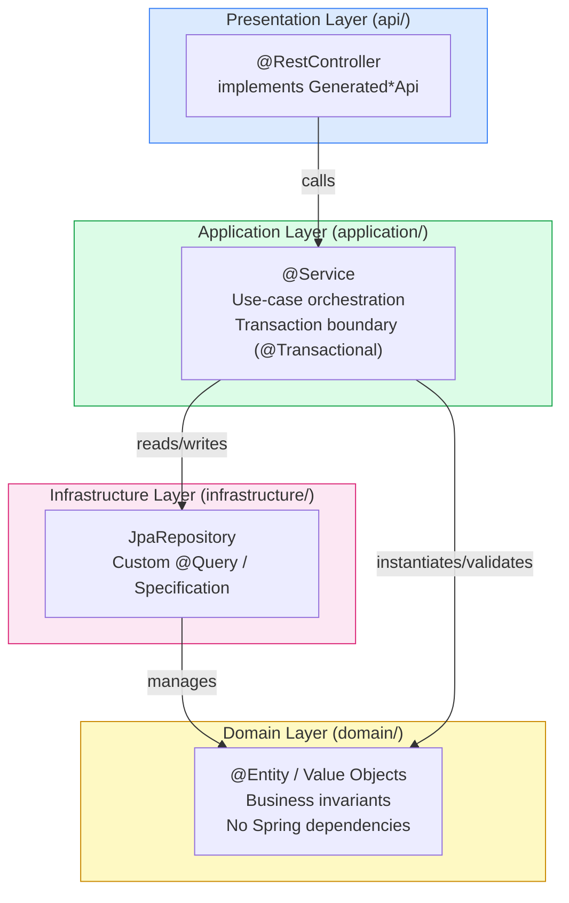
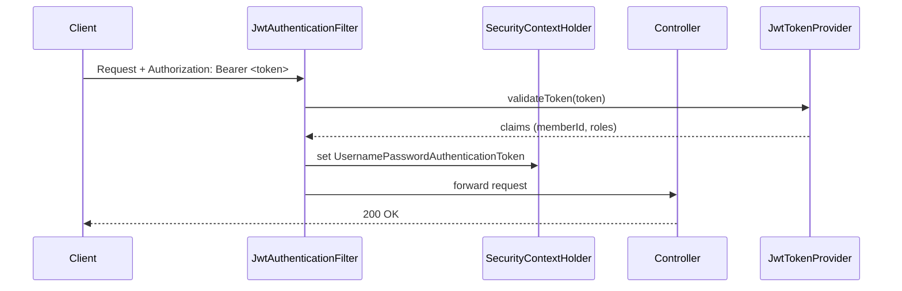
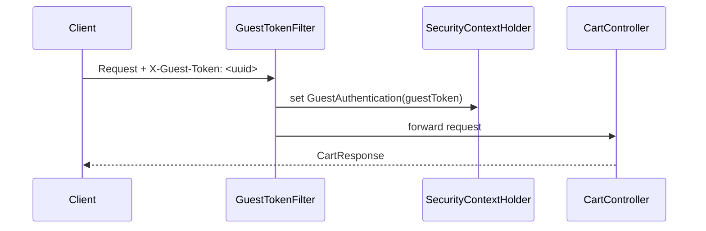
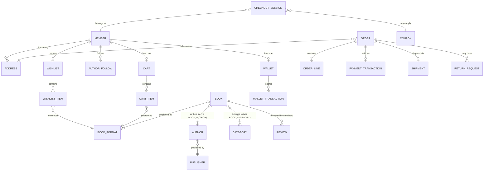

# Book Worm E-Store — Spring Boot 3 Architecture Design

> **API source:** `API/openapi.yaml` · OpenAPI 3.1.0 · Version 1.0.0  
> **Stack:** Java 21 · Spring Boot 3.x · Maven · PostgreSQL · Spring Security (JWT) · Spring Data JPA · Flyway · OpenAPI Generator · MapStruct · Lombok · Testcontainers

---

## Table of Contents

1. [Domain Overview](#1-domain-overview)
2. [Module Structure](#2-module-structure)
3. [Package Structure](#3-package-structure)
4. [Layered Architecture](#4-layered-architecture)
5. [Security Architecture](#5-security-architecture)
6. [Database & Persistence Strategy](#6-database--persistence-strategy)
7. [OpenAPI Generator Strategy](#7-openapi-generator-strategy)
8. [Maven Dependencies](#8-maven-dependencies)
9. [Design Decisions](#9-design-decisions)
10. [Cross-Cutting Concerns](#10-cross-cutting-concerns)

---

## 1. Domain Overview

The API exposes **15 bounded domains** derived from the OpenAPI `tags` block. These form the primary decomposition axis for packages, services, and Flyway migration scripts.

| # | Domain | API Tag | Key Roles | Auth |
|---|--------|---------|-----------|------|
| 1 | Authentication | `Authentication` | register, login, refresh, logout, password reset | Public / Guest |
| 2 | Users & Profile | `Users` | profile, addresses, author follows | `BearerAuth` |
| 3 | Catalogue — Authors | `Authors` | CRUD, follow/unfollow | Public read / Admin write |
| 4 | Catalogue — Publishers | `Publishers` | CRUD | Public read / Admin write |
| 5 | Catalogue — Categories | `Categories` | tree management | Public read / Admin write |
| 6 | Catalogue — Books | `Books` | listings, formats, price update | Public read / Admin write |
| 7 | Search | `Search` | full-text search with facets | Public |
| 8 | Wishlist | `Wishlist` | member wishlist CRUD | `BearerAuth` |
| 9 | Cart | `Cart` | guest + authenticated cart, merge | Guest / `BearerAuth` |
| 10 | Checkout & Orders | `Orders` | checkout session, order lifecycle | `BearerAuth` |
| 11 | Payments | `Payments` | initiate, confirm, webhook, wallet | `BearerAuth` / Public webhook |
| 12 | Shipping | `Shipping` | delivery estimates, tracking | `BearerAuth` |
| 13 | Reviews | `Reviews` | submit, moderate, publish/reject | `BearerAuth` / Admin |
| 14 | Coupons | `Coupons` | CRUD, validate | `BearerAuth` / Admin |
| 15 | Recommendations | `Recommendations` | home, personalised, bestsellers | Guest / `BearerAuth` |

### Role Taxonomy (from `MemberSummaryDTO`)

```
GUEST                — Unauthenticated, identified by X-Guest-Token header
REGISTERED_USER      — Standard authenticated member
STORE_ADMIN          — Store operations (orders, shipping, returns)
CATALOGUE_MANAGER    — Manages books, authors, publishers, categories
PLATFORM_ADMIN       — Superuser: all operations including coupon/user management
```

---

## 2. Module Structure

The project is a **single deployable Maven project** (monolith) with a clear internal package boundary per domain. No Maven sub-modules are used — the API surface is cohesive and does not justify the build complexity of a multi-module POM at this stage.

```
bookworm-api/
├── pom.xml                          ← Single root POM
├── src/
│   ├── main/
│   │   ├── java/
│   │   │   └── io/bookworm/api/     ← Root package
│   │   └── resources/
│   │       ├── application.yml
│   │       ├── application-local.yml
│   │       ├── application-test.yml
│   │       └── db/migration/        ← Flyway SQL scripts
│   └── test/
│       └── java/
│           └── io/bookworm/api/
└── API/
    └── openapi.yaml                 ← Source of truth (read-only at runtime)
```

> **Why single module?** The 15 domains share a common PostgreSQL schema, the same JWT security filter chain, and significant entity cross-references (e.g. `Book` ↔ `Author` ↔ `Category`). Splitting into Maven sub-modules would introduce circular dependency headaches with no operational benefit until a microservices migration is planned.

---

## 3. Package Structure

Root package: `io.bookworm.api`

```
io.bookworm.api
│
├── BookwormApplication.java                   ← @SpringBootApplication entry point
│
├── config/                                    ← Spring @Configuration classes only
│   ├── SecurityConfig.java                    ← SecurityFilterChain, CORS, JWT filter wiring
│   ├── JwtConfig.java                         ← JWT signing key, TTL properties
│   ├── OpenApiConfig.java                     ← SpringDoc / Swagger-UI customisation
│   ├── JpaConfig.java                         ← Auditing (@EnableJpaAuditing)
│   └── MapStructConfig.java                   ← Shared MapStruct component model config
│
├── security/                                  ← Security infrastructure (not domain logic)
│   ├── JwtTokenProvider.java                  ← Sign, parse, validate JWT
│   ├── JwtAuthenticationFilter.java           ← OncePerRequestFilter; extracts & validates JWT
│   ├── GuestTokenFilter.java                  ← Extracts X-Guest-Token header
│   ├── BookwormUserDetails.java               ← UserDetails adapter over Member entity
│   ├── BookwormUserDetailsService.java        ← Loads UserDetails by identifier
│   └── SecurityUtils.java                     ← Static helpers (current principal, role checks)
│
├── common/                                    ← Shared types & cross-cutting infrastructure
│   ├── domain/
│   │   ├── AuditableEntity.java               ← @MappedSuperclass with createdAt/updatedAt
│   │   └── Money.java                         ← Value object (BigDecimal amount + currency)
│   ├── web/
│   │   ├── GlobalExceptionHandler.java        ← @RestControllerAdvice → ErrorBody responses
│   │   ├── CorrelationIdFilter.java           ← MDC + response header X-Correlation-ID
│   │   └── PaginationMapper.java              ← Page<T> → PaginationDTO helper
│   └── validation/
│       ├── E164PhoneValidator.java            ← @E164Phone custom constraint
│       └── Iso3166Alpha2Validator.java        ← @Iso3166Alpha2 custom constraint
│
├── auth/                                      ← Domain: Authentication
│   ├── api/
│   │   └── AuthController.java                ← Implements generated AuthenticationApi
│   ├── application/
│   │   └── AuthService.java                   ← Register, login, refresh, logout, password flow
│   ├── domain/
│   │   ├── Member.java                        ← @Entity
│   │   ├── RefreshToken.java                  ← @Entity — stored hashed refresh tokens
│   │   └── PasswordResetToken.java            ← @Entity — time-limited reset tokens
│   ├── infrastructure/
│   │   ├── MemberRepository.java              ← JpaRepository<Member, UUID>
│   │   ├── RefreshTokenRepository.java
│   │   └── PasswordResetTokenRepository.java
│   └── mapper/
│       └── AuthMapper.java                    ← MapStruct: Member → RegisterResponse/TokenResponse
│
├── user/                                      ← Domain: Users & Profile
│   ├── api/
│   │   └── UserController.java                ← Implements generated UsersApi
│   ├── application/
│   │   ├── UserProfileService.java
│   │   ├── AddressService.java
│   │   ├── WishlistService.java
│   │   └── AuthorFollowService.java
│   ├── domain/
│   │   ├── Address.java                       ← @Entity
│   │   ├── Wishlist.java                      ← @Entity
│   │   ├── WishlistItem.java                  ← @Entity
│   │   └── AuthorFollow.java                  ← @Entity (join: member ↔ author)
│   ├── infrastructure/
│   │   ├── AddressRepository.java
│   │   ├── WishlistRepository.java
│   │   ├── WishlistItemRepository.java
│   │   └── AuthorFollowRepository.java
│   └── mapper/
│       └── UserMapper.java
│
├── catalogue/                                 ← Domain: Catalogue (Authors, Publishers, Categories, Books)
│   ├── api/
│   │   ├── AuthorController.java              ← Implements generated AuthorsApi
│   │   ├── PublisherController.java           ← Implements generated PublishersApi
│   │   ├── CategoryController.java            ← Implements generated CategoriesApi
│   │   └── BookController.java                ← Implements generated BooksApi
│   ├── application/
│   │   ├── AuthorService.java
│   │   ├── PublisherService.java
│   │   ├── CategoryService.java
│   │   └── BookService.java
│   ├── domain/
│   │   ├── Author.java                        ← @Entity
│   │   ├── Publisher.java                     ← @Entity
│   │   ├── Category.java                      ← @Entity (self-referencing tree)
│   │   ├── Book.java                          ← @Entity (aggregate root)
│   │   ├── BookAuthor.java                    ← @Entity (join: book ↔ author + role)
│   │   ├── BookCategory.java                  ← @Entity (join: book ↔ category)
│   │   └── BookFormat.java                    ← @Entity (PAPERBACK / HARDCOVER / EBOOK)
│   ├── infrastructure/
│   │   ├── AuthorRepository.java
│   │   ├── PublisherRepository.java
│   │   ├── CategoryRepository.java
│   │   ├── BookRepository.java
│   │   └── BookFormatRepository.java
│   └── mapper/
│       └── CatalogueMapper.java
│
├── search/                                    ← Domain: Search
│   ├── api/
│   │   └── SearchController.java              ← Implements generated SearchApi
│   ├── application/
│   │   └── BookSearchService.java             ← JPA Specifications / full-text queries
│   └── mapper/
│       └── SearchMapper.java
│
├── cart/                                      ← Domain: Cart
│   ├── api/
│   │   └── CartController.java                ← Implements generated CartApi
│   ├── application/
│   │   └── CartService.java                   ← Guest/member cart, merge logic
│   ├── domain/
│   │   ├── Cart.java                          ← @Entity
│   │   └── CartItem.java                      ← @Entity
│   ├── infrastructure/
│   │   ├── CartRepository.java
│   │   └── CartItemRepository.java
│   └── mapper/
│       └── CartMapper.java
│
├── checkout/                                  ← Domain: Checkout & Orders
│   ├── api/
│   │   ├── CheckoutController.java            ← Implements generated CheckoutApi (session flow)
│   │   └── OrderController.java               ← Implements generated OrdersApi
│   ├── application/
│   │   ├── CheckoutService.java               ← Session state machine: CREATED → CONFIRMED
│   │   └── OrderService.java                  ← Order lifecycle, cancel, return
│   ├── domain/
│   │   ├── CheckoutSession.java               ← @Entity (status: CREATED/ADDRESS_SET/…)
│   │   ├── Order.java                         ← @Entity (aggregate root)
│   │   ├── OrderLine.java                     ← @Entity
│   │   └── ReturnRequest.java                 ← @Entity
│   ├── infrastructure/
│   │   ├── CheckoutSessionRepository.java
│   │   ├── OrderRepository.java
│   │   ├── OrderLineRepository.java
│   │   └── ReturnRequestRepository.java
│   └── mapper/
│       └── OrderMapper.java
│
├── payment/                                   ← Domain: Payments & Wallet
│   ├── api/
│   │   └── PaymentController.java             ← Implements generated PaymentsApi
│   ├── application/
│   │   ├── PaymentService.java                ← Initiate, confirm (idempotency key)
│   │   └── WalletService.java                 ← Balance, transactions, redemption
│   ├── domain/
│   │   ├── PaymentTransaction.java            ← @Entity
│   │   ├── Wallet.java                        ← @Entity
│   │   └── WalletTransaction.java             ← @Entity
│   ├── infrastructure/
│   │   ├── PaymentTransactionRepository.java
│   │   ├── WalletRepository.java
│   │   └── WalletTransactionRepository.java
│   └── mapper/
│       └── PaymentMapper.java
│
├── shipping/                                  ← Domain: Shipping
│   ├── api/
│   │   └── ShippingController.java            ← Implements generated ShippingApi
│   ├── application/
│   │   ├── DeliveryEstimateService.java
│   │   └── ShipmentTrackingService.java
│   ├── domain/
│   │   ├── Shipment.java                      ← @Entity
│   │   ├── ShipmentEvent.java                 ← @Entity
│   │   └── ReturnShipment.java                ← @Entity
│   ├── infrastructure/
│   │   ├── ShipmentRepository.java
│   │   └── ReturnShipmentRepository.java
│   └── mapper/
│       └── ShippingMapper.java
│
├── review/                                    ← Domain: Reviews
│   ├── api/
│   │   └── ReviewController.java              ← Implements generated ReviewsApi
│   ├── application/
│   │   └── ReviewService.java                 ← Submit, update, moderate
│   ├── domain/
│   │   └── Review.java                        ← @Entity (status: PENDING/PUBLISHED/REJECTED)
│   ├── infrastructure/
│   │   └── ReviewRepository.java
│   └── mapper/
│       └── ReviewMapper.java
│
├── coupon/                                    ← Domain: Coupons
│   ├── api/
│   │   └── CouponController.java              ← Implements generated CouponsApi
│   ├── application/
│   │   └── CouponService.java                 ← CRUD, validate, apply
│   ├── domain/
│   │   └── Coupon.java                        ← @Entity (FLAT/PERCENT discount)
│   ├── infrastructure/
│   │   └── CouponRepository.java
│   └── mapper/
│       └── CouponMapper.java
│
└── recommendation/                            ← Domain: Recommendations
    ├── api/
    │   └── RecommendationController.java      ← Implements generated RecommendationsApi
    ├── application/
    │   └── RecommendationService.java         ← Home, personalised, bestsellers, related
    └── mapper/
        └── RecommendationMapper.java
```

---

## 4. Layered Architecture

Each domain follows the same four-layer pattern. Dependencies flow strictly top-down; no layer reaches upward.



### Layer Responsibilities

| Layer | Annotation | Responsibility |
|-------|-----------|----------------|
| **Presentation** | `@RestController` | Deserialise HTTP request → call service → serialise response. Contains **no business logic**. Implements OpenAPI-generated interface. |
| **Application** | `@Service` | Coordinates use-case flow: validate, load entities, enforce business rules, persist, return mapped DTO. All `@Transactional` boundaries live here. |
| **Domain** | `@Entity` / POJO | JPA entities and value objects. Business invariants are enforced via entity methods, not services. |
| **Infrastructure** | `JpaRepository` | Data access only. Named queries, JPQL, Specifications. No business logic. |
| **Mapper** | `@Mapper` (MapStruct) | Stateless bidirectional mapping between entity and DTO. Lives alongside its domain package; called from Application layer. |

---

## 5. Security Architecture

### JWT Flow



### Guest Token Flow



### Security Filter Chain Order

```
1. CorrelationIdFilter           (MDC setup)
2. GuestTokenFilter              (sets guest identity if no Bearer)
3. JwtAuthenticationFilter       (validates JWT, sets principal)
4. Spring Security filter chain  (authorization rules)
```

### Endpoint Security Matrix

| Pattern | Method(s) | Required |
|---------|-----------|----------|
| `/auth/register`, `/auth/login`, `/auth/refresh` | POST | None |
| `/auth/password/forgot` | POST | None |
| `/auth/logout` | POST | `BearerAuth` |
| `/authors/**`, `/publishers/**`, `/categories/**` | GET | None |
| `/authors/**`, `/publishers/**`, `/categories/**`, `/books/**` | POST/PUT/PATCH/DELETE | `CATALOGUE_MANAGER` or `PLATFORM_ADMIN` |
| `/books/**`, `/search/**`, `/recommendations/**` | GET | None |
| `/users/me/**` | ALL | `BearerAuth` (REGISTERED_USER+) |
| `/cart/**` | ALL | `GuestToken` or `BearerAuth` |
| `/checkout/**`, `/orders/**` | ALL | `BearerAuth` |
| `/payments/webhook` | POST | None (HMAC-verified in service) |
| `/payments/**` | ALL | `BearerAuth` |
| `/reviews/moderation`, `/reviews/{id}/publish`, `/reviews/{id}/reject` | ALL | `STORE_ADMIN` or `PLATFORM_ADMIN` |
| `/coupons` (write) | POST/PUT/PATCH | `STORE_ADMIN` or `PLATFORM_ADMIN` |

---

## 6. Database & Persistence Strategy

### Flyway Migration Naming Convention

```
db/migration/
├── V1__create_members.sql
├── V2__create_refresh_tokens.sql
├── V3__create_password_reset_tokens.sql
├── V4__create_addresses.sql
├── V5__create_authors.sql
├── V6__create_publishers.sql
├── V7__create_categories.sql
├── V8__create_books_and_formats.sql
├── V9__create_wishlists.sql
├── V10__create_carts.sql
├── V11__create_checkout_sessions.sql
├── V12__create_orders.sql
├── V13__create_payments.sql
├── V14__create_shipments.sql
├── V15__create_reviews.sql
├── V16__create_coupons.sql
├── V17__create_wallets.sql
└── V18__create_recommendations_support.sql
```

### Key Entity Relationships



### Optimistic Locking

All mutable entities that accept a `version` field in the API spec (e.g. `UpdateAddressRequest`, `UpdateBookRequest`, `CancelOrderRequest`) will carry a `@Version Long version` field on the JPA entity. The application layer maps the incoming `version` to the entity before calling `save()`, relying on Hibernate's `OptimisticLockException` which is translated by `GlobalExceptionHandler` to `ErrorBody` code `OPTIMISTIC_LOCK_CONFLICT`.

### Money Representation

- Database: `NUMERIC(19,4)` for amounts + `CHAR(3)` for ISO-4217 currency code
- Java: `BigDecimal amount` + `String currency` wrapped in a `Money` value object (`@Embeddable`)
- API: `MoneyDTO` uses decimal string (`"149.00"`) to prevent IEEE-754 precision loss

---

## 7. OpenAPI Generator Strategy

### Generator Configuration (in `pom.xml`)

```xml
<generatorName>spring</generatorName>
<library>spring-boot</library>
```

### What Gets Generated

| Generated artifact | Location | Action |
|--------------------|----------|--------|
| `*Api.java` interfaces | `target/generated-sources/openapi/…/api/` | **Implement** in `api/` layer |
| `*DTO.java` model classes | `target/generated-sources/openapi/…/model/` | **Use directly** as request/response types |
| `ApiUtil.java`, `OpenAPIDocumentationConfig.java` | Generated support | Included, not modified |

### Contract-First Principle

Controllers **implement** the generated interface — they never extend `Object` directly. This ensures any spec change immediately breaks compilation, preventing API drift.

```java
// Example — generated interface is the contract
@RestController
public class AuthController implements AuthenticationApi {
    @Override
    public ResponseEntity<RegisterResponse> registerMember(RegisterRequest request) { … }
}
```

### Generator Options

```yaml
# openapi-generator config
configOptions:
  interfaceOnly: false          # generate full interface + delegate pattern
  useSpringBoot3: true
  useJakartaEe: true            # Jakarta EE 10 (Spring Boot 3 requirement)
  generateBuilders: false       # Lombok @Builder handles this
  useTags: true                 # one interface per tag
  dateLibrary: java8            # LocalDate / OffsetDateTime
  serializationLibrary: jackson
  openApiNullable: false        # avoid Optional<> wrapper noise
  useBeanValidation: true       # @Valid on generated request params
  performBeanValidation: true
```

---

## 8. Maven Dependencies

### `pom.xml` Dependency Tree

```xml
<dependencies>

    <!-- ── Spring Boot Starters ─────────────────────────────── -->
    <dependency>
        <groupId>org.springframework.boot</groupId>
        <artifactId>spring-boot-starter-web</artifactId>
        <!-- Jackson, Tomcat, Spring MVC -->
    </dependency>
    <dependency>
        <groupId>org.springframework.boot</groupId>
        <artifactId>spring-boot-starter-security</artifactId>
    </dependency>
    <dependency>
        <groupId>org.springframework.boot</groupId>
        <artifactId>spring-boot-starter-data-jpa</artifactId>
    </dependency>
    <dependency>
        <groupId>org.springframework.boot</groupId>
        <artifactId>spring-boot-starter-validation</artifactId>
        <!-- Hibernate Validator / Jakarta Bean Validation 3 -->
    </dependency>
    <dependency>
        <groupId>org.springframework.boot</groupId>
        <artifactId>spring-boot-starter-actuator</artifactId>
        <!-- Health, metrics, info endpoints -->
    </dependency>

    <!-- ── Database ─────────────────────────────────────────── -->
    <dependency>
        <groupId>org.postgresql</groupId>
        <artifactId>postgresql</artifactId>
        <scope>runtime</scope>
    </dependency>
    <dependency>
        <groupId>org.flywaydb</groupId>
        <artifactId>flyway-core</artifactId>
    </dependency>
    <dependency>
        <groupId>org.flywaydb</groupId>
        <artifactId>flyway-database-postgresql</artifactId>
    </dependency>

    <!-- ── Security / JWT ───────────────────────────────────── -->
    <dependency>
        <groupId>io.jsonwebtoken</groupId>
        <artifactId>jjwt-api</artifactId>
        <version>0.12.x</version>
    </dependency>
    <dependency>
        <groupId>io.jsonwebtoken</groupId>
        <artifactId>jjwt-impl</artifactId>
        <version>0.12.x</version>
        <scope>runtime</scope>
    </dependency>
    <dependency>
        <groupId>io.jsonwebtoken</groupId>
        <artifactId>jjwt-jackson</artifactId>
        <version>0.12.x</version>
        <scope>runtime</scope>
    </dependency>

    <!-- ── Code Generation / Mapping ────────────────────────── -->
    <dependency>
        <groupId>org.mapstruct</groupId>
        <artifactId>mapstruct</artifactId>
        <version>1.6.x</version>
    </dependency>
    <dependency>
        <groupId>org.projectlombok</groupId>
        <artifactId>lombok</artifactId>
        <optional>true</optional>
    </dependency>

    <!-- ── OpenAPI / Swagger UI ─────────────────────────────── -->
    <dependency>
        <groupId>org.springdoc</groupId>
        <artifactId>springdoc-openapi-starter-webmvc-ui</artifactId>
        <version>2.x</version>
    </dependency>
    <!-- Generated code model dependencies -->
    <dependency>
        <groupId>org.openapitools</groupId>
        <artifactId>jackson-databind-nullable</artifactId>
        <version>0.2.6</version>
    </dependency>
    <dependency>
        <groupId>io.swagger.core.v3</groupId>
        <artifactId>swagger-annotations-jakarta</artifactId>
        <version>2.x</version>
    </dependency>

    <!-- ── Testing ───────────────────────────────────────────── -->
    <dependency>
        <groupId>org.springframework.boot</groupId>
        <artifactId>spring-boot-starter-test</artifactId>
        <scope>test</scope>
        <!-- JUnit 5, Mockito, AssertJ, MockMvc -->
    </dependency>
    <dependency>
        <groupId>org.springframework.security</groupId>
        <artifactId>spring-security-test</artifactId>
        <scope>test</scope>
    </dependency>
    <dependency>
        <groupId>org.testcontainers</groupId>
        <artifactId>junit-jupiter</artifactId>
        <scope>test</scope>
    </dependency>
    <dependency>
        <groupId>org.testcontainers</groupId>
        <artifactId>postgresql</artifactId>
        <scope>test</scope>
    </dependency>

</dependencies>

<!-- ── Build Plugins ──────────────────────────────────────── -->
<build>
  <plugins>

    <!-- Spring Boot Maven Plugin -->
    <plugin>
      <groupId>org.springframework.boot</groupId>
      <artifactId>spring-boot-maven-plugin</artifactId>
      <configuration>
        <excludes>
          <exclude>
            <groupId>org.projectlombok</groupId>
            <artifactId>lombok</artifactId>
          </exclude>
        </excludes>
      </configuration>
    </plugin>

    <!-- OpenAPI Generator — runs during generate-sources phase -->
    <plugin>
      <groupId>org.openapitools</groupId>
      <artifactId>openapi-generator-maven-plugin</artifactId>
      <version>7.x</version>
      <executions>
        <execution>
          <goals><goal>generate</goal></goals>
          <configuration>
            <inputSpec>${project.basedir}/API/openapi.yaml</inputSpec>
            <generatorName>spring</generatorName>
            <apiPackage>io.bookworm.api.generated.api</apiPackage>
            <modelPackage>io.bookworm.api.generated.model</modelPackage>
            <configOptions>
              <useSpringBoot3>true</useSpringBoot3>
              <useJakartaEe>true</useJakartaEe>
              <interfaceOnly>true</interfaceOnly>
              <useTags>true</useTags>
              <dateLibrary>java8</dateLibrary>
              <openApiNullable>false</openApiNullable>
              <useBeanValidation>true</useBeanValidation>
            </configOptions>
          </configuration>
        </execution>
      </executions>
    </plugin>

    <!-- Maven Compiler Plugin — annotation processors (Lombok + MapStruct) -->
    <plugin>
      <groupId>org.apache.maven.plugins</groupId>
      <artifactId>maven-compiler-plugin</artifactId>
      <configuration>
        <source>21</source>
        <target>21</target>
        <annotationProcessorPaths>
          <path>
            <groupId>org.projectlombok</groupId>
            <artifactId>lombok</artifactId>
          </path>
          <path>
            <groupId>org.mapstruct</groupId>
            <artifactId>mapstruct-processor</artifactId>
          </path>
          <!-- Lombok-MapStruct binding — must run Lombok before MapStruct -->
          <path>
            <groupId>org.projectlombok</groupId>
            <artifactId>lombok-mapstruct-binding</artifactId>
            <version>0.2.0</version>
          </path>
        </annotationProcessorPaths>
      </configuration>
    </plugin>

    <!-- Flyway Maven Plugin — local dev baseline -->
    <plugin>
      <groupId>org.flywaydb</groupId>
      <artifactId>flyway-maven-plugin</artifactId>
    </plugin>

  </plugins>
</build>
```

---

## 9. Design Decisions

### DD-01 — Contract-First via OpenAPI Generator

**Decision:** The OpenAPI spec (`API/openapi.yaml`) is the single source of truth. Java interfaces and DTOs are generated from it at build time. Controllers implement generated interfaces.

**Why:** Prevents API drift between spec and implementation. Any schema change in the YAML immediately surfaces as a compile error in the implementing controller. The `operationId` fields in the spec (e.g. `registerMember`, `loginMember`) become the generated method names — they must be set consistently.

**Trade-off:** Generated DTOs are immutable records or Lombok classes; some manual adaptation may be needed for validation constraints not expressible in OpenAPI (handled via custom `@Constraint` annotations in `common/validation/`).

---

### DD-02 — Domain Package Per API Tag, Not Horizontal Layering

**Decision:** Packages are `io.bookworm.api.<domain>.<layer>` not `io.bookworm.api.<layer>.<domain>`.

**Why:** Bounded domain cohesion. All code for the `cart` use case lives under `cart/`. Future extraction to a microservice requires moving one package, not scattering changes across four top-level layer packages. This also aligns with the Spring Boot team's recommended "package-by-feature" style.

---

### DD-03 — Single `@Transactional` Boundary in Application Layer

**Decision:** `@Transactional` is placed only on application-layer service methods, never on controllers or repositories.

**Why:** The controller layer is HTTP-concern-only. Repositories inherit Spring Data's per-method default transaction but should not own cross-entity transaction boundaries. Complex use cases (e.g. checkout confirm: apply coupon + debit wallet + create order + clear cart) require a single service-level transaction with rollback on failure.

---

### DD-04 — Idempotency on Payment and Order Confirm

**Decision:** The `X-Idempotency-Key` header (UUID) is required by the spec on `/payments/initiate`, `/payments/{id}/confirm`, and `/checkout/{id}/confirm`. The application layer stores idempotency key + response in a short-lived DB table and replays the cached response on duplicate requests.

**Why:** Payment confirmation is not idempotent by nature; the gateway may re-deliver webhooks or clients may retry on timeout. This design prevents double charges without requiring distributed lock infrastructure.

---

### DD-05 — Correlation ID Propagation

**Decision:** `CorrelationIdFilter` reads `X-Correlation-ID` from the request (or generates a UUID if absent), stores it in MDC, and writes it back to the response header. `GlobalExceptionHandler` embeds it in every `ErrorBody.correlationId`.

**Why:** The spec mandates `correlationId` in all error responses. It is also required for log correlation in distributed tracing without a full OpenTelemetry setup.

---

### DD-06 — Guest Cart via `X-Guest-Token`

**Decision:** An unauthenticated cart is identified by the `X-Guest-Token` header (a client-generated UUID). The `Cart` entity has a nullable `memberId` and a nullable `guestToken`. On `POST /cart/merge`, the guest cart items are merged into the authenticated member's cart and the guest cart is discarded.

**Why:** The spec explicitly defines `GuestToken` as a security scheme and provides `/cart/merge`. This avoids forcing users to register before shopping, which is a known conversion-rate risk in e-commerce.

---

### DD-07 — Flyway Over Liquibase

**Decision:** Flyway is chosen over Liquibase for schema migration.

**Why:** The schema is relationally simple and append-mostly during early development. Flyway's plain SQL format is readable by all team members without XML/YAML knowledge. Spring Boot 3 auto-configures Flyway when `spring.flyway` properties are present.

---

### DD-08 — MapStruct Over ModelMapper / Manual Mapping

**Decision:** MapStruct with compile-time code generation is used for all entity ↔ DTO conversions.

**Why:** Zero runtime reflection cost, compile-time mapping verification, and IDE navigation. `ModelMapper` relies on runtime reflection which introduces subtle bugs when field names change. The `lombok-mapstruct-binding` binding ensures Lombok runs before MapStruct in the annotation processor chain — without it MapStruct cannot see Lombok-generated getters/setters.

---

### DD-09 — Testcontainers for Integration Tests

**Decision:** Integration tests use a real PostgreSQL instance via Testcontainers rather than H2 in-memory.

**Why:** PostgreSQL-specific features (`ILIKE`, `ON CONFLICT`, JSON operators, `NUMERIC` precision) would behave differently on H2. Testcontainers starts a real PostgreSQL Docker container per test class (shared with `@DynamicPropertySource`), ensuring production parity. Flyway runs against this container, so migration scripts are tested too.

---

### DD-10 — `@Version` Optimistic Locking, Not Pessimistic

**Decision:** All entities accepting a `version` field in the API use JPA `@Version` (optimistic locking), not `SELECT FOR UPDATE` (pessimistic).

**Why:** The API spec includes `version` in update request bodies (e.g. `UpdateAddressRequest`, `UpdateBookRequest`, `CancelOrderRequest`). This is an explicit contract signal that the client must supply the last known version. Optimistic locking scales better under low-contention workloads (catalogue reads dominate) and avoids deadlocks.

---

### DD-11 — `Money` as `@Embeddable` Value Object

**Decision:** Monetary values are stored as `@Embeddable Money(BigDecimal amount, String currency)` not as raw `BigDecimal` columns.

**Why:** The API's `MoneyDTO` always carries both amount and currency together. Embedding the pair prevents orphaned currency columns and makes intent explicit. `NUMERIC(19,4)` provides sufficient precision for retail pricing without floating-point errors.

---

### DD-12 — Role-Based Access with Spring Security Method Security

**Decision:** Coarse-grained security (authenticated vs. public) is enforced in `SecurityConfig`. Fine-grained role checks (e.g. `CATALOGUE_MANAGER` for book writes) are enforced with `@PreAuthorize` on service methods, not controllers.

**Why:** Placing `@PreAuthorize` on the service layer means security is enforced regardless of how the service is called (HTTP, scheduled task, internal call). The controller layer remains pure HTTP orchestration.

---

## 10. Cross-Cutting Concerns

### Error Handling

`GlobalExceptionHandler` (`@RestControllerAdvice`) maps every exception type to the `ErrorBody` schema defined in the spec:

| Exception | HTTP Status | Error Code |
|-----------|-------------|------------|
| `MethodArgumentNotValidException` | 400 | `VALIDATION_ERROR` |
| `AuthenticationException` | 401 | `UNAUTHENTICATED` |
| `AccessDeniedException` | 403 | `FORBIDDEN` |
| `EntityNotFoundException` | 404 | `RESOURCE_NOT_FOUND` |
| `DataIntegrityViolationException` | 409 | `CONFLICT` |
| `OptimisticLockingFailureException` | 409 | `OPTIMISTIC_LOCK_CONFLICT` |
| `BusinessRuleException` (custom) | 422 | `BUSINESS_RULE_VIOLATION` |
| `RateLimitExceededException` (custom) | 429 | `RATE_LIMIT_EXCEEDED` |
| `Exception` (fallback) | 500 | `INTERNAL_ERROR` |

### Pagination

All list endpoints use 1-based page numbers (`PageParam` default `1`, `SizeParam` max `100`). A `PaginationMapper` utility converts Spring Data's `Page<T>` (0-based) to the API's `PaginationDTO` (1-based) uniformly.

### Audit Fields

`AuditableEntity` (`@MappedSuperclass`) provides `createdAt` and `updatedAt` via `@CreatedDate` / `@LastModifiedDate` with `@EnableJpaAuditing`. All entities extend this class.

### Configuration Properties

```yaml
# application.yml structure
bookworm:
  jwt:
    secret: ${JWT_SECRET}          # externally injected
    access-token-ttl: 900          # 15 minutes (seconds)
    refresh-token-ttl: 604800      # 7 days (seconds)
  security:
    cors:
      allowed-origins: ${CORS_ORIGINS:http://localhost:3000}
  payment:
    gateway-webhook-secret: ${PAYMENT_WEBHOOK_SECRET}
```

### Testing Pyramid

```
                    ┌─────────────────┐
                    │  E2E / Contract │  ← OpenAPI contract tests (optional)
                   /│   (few)         │\
                  / └─────────────────┘ \
                 /  ┌─────────────────┐  \
                /   │  Integration    │   \
               /    │  @SpringBootTest│    \
              /     │  + Testcontainers│   \
             /      └─────────────────┘    \
            /────────────────────────────────\
           /    Unit Tests (Services, Mappers) \
          /   JUnit 5 + Mockito + AssertJ      \
         /──────────────────────────────────────\
```

| Layer | Test type | Tool |
|-------|-----------|------|
| Controller | `@WebMvcTest` + `MockMvc` | Spring Test |
| Service | Unit with mocked repositories | Mockito |
| Repository | `@DataJpaTest` with Testcontainers PostgreSQL | Testcontainers |
| Mapper | Unit (no Spring context) | JUnit 5 |
| Integration | `@SpringBootTest` full context + Testcontainers | Testcontainers |
| Security | `@WithMockUser`, `MockMvc` security matchers | Spring Security Test |

---

*Architecture design based on `API/openapi.yaml` — Book Worm E-Store API v1.0.0*
